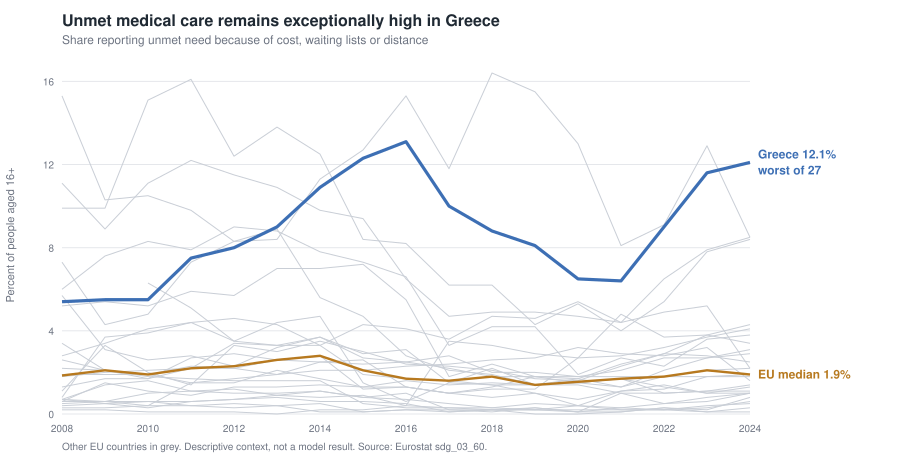

# Preliminary health-data extension

## Status

Exploratory feasibility analysis only. It does not alter the completed claim
freeze or reopen the model search.

Every number below is produced by `scripts/93_health_extension.py` and written
to `data/processed/health_*.csv`. An earlier version of this document was
written without code behind it; about half its numbers had no artifact, and its
results table reported unsigned effects while the figure beside it plotted
signed ones. Both problems are corrected here, and the corrections change part
of the reasoning — see [What changed](#what-changed-from-the-first-draft).

## Question

Do health status, barriers to health care, or their accumulation add useful
information about reported hardship in Greece and the EU?

## Data and design

Four annual Eurostat indicators were examined:

1. Unmet medical care because of cost, waiting lists, or distance
   (`sdg_03_60`).
2. Share not reporting good or very good health, derived from
   `hlth_silc_01`.
3. Long-standing illness or health problem (`hlth_silc_04`).
4. Some or severe limitation in usual activities (`hlth_silc_06`).

The common model sample is 2016–2024 and 27 EU countries (242 country-years;
241 where activity limitation or chronic illness is missing a cell). Each
measure is tested separately against the project's existing baseline:

`reported hardship ~ AROP + year effects + health measure`

**Every measure is pre-registered as `higher_is_worse`**: more unmet care, worse
health, more illness and more limitation should all predict *more* hardship. A
positive coefficient is the only sign that can support the hypothesis. This is
stated before any result because it is what makes a negative coefficient a
contradiction rather than a quiet null.

Accumulation is defined as the running total of adverse percentage points above
the same-year EU median, not netted against good years. Unmet care begins in
2008; the three health-status measures begin in 2016. Accumulated measures are
also tested while controlling for their current counterpart.

Inference uses country-clustered standard errors, Benjamini–Hochberg FDR within
each four-test stage, 999-draw restricted wild-cluster bootstrap, and
leave-one-country-out refits. Verdicts come from `e_rule.py`, the project's
pre-registered decision rule, applied rather than described.

## Descriptive findings



*Other EU countries are shown in grey. This is descriptive evidence about
health-care access, not evidence that unmet care explains the hardship gap.*

Health-care access is exceptional in Greece. The share reporting unmet medical
care was 13.1% in 2016, 8.1% in 2019, 9.0% in 2022, and 12.1% in 2024. Greece
ranked second-worst in 2016, 2019, and 2022 and worst of 27 in 2024. The EU
country median was only 1.9% in 2024.

The broad health-status indicators point the other way in cross-section. In
2024 Greece reported:

| Indicator | Greece | EU-country median | Greek rank, worst first |
|---|---:|---:|---:|
| Not good or very good health | 21.8% | 33.3% | 25/27 |
| Long-standing illness | 24.7% | 36.0% | 23/27 |
| Activity limitation | 18.4% | 24.6% | 23/26 |

These are unadjusted adult rates. They should not be interpreted as evidence
that Greeks are objectively healthier. Age composition, survey response,
diagnosis, expectations, and health-system contact can all affect
cross-country comparisons.

## Current-level models


*The intervals use country-clustered standard errors, while the displayed
bootstrap p-values determine the robustness verdict. No estimate passes the
full testing sequence.*

None of the four current health measures survives, and **three of the four point
the wrong way**.

| Measure | Standardised effect | FDR p | Bootstrap p | Greece residual, baseline → model | Verdict |
|---|---:|---:|---:|---:|---|
| Unmet medical care | **+0.18** | 0.643 | 0.660 | +47.75 → +52.65 | inconclusive under available power |
| Not-good health | **−0.21** | 0.443 | 0.423 | +47.75 → +47.42 | unsupported, wrong sign |
| Long-standing illness | **−0.32** | 0.395 | 0.129 | +47.65 → +45.24 | unsupported, wrong sign |
| Activity limitation | **−0.15** | 0.443 | 0.363 | +47.58 → +47.00 | unsupported, wrong sign |

The standardised effects are **signed**, in residual-SD units of the baseline.
This matters: read as magnitudes, long-standing illness at 0.32 with a bootstrap
p of 0.129 looks like the closest thing here to a finding. It is in fact the
strongest *wrong-signed* result — worse health associated with *less* reported
hardship. Sections below explain why.

Residuals belong to the simple AROP-plus-year-effects baseline on the 2016–2024
sample. They are not the frozen model's residual.

Unmet medical care is the one correctly signed measure, and it is also the
weakest. Its coefficient is imprecise (+0.77, SE 1.65), it is the only measure
whose leave-one-out refits change sign (−0.76 to +2.64 across the 27 drops), and
adding it makes Greece's out-of-sample residual *larger*, from +47.75 to +52.65.

## Accumulated measures

No accumulated measure survives FDR or the bootstrap, either alone or after its
current counterpart is controlled. The same three measures remain wrong-signed.

| Accumulated measure | Effect alone | FDR alone | Boot alone | FDR given current | Boot given current |
|---|---:|---:|---:|---:|---:|
| Unmet care | +0.30 | 0.372 | 0.494 | 0.296 | 0.081 |
| Not-good health | −0.20 | 0.295 | 0.288 | 0.789 | 0.619 |
| Long-standing illness | −0.25 | 0.225 | 0.109 | 0.789 | 0.795 |
| Activity limitation | −0.24 | 0.230 | 0.131 | 0.296 | 0.140 |

The accumulated-health block reduces the simple baseline residual from +47.49 to
+43.32, and Greece remains the most under-predicted country by a wide margin. No
component has robust individual support.

**The blocks are not collinear.** With an intercept in the design matrix the
maximum VIF is 1.7 for the current block, 2.0 for the accumulated block, and 4.0
for the two combined — all well inside any conventional threshold. The three
health-status measures correlate 0.47 to 0.58 with each other, which is
moderate, not severe. Collinearity is therefore *not* a reason to reject these
models; the lack of individual support is.

## Within-country evidence, and a sign reversal

Separating country means from annual deviations changes the sign for all three
health-**status** measures. It does not change the sign of unmet medical care,
which measures **access** to care rather than health, and which is positive in
both comparisons. Three of the four rows reverse, not four:

| Measure | Kind | Between countries | Within countries | Within cluster p | Within bootstrap p | Reversal |
|---|---|---:|---:|---:|---:|:--:|
| Unmet medical care | access | +0.803 (p 0.670) | +0.500 | 0.198 | 0.185 | no |
| Not-good health | status | −0.350 (p 0.269) | **+0.567** | 0.014 | 0.034 | **yes** |
| Long-standing illness | status | −0.559 (p 0.087) | +0.332 | 0.351 | 0.379 | **yes** |
| Activity limitation | status | −0.427 (p 0.237) | **+0.406** | 0.020 | 0.031 | **yes** |

This is the single most important result in the extension, and the earlier draft
missed it by reporting the two halves in separate sections. It is the same
between/within reversal the main report treats as a headline limitation.

That unmet care behaves consistently while the status measures do not is itself
informative. Access to care is a property of a health system, comparable across
borders in a way that self-rated health is not; self-rated health carries
national reporting conventions, age composition and expectations that differ
systematically between countries and cancel within one. Consistency here is not
support, though: unmet care is also the only measure whose leave-one-out refits
change sign.

The reading for the three that do reverse is that the negative pooled
coefficients are cross-country composition, not a health effect. Richer countries report worse health *and*
less hardship, so pooling the two comparisons produces a coefficient with the
wrong sign that describes neither. Within a country, years of worse reported
health are years of more reported hardship — the expected direction. Both within
coefficients that clear the bootstrap are leave-one-country-out sign-stable.

The first-difference stage points the same way and reaches the same limit: all
four coefficients are correctly signed (+0.11 to +0.19), and none survives FDR
(adjusted p 0.275 or higher).

Within Greece specifically, the simple correlations with hardship over 2016–2024
are +0.84 for not-good health and +0.70 for activity limitation — **and −0.70
for long-standing illness**, which runs the other way on the same nine years.
The earlier draft reported the two positive correlations and omitted the
negative one. With nine observations none of the three should carry weight.

None of this establishes a mechanism. The health variables and hardship are both
collected through EU-SILC, so common survey method and general response
consistency remain live explanations for the within-country co-movement.

## Incremental checks against the proximity-clean companion

No health measure adds robust, directionally coherent information to the
report's five-predictor companion model (P3 with the same-instrument deprivation
measure removed).

Current and accumulated long-standing illness clear conventional FDR at 0.049,
but both coefficients have the wrong sign (−0.34 and −0.08) and neither comes
close to the bootstrap (0.439 and 0.308). Under the pre-registered rule, a
wrong-signed result that clears FDR is recorded as a contradiction, not filed as
a quiet null — and here it does not clear the bootstrap either. Seven of the
eight tests are wrong-signed; the eighth, accumulated unmet care, is +0.017 with
a bootstrap p of 0.922.

## Preliminary conclusion

### Adds value to the report

Unmet medical care is a strong descriptive and institutional finding. Greece's
extreme position is concrete and policy-relevant. It belongs in the discussion
of what hardship means in practice, ideally split into cost, waiting-time, and
distance barriers and by income group.

The within-country co-movement of hardship with not-good health and activity
limitation is useful as same-instrument corroboration, and the between/within
reversal is itself worth reporting: it is a clean second instance of the
limitation the main report already documents. Neither is independent validation.

### Does not add value to the models

The four health measures should not be added to the headline explanatory
models. Current levels are unsupported and three of four are wrong-signed;
accumulated versions add no robust information; the pooled estimates are
contaminated by cross-country composition; and health may be a consequence of
hardship rather than a cause. Note that collinearity is *not* among the reasons
— that argument, made in the first draft, does not hold.

### Best next extension

Before any publication-level health analysis, use age-standardised or
age-specific rates and add independent sources: out-of-pocket health spending,
catastrophic health expenditure, prescribed-medicine access, and avoidable or
treatable mortality. Those data can test whether the survey signals align with
administrative or expenditure evidence without creating another EU-SILC
restatement. Age standardisation is the highest-value single fix: the negative
between-country coefficients are exactly what an age-composition artefact would
produce.

## What changed from the first draft

| Claim in the first draft | Status |
|---|---|
| All descriptive numbers, ranks, medians | **Confirmed**, reproduce exactly |
| Current-level FDR and bootstrap p-values | **Confirmed** to within bootstrap noise |
| Accumulated "alone" p-values | **Confirmed** |
| Within coefficients +0.565, +0.405 | **Confirmed** (+0.567, +0.406) |
| Standardised effects 0.21 / 0.32 / 0.15 | **Corrected** — they are −0.21 / −0.32 / −0.15 |
| "Maximum VIF is 54.9 … 24.6" | **Wrong.** Those are VIFs computed without an intercept in the design matrix, which measures distance from the origin rather than collinearity. Correct values are 4.0 and 1.7 |
| "The combined block is not interpretable" | **Withdrawn**, as it rested on the VIF error |
| Within-Greece correlations 0.84, 0.71 | **Confirmed** (0.84, 0.70); chronic illness at −0.70 added |
| Companion bootstrap 0.087, 0.088 | **Not reproduced**; this specification gives 0.439 and 0.308, further from significance |
| Between/within sign reversal | **New** — not in the first draft. Three of four measures; the access measure does not reverse |
| First differences correctly signed | **New** — the first draft reported only that they fail FDR |

## Main limitations

- Post-freeze exploratory analysis; it cannot create a new headline claim.
- Twenty-seven country clusters.
- EU-SILC self-reporting and common-method dependence.
- Health may be an outcome or mediator of hardship, not an antecedent cause.
- Broad health rates are not age-standardised, which is the most likely source
  of the negative between-country coefficients.
- Health-status accumulation begins only in 2016 and is not a crisis-era
  exposure measure.
- Within-Greece correlations rest on nine observations.

## Reproducing

```bash
python3 scripts/93_health_extension.py
```

Offline by default, reading `data/raw/health_panel.csv`. Pass `--fetch` to
re-acquire the panel from Eurostat, which moves the data vintage.
