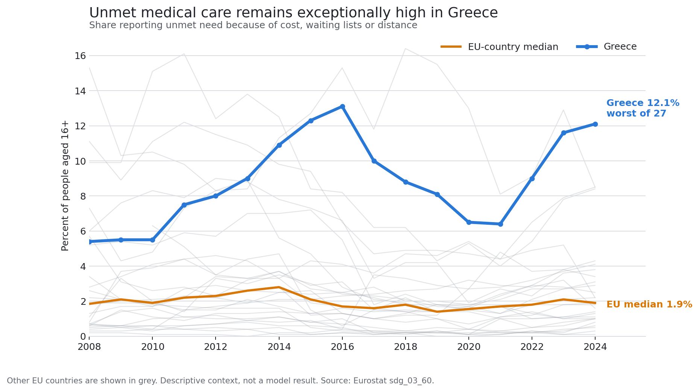
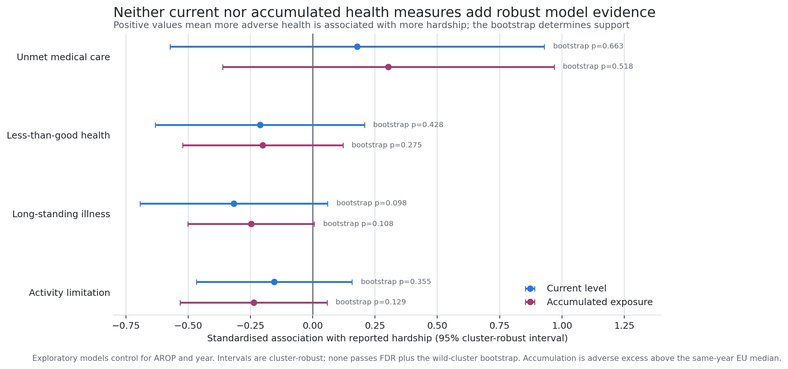

# Preliminary health-data extension

## Status

Exploratory feasibility analysis only. It does not alter the completed claim
freeze or reopen the model search. No file in the Greece poverty project was
changed.

## Question

Do health status, barriers to health care, or their accumulation add useful
information about reported hardship in Greece and the EU?

## Data and design

Four annual Eurostat indicators were examined:

1. Unmet medical care because of cost, waiting lists, or distance
   (`sdg_03_60`).
2. Share not reporting good or very good health, derived from
   `hlth_silc_01`.
3. Long-standing illness or health problem (`hlth_silc_04`).
4. Some or severe limitation in usual activities (`hlth_silc_06`).

The common model sample is 2016-2024 and 27 EU countries. Each measure is
tested separately against the project's existing baseline:

`reported hardship ~ AROP + year effects + health measure`

Accumulation is defined as the running total of adverse percentage points
above the same-year EU median. Unmet care begins in 2008; the three health
status measures begin in 2016. Accumulated measures are also tested while
controlling for their current counterpart.

Inference uses country-clustered standard errors, FDR within each four-test
stage, 999-draw restricted wild-cluster bootstrap checks for the level and
accumulation tests, and leave-one-country-out stability where a result might
otherwise be interpreted positively.

## Descriptive findings

*Other EU countries are shown in grey. This is descriptive evidence about
health-care access, not evidence that unmet care explains the hardship gap.*

Health-care access is exceptional in Greece. The share reporting unmet medical
care was 13.1% in 2016, 8.1% in 2019, 9.0% in 2022, and 12.1% in 2024. Greece
ranked second-worst in 2016, 2019, and 2022 and worst of 27 in 2024. The EU
country median was only 1.9% in 2024.

The broad health-status indicators point the other way in cross-section. In
2024 Greece reported:

| Indicator | Greece | EU-country median | Greek rank, worst first |
|---|---:|---:|---:|
| Not good or very good health | 21.8% | 33.3% | 25/27 |
| Long-standing illness | 24.7% | 36.0% | 23/27 |
| Activity limitation | 18.4% | 24.6% | 23/26 |

These are unadjusted adult rates. They should not be interpreted as evidence
that Greeks are objectively healthier. Age composition, survey response,
diagnosis, expectations, and health-system contact can all affect
cross-country comparisons.

## Current-level models

*The intervals use country-clustered standard errors, while the displayed
bootstrap p-values determine the robustness verdict. No estimate passes the
full testing sequence.*

None of the four current health measures survives the testing sequence.

| Measure | Standardised effect | FDR p | Bootstrap p | Greece residual, baseline -> model |
|---|---:|---:|---:|---:|
| Unmet medical care | 0.18 | 0.642 | 0.663 | +47.74 -> +52.63 |
| Not-good health | 0.21 | 0.442 | 0.428 | +47.74 -> +47.41 |
| Long-standing illness | 0.32 | 0.394 | 0.098 | +47.64 -> +45.23 |
| Activity limitation | 0.15 | 0.442 | 0.355 | +47.57 -> +46.99 |

The residuals here belong to the simple AROP-plus-year-effects baseline on the
2016-2024 sample. They are not the frozen model's residual.

Unmet care does not behave as an explanatory predictor. Its coefficient is
imprecise, changes sign across leave-one-country-out fits, and makes Greece's
out-of-sample residual larger.

## Accumulated measures

No accumulated measure survives FDR or the bootstrap, either alone or after
its current counterpart is controlled.

| Accumulated measure | FDR p alone | Bootstrap p alone | FDR p given current | Bootstrap p given current |
|---|---:|---:|---:|---:|
| Unmet care | 0.372 | 0.518 | 0.296 | 0.104 |
| Not-good health | 0.296 | 0.275 | 0.789 | 0.629 |
| Long-standing illness | 0.223 | 0.108 | 0.789 | 0.789 |
| Activity limitation | 0.229 | 0.129 | 0.296 | 0.141 |

The accumulated-health block reduces the simple baseline residual from +47.47
to +43.29, but Greece remains the most under-predicted country and no component
has robust individual support. The combined current-plus-accumulated block is
not interpretable: its maximum VIF is 54.9. Even the current-only health block
has a maximum VIF of 24.6 because the three broad health-status measures overlap
heavily.

## Within-country evidence

Two exploratory within-country signals appear after country means are
separated from annual deviations:

| Measure | Within coefficient | Cluster p | Wild-bootstrap p | LOO sign stable |
|---|---:|---:|---:|---:|
| Not-good health | +0.565 | 0.014 | 0.037 | yes |
| Activity limitation | +0.405 | 0.020 | 0.031 | yes |

Within Greece, their simple correlations with hardship are 0.84 and 0.71.
This says that years when people report worse health or more limitation also
tend to be years when they report more hardship.

It does not establish a dynamic mechanism. In first differences, none of the
four health coefficients survives FDR; the adjusted p-values are 0.284 or
higher. The health variables and hardship are also collected through EU-SILC,
so common survey method and general response consistency remain possible.

## Incremental checks against the proximity-clean companion

No health measure adds robust, directionally coherent information to the
existing five-predictor companion model. Current and accumulated chronic
illness clear conventional FDR at 0.047, but both coefficients have the wrong
substantive sign and fail the wild bootstrap (0.087 and 0.088). They should be
treated as cross-country suppression or construct mismatch, not findings.

## Preliminary conclusion

### Adds value to the report

Unmet medical care is a strong descriptive and institutional finding. Greece's
extreme position is concrete and policy-relevant. It belongs in the discussion
of what hardship means in practice, ideally split into cost, waiting-time, and
distance barriers and by income group.

The within-country co-movement of hardship with not-good health and activity
limitation is useful as same-instrument corroboration. It suggests hardship is
not entirely detached from broader reported wellbeing, but it is not
independent validation.

### Does not add value to the models

The four health measures should not be added to the headline explanatory
models. Current levels are unsupported, accumulated versions add no robust
information, the block models are collinear, and the broad health measures can
be consequences of hardship rather than causes.

### Best next extension

Before any publication-level health analysis, use age-standardised or
age-specific rates and add independent sources: out-of-pocket health spending,
catastrophic health expenditure, prescribed-medicine access, and avoidable or
treatable mortality. Those data can test whether the survey signals align with
administrative or expenditure evidence without creating another EU-SILC
restatement.

## Main limitations

- Post-freeze exploratory analysis; it cannot create a new headline claim.
- Twenty-seven country clusters.
- EU-SILC self-reporting and common-method dependence.
- Health may be an outcome or mediator of hardship, not an antecedent cause.
- Broad health rates are not age-standardised.
- Health-status accumulation begins only in 2016 and is not a crisis-era
  exposure measure.
