# V2 Research Record

## How to read this

This is the living record of the V2 analysis. It documents what was planned,
what was run, what was found, and what decision followed at each stage.

Every stage below opens with **In plain words** — a short, non-technical
account of what the step was for and what came out of it. If you read nothing
else, read those. Everything after that heading is the formal record.

Every stage ends with **Where the detail lives** — the script that produced it,
the files it wrote, and the commit that froze it.

Some stages also carry **Notes from review** — why a decision went the way it
did, what was argued against, and what was caught by review rather than by the
code. These exist because the reasoning is the first thing to evaporate. Six
months from now the numbers will still be in the CSVs; the argument that
produced them will not be anywhere else.

The technical report, academic paper, and narrative companion are not updated
stage by stage. They are revised only after the analytical sequence is complete
and the claims have been frozen.

This notebook is the running log. `publication_strategy.md` was closed on
2026-08-22 and holds the pre-EA history; nothing new goes there.

**Sources of truth.** This document does not restate them, it points at them:

| Thing | Lives in | Maintained by |
|---|---|---|
| The 53 published claims and their disposition | `docs/claim_matrix.csv` | `scripts/build_claim_matrix.py`, audited by `audit_parity.py` |
| Pre-EA history, literature checks, long-form stage narrative | `docs/publication_strategy.md` | **closed archive** — do not append |
| The protocol V2 follows | `docs/project_description_v3.md` | hand-written |
| Frozen P3/P5/P3a values and wording rules | `data/processed/p5f_frozen_result.json` | frozen, never edited |
| Frozen construct map | `data/processed/construct_map_frozen.json` | frozen, never edited |
| Frozen E pre-registration | `data/processed/e_preregistration.json` | frozen, never edited |

## Document Control

<!-- AUTO:BEGIN document-control -->
| Field | Value |
|---|---|
| Current stage | none — sequence complete |
| Last completed stage | FINAL |
| Branch | `p6-rewrite` |
| HEAD | `c7116d4` Fix Figure 8's headline: real wages also reverses sign, just negligibly |
| Uncommitted changes | yes |
| Last refreshed | 2026-08-26 |
| Frozen V1 reference | `v1-final` |
| Frozen V2 analytical reference | `p5f-frozen` |
<!-- AUTO:END document-control -->

## Ground Rules

- Pre-registration is committed before the corresponding test is run.
- Results are committed separately from their pre-registration.
- Exploratory analyses remain exploratory.
- Superseded decisions and claims are retained and linked to replacements.
- Null, inconclusive, infeasible, and unsupported results remain visible.
- Current and accumulated measures are different estimands.
- Raw gaps and regression residuals are not a formal decomposition.
- Proximate hardship indicators cannot become the headline explanation.
- No Family E result may alter P3, P5, or `p5f-frozen`.
- Freezing a result protects its numbers and interpretation. It does not
  protect an inaccurate label, and it does not forbid a pre-registered audit of
  what the result depends on.
- Evidence that deprivation predicts hardship is **not** equivalent to evidence
  from income, employment, wage or housing data. Both are analytically
  relevant; both are reported as separate layers, never forced under one
  "objective" label.
- E1 and E4 use the neutral baseline `AROP + year effects`. P3 returns only at
  E6, as the frozen combined benchmark reported alongside the deprivation-free
  companion.

## Stage Index

<!-- AUTO:BEGIN stage-index -->
| Stage | Question | Status | Pre-registration | Result | Entry |
|---|---|---|---|---|---|
| P0 | Is our outcome measure the real thing? | complete | — | — | [P0](#p0--is-our-outcome-measure-the-real-thing) |
| P2 | Can we build a synthetic comparison country? | complete | — | — | [P2](#p2--can-we-build-a-synthetic-comparison-country) |
| P3 | How much of Greece's gap do objective conditions explain? | complete | — | — | [P3](#p3--how-much-of-greeces-gap-do-objective-conditions-explain) |
| P5 | Is that a real relationship, or a difference between countries? | complete | — | `p5f-frozen` | [P5](#p5--is-that-a-real-relationship-or-a-difference-between-countries) |
| P3a | Does breadth of disadvantage add anything? | complete | `p3a_frozen_universe.json` | — | [P3a](#p3a--does-breadth-of-disadvantage-add-anything) |
| E0 | What data and constructs are suitable for testing? | complete | — | `2103b3d` | [E0](#e0--data-and-construct-map) |
| PRE | What exact tests and decision rules are fixed before analysis? | complete | `a747e7a` | `476e177` | [PRE](#pre--pre-registration-and-power) |
| EDA | What do the candidate variables actually look like? | complete | — | — | [EDA](#eda--descriptive-groundwork) |
| EA | How much of the P3 result depends on a same-instrument predictor? | complete | `ea_preregistration.json` | — | [EA](#ea--deprivation-free-companion-audit) |
| E1 | Which current-level constructs are associated with hardship? | complete | `a747e7a` | — | [E1](#e1--current-level-constructs) |
| E2 | Do sensitivity variants change the current-level conclusions? | complete | `a747e7a` | — | [E2](#e2--current-level-sensitivities) |
| E3 | What do the diagnostic and contextual checks show? | complete | `a747e7a` | — | [E3](#e3--diagnostic-and-contextual-checks) |
| E4 | Which accumulated constructs are associated with hardship? | complete | `a747e7a` | — | [E4](#e4--accumulated-exposure) |
| E5 | Do accumulated-measure sensitivities change those conclusions? | complete | `a747e7a` | — | [E5](#e5--accumulation-sensitivities) |
| E6 | Does the frozen combined model remain appropriate? | complete | `a747e7a` | — | [E6](#e6--frozen-combined-model) |
| E7 | Do accumulated measures add information beyond current snapshots? | complete | `a747e7a` | — | [E7](#e7--current-versus-accumulated-comparison) |
| FINAL | What survives into the final reports? | complete | — | — | [FINAL](#final--claim-freeze-and-publication) |
<!-- AUTO:END stage-index -->

## Standard Stage Template

Every analytical stage uses these headings, in this order:

### In plain words
### Question
### Pre-registered specification
### Data and sample
### Minimum detectable effect
### Results
### Robustness and validation
### Interpretation
### What this does not establish
### Decision
### Open issues
### Where the detail lives

---

# Part I — Completed stages

## P0 — Is our outcome measure the real thing?

### In plain words

Before testing anything, we had to know whether the hardship series we built
ourselves was actually the official European statistic, or something we had
invented that merely resembled it. It turned out to be the official one. Where
both exist, they agree almost perfectly — the typical difference is zero, and
no country-year differs by more than a tenth of a percentage point. So the
series was renamed to say what it is: the official indicator, extended
backwards in time before the official version begins.

### Question

Is the constructed `DIF+GRT` series the same quantity as Eurostat `ilc_sbjp01`?

### Results

| Check | Tolerance set before running | Result |
|---|---|---|
| Median absolute difference | ≤ 0.5 pp | **0.0 pp** |
| Share of country-years within 5 pp | ≥ 0.95 | **1.00** |
| Minimum cross-sectional Spearman rank correlation | ≥ 0.90 | **0.999** |
| Greece trend correlation | ≥ 0.90 | **0.99999** |

432 overlapping country-years; 318 exact matches; none differing by more than
0.1 pp.

### Decision

**Passed.** The outcome is renamed the *backward-extended official subjective-
hardship indicator*. Four wording rules were locked: terminology; that the
splice occurs at 2010; that validation covers only the overlap period; and
that pre-2010 provenance is ours, not Eurostat's.

### Notes from review

The tolerances were declared before the comparison ran, which mattered more than
it looked at the time: the agreement turned out to be near-perfect, and a
tolerance set *afterwards* would have been unfalsifiable no matter what number
it contained.

The renaming was not cosmetic. Calling it "our constructed series" understated
what it is and invited a reviewer to ask why we had not simply used the official
indicator. Calling it "the official indicator" would have overstated the pre-2010
segment, which has no official counterpart. The compound name is the only one
that survives both objections.

### What this does not establish

Nothing about the pre-2010 segment, which has no official counterpart to be
validated against.

### Where the detail lives

`scripts/51_p0_outcome_reconciliation.py`, `scripts/outcome.py` ·
`data/processed/p0_outcome_reconciliation.csv`, `p0_verdict.csv` ·
`docs/publication_strategy.md` § "P0 complete"

---

## P2 — Can we build a synthetic comparison country?

### In plain words

The idea was to construct an artificial "Greece" out of a weighted blend of
other European countries that matched Greece before the crisis, then see how
far the real Greece diverged from it afterwards. This failed, and we recorded
the failure instead of quietly dropping it. The blend collapsed onto essentially
two countries — Hungary and Bulgaria — which between them have about half
Greece's income and three times its deprivation rate. A comparison built on
that is not a comparison. The large post-crisis divergence the method produced
is therefore **not reportable as a result**, and a rule in the audit script
forbids it appearing in any document.

### Question

Is a synthetic-control comparative design viable on this panel?

### Pre-registered specification

Primary pre-period 2005–2008 (2009 excluded as a transition year), six gates
fixed before running.

### Results

| Specification | Pre-period RMSE | Max donor weight | Effective donors |
|---|---|---|---|
| 2005–2008, unpenalised | 0.91 | 0.55 | 1.98 |
| 2005–2008, regularised (λ=0.5) | 0.91 | 0.55 | 1.98 |
| 2005–2009 | 0.93 | 0.49 | 2.22 |

Donor weights: Hungary 0.552, Bulgaria 0.448, everything else ≈ 0.

**Failed 4 of 6 gates**: donor concentration, covariate imbalance on income,
covariate imbalance on deprivation, and effective donor count.

### Decision

**Rejected as infeasible.** The +27 pp divergence figure is marked
non-reportable via `FORBIDDEN` rules in `audit_parity.py`, which fails the
build if it appears in any output document.

### Notes from review

An earlier draft reported this design as evidence, citing a near-exact
pre-crisis fit. That fit existed only on a degenerate two-point window
(2007–2008). On the honest 2003–2008 window the RMSE is 25.3 — a failure. The
error reached three published documents before review caught it.

A separate error travelled with it: `p=0.037` was attributed to synthetic-control
placebo inference when it comes from the TWFE country-placebo test.

The machine-enforced ban exists because of how that first error propagated. A
figure that is merely *documented* as unreportable gets copied into a summary
by someone reading quickly. One that fails the build does not.

### Where the detail lives

`scripts/52_p2_comparative_design.py` ·
`data/processed/p2_specifications.csv`, `p2_donor_weights.csv`,
`p2_placebo_distribution.csv` ·
`docs/publication_strategy.md` § "P2 FAILS its pre-registered gates"

---

## P3 — How much of Greece's gap do objective conditions explain?

> **Label corrected 2026-08-22.** This is the **frozen P3 mixed-distance
> model**, not an objective-only model: it excludes the closest Tier-0
> indicators but retains official severe material and social deprivation, drawn
> from the same survey system as the outcome. The numbers, specification and
> interpretation below are frozen and unchanged. What changed is the label and
> the addition of a pre-registered audit — see [EA](#ea--deprivation-free-companion-audit).

### In plain words

We predicted each country's hardship level from objective conditions,
deliberately excluding the measures closest to the outcome — arrears, being
unable to meet an unexpected expense, financial expectations. Greece's actual
hardship sits far above what those conditions predict: **27 points above**, the
worst gap in Europe. Then we added one variable — how much cumulative excess
unemployment the country has absorbed since the crisis — and the gap fell to
**7 points**.

So adding accumulated unemployment substantially narrows Greece's cross-country
prediction residual. It does not eliminate it. **Greece remains among the three
most under-predicted countries in Europe**, which is what kept this at Branch 2
rather than Branch 1.

One caveat on the label, and it is not only a caveat. Of P3's six predictors,
`severe_mat_soc_deprivation` is classified by E0 as `proximate_same_instrument`
— it comes from the same survey system as the outcome and belongs to construct
P1, the diagnostic-only construct. So this model excludes the *closest*
proximate measures but is not free of same-instrument hardship indicators.

Freezing P3 protects its numbers from being changed after the fact. It does not
oblige us to keep calling it "objective-only" once one predictor is known to
break the proximity rule we adopted later. So the model keeps its numbers and
gets an accurate name — the **frozen P3 mixed-distance model** — and the
question of how much the result depends on that one predictor is settled by a
pre-registered audit rather than by wording. See [EA](#ea--deprivation-free-companion-audit).

### Question

With the Tier-0 proximate indicators excluded, how large is Greece's residual,
and does accumulated exposure narrow it?

### Specification

Six predictors plus year fixed effects, all fixed in advance:

| Predictor | E0 proximity class |
|---|---|
| `severe_mat_soc_deprivation` | **`proximate_same_instrument`** (construct P1) |
| `housing_cost_overburden` | `objective` |
| `ltu_rate` | `objective` |
| `aic_pps_pc_k` | `objective` |
| `wage_years_below_2008` | derived accumulation |
| `cum_excess_unemployment` | derived accumulation |

Excluded by construction (Tier 0): arrears, inability to meet an unexpected
expense, financial expectations.

### Results

| Specification | Greece residual | Rank |
|---|---|---|
| Objective conditions, no accumulation | **+27.05** | 1 of 27 |
| Plus `cum_excess_unemployment` | **+6.93** | 3 of 27 |
| Plus Tier-0 proximate indicators (diagnostic only) | +3.81 | — |

Model fit R² = 0.907, n = 269.

### Decision

**Branch 2 of 4** — *material history explains a meaningful share, not the full
difference.* Chosen by `scripts/branch_rule.py`, a tested function (17 tests),
not by judgement: the residual clears the ≤10 bar, but the rank stays inside
the extreme-outlier group (≤3), which rules out Branch 1.

> This branch rule exists because an earlier hand-written version defaulted to
> the strongest conclusion and reported "strong objective support" while Greece
> sat at rank 3. Prose pre-registration did not prevent that; a tested function
> does.

### Notes from review

The branch rule is the origin of a policy now applied to every decision rule in
the project. The pre-commitment was correct and written down in advance; the
implementation had an if/else chain whose final `else` returned the strongest
available conclusion. Nothing in the prose was wrong. The code simply did not
implement it, and the first run published the wrong branch.

Since then a decision rule is a tested function or it is not a rule.
`branch_rule` (17 tests), `mundlak_rule` (23), `ea_rule` (47). The EA run proved
the policy was not paranoia: that rule failed too, on a case its author had not
imagined.

### Evidentiary tier

**Post-selection robustness, not independent confirmation.**
`cum_excess_unemployment` was discovered on this same panel during family-A
screening. It has not been validated out of sample.

### Where the detail lives

`scripts/53_p3_objective_only.py`, `scripts/branch_rule.py`,
`scripts/test_branch_rule.py` ·
`data/processed/p3_objective_only.csv`, `p3_residuals.csv` ·
`docs/publication_strategy.md` § "P3 result: BRANCH 2"

---

## P5 — Is that a real relationship, or a difference between countries?

### In plain words

This is the most important limitation in the whole project, so it is worth
stating carefully — and carefully means resisting the stronger sentence that
keeps suggesting itself.

The accumulated-unemployment result works by comparing *countries to each
other*: countries that absorbed more accumulated unemployment have higher
hardship. That signal is strong and statistically solid.

The second half is where the wording has to stay disciplined. **We found no
supporting within-country evidence, and the estimate is too imprecise to
establish or rule out such a relationship.** It is flat and inconclusive, not
demonstrated to be absent.

Two things this specifically does not say. It does not say the relationship
fails *inside Greece*: the within coefficient pools year-to-year variation
across all 27 countries, so it is not a Greece-specific time series, and we
never estimated one. And it does not say there is no dynamic relationship —
only that this analysis does not demonstrate one.

That means we may describe this as a *scarring marker that distinguishes
countries*. We may **never** write "as exposure accumulated, hardship rose."
That sentence is not supported.

### Results

| Component | Estimate | p |
|---|---|---|
| Between-country | **+0.3323** | < 0.0001 |
| Within-country | **−0.0755** | 0.692 |
| Test of within = between | — | 0.058 |
| Country fixed effects | −0.0385 | — |
| First differences | −0.0034 | — |
| Country-specific trends | +0.0490 | — |

Mundlak outcome **B — between-country scarring marker**.

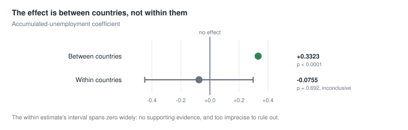

### Robustness and validation

Wild cluster bootstrap, null-imposed: **p = 0.0005** in the primary
specification (the 1/2,000 resolution floor). Worst result across Rademacher,
Webb and Mammen weights × three seeds: **p = 0.0070**.

Leave-one-country-out: max change 12.7%; dropping Greece changes it by −0.8%.
No instability flags.

> The first bootstrap implementation used unrestricted residuals and returned
> p = 0.82 against t = 9.69 — obvious nonsense. Fixed by refitting under the
> null and resampling those residuals.

### What this does not establish

That annual increases in accumulated exposure caused, or even tracked, annual
increases in hardship within Greece. The p = 0.058 equality test **fails to
reject** equality; it is not evidence the two are equal, and the point estimates
remain materially different (−0.076 against +0.332).

### Decision

**Frozen** at tag `p5f-frozen`. Eight wording rules locked in
`p5f_frozen_result.json`. Classification performed by `scripts/mundlak_rule.py`
(23 tests), not by judgement.

### Notes from review

This is the stage that most changed what the project is allowed to claim, and
the wording rules are strict because the tempting sentence is so close to the
defensible one.

"As exposure accumulated, hardship rose" is banned outright. It describes a
within-country dynamic the analysis does not support, and it is what most
readers will assume the between-country result means unless told otherwise.

The `p=0.058` equality test caused a specific argument. It fails to reject
equality of the within and between coefficients — and it is *not* evidence they
are equal. The point estimates remain −0.076 and +0.332. A rule was locked
requiring both facts to be stated together, because quoting the p-value alone
implies a conclusion the test cannot deliver.

The bootstrap was also wrong on the first attempt: unrestricted residuals gave
p=0.82 against t=9.69. Nonsense loud enough to notice — which is the only reason
it was caught, and an argument for reporting test statistics alongside p-values.

### Where the detail lives

`scripts/54_p5_inference_audit.py`, `scripts/mundlak_rule.py`,
`scripts/test_mundlak_rule.py` ·
`data/processed/p5_audit.csv`, `p5_bootstrap.csv`, `p5_influence.csv`,
`p5f_frozen_result.json` ·
`docs/publication_strategy.md` § "P5 result: OUTCOME B"

---

## P3a — Does breadth of disadvantage add anything?

### In plain words

We tested whether counting how many *different kinds* of hardship a country
accumulates adds predictive value beyond what we already had. It does not — it
actively makes things worse. Adding it pushed Greece's gap from 7 points back up
to 10, and Greece from rank 3 back to rank 1. The variable also flipped sign in
a way we could not interpret, so we left it uninterpreted rather than
constructing a story around it. Recorded as a null.

### Results

| Specification | Greece residual | Rank | n |
|---|---|---|---|
| Frozen P3 | 6.93 | 3 of 27 | 269 |
| P3 + accumulated breadth | **10.39** | **1 of 27** | 269 |

Breadth coefficient −2.17, a stable conditional sign reversal, **left
uninterpreted** by decision.

Common-sample verification confirms 269 rows in both specifications, so the
comparison is clean.

### Decision

**Failed the incremental criterion, and reversed sign conditionally.** This is
a result about the specification, not a power-based null: breadth measurably
worsened the model it was added to. No MDE was computed for this family, so it
must not be recorded as *unsupported with adequate power*. The universe was
frozen in `p3a_frozen_universe.json` before testing.

### Notes from review

The sign reversal was left uninterpreted deliberately, and that was a choice
made against real temptation. A conditional coefficient of −2.17 on a breadth
measure invites a story about compensating adjustment or habituation. Any such
story would have been constructed after seeing the sign, on a variable that had
just failed its pre-registered test.

Freezing the universe first is what made the null publishable. Without it, a
failed breadth measure would simply have been dropped and never mentioned —
which is how null results disappear.

### Where the detail lives

`scripts/55a_p3a_freeze_universe.py`, `scripts/55b_p3a_family_d.py` ·
`data/processed/p3a_frozen_universe.json`, `p3a_results.csv`,
`p3a_individual_indicators.csv` ·
`docs/publication_strategy.md` § "P3a result"

---

## E0 — Data and construct map

### In plain words

E0 was a data preparation and quality-control stage. **No new models were run
and no search for significant results took place.** Five things happened.

**1. Put the data in one place.** We combined the existing model data with
additional variables from the statistical appendix. The result covers 27 EU
countries from 2015 to 2024.

**2. Checked whether the data are complete.** We recorded how many countries and
years are available for every variable. Most have complete coverage; a few have
clearly documented gaps.

**3. Described what every variable actually measures.** For each one we recorded
its source and unit; whether higher or lower values indicate hardship; whether
it is objective, self-reported or contextual; whether it overlaps with another
variable; and whether and how it can be accumulated over time.

**4. Separated variables that look similar but measure different things.**
Inflation is not the price level. Migration is not unemployment. Inequality is
not deprivation. Working hours alone do not necessarily indicate hardship. And
arrears and unexpected expenses sit very close to the subjective-hardship
question itself.

**5. Compared relationships in three different ways** — across all
country-years, between countries' average positions, and within countries as
conditions changed over time. Some relationships that look strong across
countries turn weak or reverse direction within them. Pooled correlations alone
would have produced misleading variable groups.

That work supported six defensible questions:

- Do material resources matter?
- Does labour-market exclusion matter?
- Does falling behind one's own past matter?
- Does wage-adjusted affordability matter?
- Does accumulated inflation matter?
- Does housing pressure matter?

A seventh group — proximate hardship indicators such as arrears — is kept
visible but **cannot be used as the headline explanation**, because it is too
close to the outcome being explained.

So E0's result is not a statistical conclusion. It is a documented map of the
available evidence, plus rules preventing incompatible, duplicated or circular
variables from being mixed in the next stage.

### Notes from review

The first proposed grouping was rejected, and the reasons are worth keeping.

*Families were being fitted, not theorised.* `net_migration` and `s80s20` had
been assigned to whichever family they correlated with best — immediately after
stating that correlation should validate theory groupings, not define them. Both
are now contextual or standalone retests.

*"Coherence" was an undefined number.* A ratio of within-family to
between-family mean |r|, presented as if it were interpretable on its own.

*HICP was a category error.* The three HICP series are inflation *rates*, and
they had been pooled as country "price levels". The correlation evidence then
settled the matter independently: near-zero pooled against `wadj_a01`, and
sign-reversing between the views.

*Four variables were wrongly ruled out.* `real_wages_idx`, `real_income_idx`,
`arop_threshold_real` and `pct_below_peak` were marked "already indexed" and so
ineligible for accumulation — when the project had already built accumulations
from all four, one of which (`wage_years_below_2008`) was an FDR survivor.

The binary eligible/ineligible field was the root cause of that last error, and
it was replaced with the six-way taxonomy rather than corrected in place.

> Two errors were caught in review and corrected. The correlation tables
> originally left out the outcome itself, which made the intended exploration
> impossible. And four variables were wrongly marked ineligible for
> accumulation when the project had already built accumulations from all four —
> one of them a surviving result from an earlier stage.

---

### Step 1 — The combined dataset

One table: **27 EU countries · 2015–2024 · 270 country-year rows · 68 columns**,
carrying hardship, AROP, AROPE and the candidate variables together. Seventeen
series were merged in from the statistical appendix.

`data/processed/e0_extended_panel.csv`

### Step 2 — Coverage results

Coverage is generally strong: **24 of 31 variables are complete at 270/270**,
all 27 countries in every year. The seven exceptions are all documented:

| Variable | n_obs | Countries | What is missing |
|---|---:|---:|---|
| `arop_threshold_real` | 260 | 26 | **Croatia** entirely — its threshold series begins too late to index to 2008 |
| `arrears` | 268 | 27 | Luxembourg 2018, 2019 |
| `saving_rate` | 268 | 27 | Bulgaria 2023, 2024 |
| `debt_to_income` | 268 | 27 | Bulgaria 2023, 2024 |
| `real_income_idx` | 268 | 27 | Bulgaria 2023, 2024 |
| `net_migration` | 269 | 27 | Portugal 2024 |
| `housing_cost_overburden` | 269 | 27 | France 2021 |

Revised AROPE covers all 27 countries in every year, verified, with no splice
required.

Most comparisons can therefore use the full panel. Anything involving the real
AROP threshold runs on a smaller sample or as a clearly labelled sensitivity
check — and because the gap is one whole country rather than scattered
country-years, that sample is 26 countries, not 27.

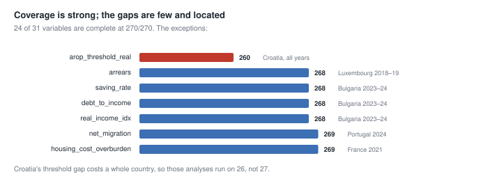

`data/processed/e0_coverage.csv` — columns mean:

| Column | Meaning |
|---|---|
| `n_obs` | available country-years |
| `pct` | percentage coverage |
| `countries` | countries represented |
| `min_year_reporters` | smallest number of countries available in any one year |
| `years` | years with observations |

### Step 3 — Variable-classification results

Each of the **31 variables** is documented by: meaning and unit; Eurostat
source; expected adverse direction; whether it is a level, flow or derived
measure; whether it is objective, proximate, contextual or mechanically
related; how it could be accumulated; and whether it is a primary measure,
sensitivity, contextual item or retest.

| Variable | Classification |
|---|---|
| `aic_pps_pc` | primary resources measure (C1) |
| `ltu_rate` | primary current labour measure (C2) |
| `wadj_a01` | wage-adjusted affordability (C4) |
| `hicp` | **inflation, not a price-level measure** (C5) |
| `arrears`, `unexpected_expenses` | proximate, same survey framework as hardship (P1) |
| `net_migration` | contextual — **not** unemployment |
| `s80s20` | inequality retest — **not** deprivation |
| `debt_to_income`, `saving_rate` | ambiguous-direction context |
| `work_effort_squeeze` | overlaps strongly with hours and hourly compensation |

`cum_excess_unemployment` is the primary *historical* labour measure, but it is
**not** one of the 31 registry rows — it is a derived accumulation carried in
from the earlier P3 work, and it appears in the frozen construct map as C2's
accumulated representative rather than in the E0 registry.

Roles assigned across the 31:

| Role | Count |
|---|---:|
| Primary representative | 9 |
| Sensitivity variant | 9 |
| Proximate diagnostic | 4 |
| Contextual descriptive | 3 |
| Mechanical comparator | 3 |
| Standalone retest | 2 |
| Standalone retest of known null | 1 |

`data/processed/e0_variable_registry.csv`

Related technical detail:

| File | Holds |
|---|---|
| `e0_provenance.json` | sources and versions |
| `e0_lineage.csv` | shared construction inputs |
| `e0_nonindependence_flags.csv` | definitional and construction overlaps — **35 flags** across four types |

### Step 4 — Correlation results

The three views showed that relationships depend on which question is being
asked.

| Pair | Pooled | Between | Within | Reading |
|---|---:|---:|---:|---|
| `aic_pps_pc` – `consumption_pc` | 0.899 | 0.972 | 0.831 | resources measures are highly redundant |
| `aic_pps_pc` – `hourly_comp` | 0.903 | 0.915 | 0.932 | |
| `ltu_rate` – `unemployment_rate` | 0.914 | 0.897 | 0.961 | labour measures are highly redundant |
| `ltu_rate` – `employment_rate` | −0.769 | −0.759 | −0.802 | |
| `wadj_a01` – `work_effort_squeeze` | **0.963** | 0.968 | 0.924 | two versions of one structural position — may never enter a model together |
| `wadj_a01` – `hicp` | 0.058 | **0.480** | **−0.285** | **sign reverses** — inflation and affordability are not one construct |
| `wadj_a01` – `hicp_food` | 0.087 | 0.637 | −0.253 | sign reverses |
| `wadj_a01` – `hicp_housing` | 0.011 | 0.222 | −0.130 | sign reverses |

The three HICP pairs are the reason C5 was separated from C4 on evidence rather
than preference: near-zero pooled, moderately positive between countries,
negative within them.

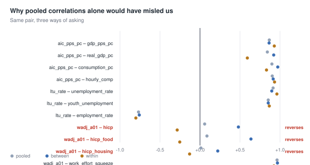

| File | Holds |
|---|---|
| `e0_corr_pooled.csv` | across all country-years |
| `e0_corr_between.csv` | between countries' average positions |
| `e0_corr_within.csv` | within countries over time |
| `e0_redundancy.csv` | primary–sensitivity redundancy, all three views, with `sign_flips` |

All three correlation views carry five comparator columns: `subjective_poverty`,
`arop`, `arope`, `gap_subj_arop`, `gap_subj_arope`.

### Step 5 — The frozen construct map

Six objective constructs plus one diagnostic:

| ID | Construct | Primary representative |
|---|---|---|
| C1 | Material resources | `aic_pps_pc` |
| C2 | Labour-market exclusion | `ltu_rate` (current) / `cum_excess_unemployment` (accumulated) |
| C3 | Loss against own past | four individual primaries, **no composite** |
| C4 | Wage-adjusted affordability | `wadj_a01` |
| C5 | Inflation exposure | `hicp` |
| C6 | Housing pressure | `housing_cost_overburden`, base year **2010** |
| P1 | Proximate material hardship | `severe_mat_soc_deprivation` — **diagnostic only, never headline** |

C6 uses 2010 rather than 2008 because coverage only reaches 27 reporters from
2010.

`data/processed/construct_map_frozen.json`

### Construction and non-independence findings

A six-way accumulation taxonomy replaced the earlier binary
eligible/ineligible field: `direct_excess`, `fixed_base_shortfall`,
`duration_below_base`, `compounded_change`, `ambiguous_direction`,
`not_applicable`.

**35 non-independence flags** across four types: `arithmetic_coupling`,
`definitional_overlap`, `component_overlap`, `construction_overlap`.

### What E0 does not establish

Nothing empirical about the outcome. E0 is construction and classification
only. The data are mostly complete, but many candidate variables overlap, some
have ambiguous meanings, and pooled correlations alone would have produced
misleading families. What E0 buys is that the next stage can test clearly
separated hypotheses instead of searching across a loosely assembled variable
list.

### Where the detail lives

`scripts/57_e0_extended_panel.py`, `scripts/58_e0_extension.py`,
`scripts/59_freeze_construct_map.py` ·
`data/processed/e0_extended_panel.csv`, `e0_variable_registry.csv`,
`e0_coverage.csv`, `e0_corr_{pooled,between,within}.csv`,
`e0_nonindependence_flags.csv`, `e0_redundancy.csv`, `e0_lineage.csv`,
`e0_provenance.json`, `construct_map_frozen.json` ·
commits `9223306`, `e791e01`, `2103b3d`

---

## PRE — Pre-registration and power

### In plain words

Everything about how Family E will be tested was written down and committed to
git **before any result existed** — the exact model, the exact transformations,
what counts as success, and how much of a signal we could realistically detect.

That last part is the uncomfortable one. The power calculation says we can only
reliably detect effects of about **9.3 points**, which is very large. Most of
what we are about to test will probably come back looking like nothing — but
"we found nothing" and "there is nothing" are different statements. Anything
below that threshold gets labelled **inconclusive under available power**, not
*unsupported*.

The reason the threshold is so high is visible in the numbers: almost all the
usable variation is between countries (SD 12.87) rather than within them
(SD 4.01). That is the same fact P5 found, arrived at from a different direction.

### Questions and outcomes

| | Formula |
|---|---|
| **Primary** | `subjective_poverty ~ arop + C(time) + <construct>` |
| **Secondary** | `(subjective_poverty - arop) ~ C(time) + <construct>` |

AROP is not re-added on the right-hand side of the secondary formula — it is
already inside the outcome by subtraction.

**A secondary result cannot override a primary null.** It may qualify or
illustrate a primary finding; it may never create one.

### Transformations and baselines

Exact formula, direction, baseline and floor fixed for all 11 primaries. All
accumulations verified as **running sums with no backward leakage of future
information**.

Two wording distinctions carried in from review:

- **Housing accumulation** measures deterioration *since the 2010 baseline*, not
  total burden. A country already overburdened in 2010 receives no credit for
  that level.
- **Compounded HICP** measures cumulative *price growth*, not affordability and
  not hardship. Affordability is C4's separate question.

### Multiple-testing families

Three declared BH families: current primaries, accumulated primaries, secondary
outcome. Correction does **not** span the earlier exploratory families A–D.

Sensitivity variants cannot become discoveries when the primary fails.

### Minimum detectable effects

| Effect (SD per SD) | Effect (points per SD) | Power |
|---:|---:|---:|
| 0.1 | 1.33 | 0.117 |
| 0.2 | 2.65 | 0.233 |
| 0.3 | 3.98 | 0.390 |
| 0.4 | 5.31 | 0.535 |
| 0.5 | 6.64 | 0.672 |
| 0.6 | 7.96 | 0.797 |
| **0.7** | **9.29** | **0.895** |
| 0.8 | 10.62 | 0.970 |
| 0.9 | 11.95 | 0.988 |
| 1.0 | 13.27 | 0.995 |

**MDE at 80% power ≈ 0.70 residual SD = 9.29 points.**

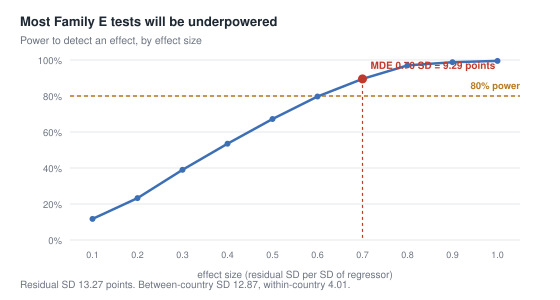

Residual SD 13.27 · between-country SD **12.87** · within-country SD **4.01**.

> Two bugs were found and fixed in this simulation before publication. Noise
> drawn by permuting residuals within country preserved each country's mean and
> so correlated with the regressor — a planted +5.31 came back as −2.35, wrong
> in sign and magnitude. And detection counted any p < 0.05 as a hit regardless
> of coefficient sign. Both would have published nonsense.

### Decision criteria

All six must hold:

1. Direction matches the pre-registration
2. FDR-adjusted result survives within its declared family
3. Wild-cluster bootstrap supports it
4. Coefficient is leave-one-country-out stable in sign
5. Greece's **equal-sample** absolute residual improves
6. No proximity or construction-overlap rule is violated

### Frozen-model safeguards

The combined model is the frozen P3 specification. The 15 pairwise family
combinations are **not** reopened. Nothing in E may alter `p5f-frozen`.

### Where the detail lives

`scripts/60_e_preregistration.py`, `scripts/61_e_mde.py` ·
`data/processed/e_preregistration.json`, `e_mde.csv` ·
commits `a747e7a` (pre-registration, no results), `476e177` (MDE)

---

# Part II — Pending stages

## EDA — Descriptive groundwork

### In plain words

Before testing anything, what does the data actually look like? This stage runs
no models, produces no p-values and can neither support nor refute anything. It
exists so the modelling that follows is read against a picture of the data
rather than in the abstract.

Three things came out of it, and together they set up everything after.

**The gap is enormous and AROPE barely dents it.** Greek subjective hardship
runs about 53 points above AROP. Switching to AROPE — the EU's broader measure,
which adds material deprivation and low work intensity — closes only about a
fifth of that. Forty-three points remain.

**Greece is not an outlier on everything, but it is an extreme outlier on
several things at once.** It is worst in the EU on long-term unemployment,
wage-adjusted affordability and housing-cost overburden, and last of 27 on real
wages. Yet on relative income poverty (AROP) it ranks 7th — unremarkable.

**Two very different recoveries happened at once.** The labour market genuinely
recovered: Greece's long-term unemployment gap closed by 71%. Wages and
resources went the other way — real wages diverged 78%, material resources 93%.
And the hardship gap itself did neither. It is **flat**: 48.8 points in 2015,
49.6 in 2024.

That last combination is the whole reason the later stages look at accumulated
history rather than current conditions. Something recovered and hardship did not
follow it down.

> A caution about this stage that applies to all of it: these are descriptive
> patterns, and the construct map (`2103b3d`) and E test pre-registration
> (`a747e7a`) were both frozen **before** this ran. Nothing seen here was
> allowed to choose what gets tested.

### The paradox, and the AROPE bridge

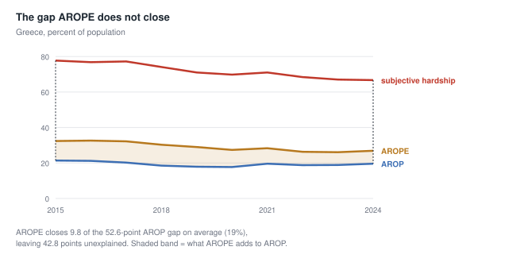

| Year | Subjective | AROP | AROPE | subj − AROP | subj − AROPE | AROPE closes |
|---:|---:|---:|---:|---:|---:|---:|
| 2015 | 77.7 | 21.4 | 32.4 | 56.3 | 45.3 | 11.0 |
| 2019 | 71.0 | 17.9 | 29.0 | 53.1 | 42.0 | 11.1 |
| 2022 | 68.4 | 18.8 | 26.3 | 49.6 | 42.1 | 7.5 |
| 2024 | 66.7 | 19.6 | 26.9 | 47.1 | 39.8 | 7.3 |

Mean gap against AROP **52.6 points**; against AROPE **42.8**. AROPE closes
**9.8 points — 19%** — and its contribution is *shrinking*, from 11.0 points in
2015 to 7.3 in 2024.

So the broader measure helps, and is worth using. It does not resolve the
paradox.

### Where Greece ranks

Rank 1 = worst in the EU27, on each variable's own adverse direction. Latest
year available.

| Construct | Variable | Greece | EU median | Rank |
|---|---|---:|---:|---:|
| outcome | `subjective_poverty` | 66.7 | 17.1 | **1/27** |
| outcome | `arop` | 19.6 | 15.5 | 7/27 |
| outcome | `arope` | 26.9 | 19.6 | 3/27 |
| outcome | `gap_subj_arop` | 47.1 | 1.2 | **1/27** |
| C1 | `aic_pps_pc` | 21,310 | 24,129 | 22/27 |
| C2 | `ltu_rate` | 5.4 | 1.7 | **1/27** |
| C3 | `real_wages_idx` | 68.2 | 111.8 | **27/27** |
| C3 | `real_income_idx` | 84.1 | 120.6 | **26/26** |
| C3 | `arop_threshold_real` | 78.8 | 119.1 | **26/26** |
| C3 | `pct_below_peak` | 11.2 | 0.0 | **1/27** |
| C4 | `wadj_a01` | 173.1 | 121.0 | **1/27** |
| C5 | `hicp` | 3.0 | 2.6 | 9/27 |
| C6 | `housing_cost_overburden` | 28.9 | 6.7 | **1/27** |
| P1 | `severe_mat_soc_deprivation` | 14.0 | 4.3 | 3/27 |

The AROP rank of 7 next to the subjective rank of 1 is the paradox in a single
row. Note also that all four C3 measures — loss against one's own past — put
Greece at or near the bottom of Europe.

### What recovered, and what did not

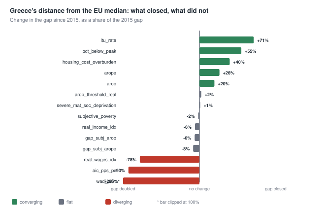

Movement in Greece's gap against the EU median, 2015 → 2024, as a share of the
2015 gap. Under 10% counts as flat.

| Variable | Gap 2015 | Gap 2024 | Shift | Rank | Trend |
|---|---:|---:|---:|---:|---|
| `ltu_rate` | 12.8 | 3.7 | **+71%** | 1 → 1 | converging |
| `pct_below_peak` | 24.8 | 11.2 | +55% | 1 → 1 | converging |
| `housing_cost_overburden` | 36.8 | 22.2 | +40% | 1 → 1 | converging |
| `arope` | 9.9 | 7.3 | +26% | 3 → 3 | converging |
| `arop` | 5.1 | 4.1 | +20% | 7 → 7 | converging |
| `severe_mat_soc_deprivation` | 9.8 | 9.7 | +1% | 4 → 3 | flat |
| `arop_threshold_real` | −41.3 | −40.3 | +2% | 26 → 26 | flat |
| **`subjective_poverty`** | 48.8 | 49.6 | **−2%** | 1 → 1 | **flat** |
| `real_income_idx` | −34.5 | −36.5 | −6% | 27 → 26 | flat |
| `gap_subj_arop` | 43.2 | 45.9 | −6% | 1 → 1 | flat |
| `gap_subj_arope` | 38.9 | 42.1 | −8% | 1 → 1 | flat |
| `real_wages_idx` | −24.5 | −43.7 | **−78%** | 26 → 27 | diverging |
| `aic_pps_pc` | −1,460.7 | −2,819.2 | −93% | 16 → 22 | diverging |
| `wadj_a01` | 14.7 | 52.1 | −255% | 10 → 1 | diverging |

`hicp` is excluded: it is an annual inflation *rate*, so comparing 2015's value
with 2024's is not a recovery comparison at all.

**Converging (5):** long-term unemployment, share below peak, housing
overburden, AROP, AROPE.
**Flat (6):** real income, real threshold, deprivation, and the outcome and both
outcome gaps.
**Diverging (3):** real wages, material resources, wage-adjusted affordability.

The labour market recovered substantially and hardship did not follow. Incomes
and wages did not recover at all.

### Correlation views

Already produced at E0 and not repeated here: `e0_corr_pooled.csv`,
`e0_corr_between.csv`, `e0_corr_within.csv`, plus `e0_redundancy.csv`. See
[E0 step 4](#e0-data-and-construct-map) for the sign reversals that shaped the
construct map.

### What this does not establish

Nothing inferential. Descriptive corroboration tier only. In particular:

- A variable converging or diverging says nothing about whether it *explains*
  hardship. `ltu_rate` converged strongly and is still the construct with the
  strongest prior support.
- The flat outcome gap is not evidence that nothing works. It is the thing to
  be explained.
- No correlation, rank or trajectory here may be cited as support for any
  construct. The tests that can do that are pre-registered and have not run.

### Notes from review

An earlier version of the recovery table used a plain "did the gap shrink"
flag, which classified `arop_threshold_real` as converging on a movement of 1.0
point across nine years, and `severe_mat_soc_deprivation` on 0.1. Both are flat
in any meaningful sense. Movement is now measured against the size of the
original gap with a 10% flat band, which changed six rows.

`hicp` was in the recovery table as well, comparing two different years'
inflation rates as though they were levels — precisely the category error E0
was built to catch, reappearing one stage later in different clothing.

### Where the detail lives

`scripts/67_eda_descriptives.py` ·
`data/processed/e_descriptives.csv`, `e_descriptive_ranks.csv`,
`e_descriptive_recovery.csv`

---

## EA — Deprivation-free companion audit

### In plain words

P3's headline model contains one predictor that, by the rules we adopted later,
should not be in a headline model: severe material and social deprivation comes
from the same survey system as the outcome we are trying to explain. Using it to
predict hardship is closer to explaining a thing with itself than the other five
predictors are.

We are not going to fix this by choosing better words. We run **one** extra
model — same countries, same years, same year effects, the same five remaining
predictors, with that one variable removed — and see what happens to the result.
Nothing gets substituted in its place, and we do not go looking for a better
companion if the first one disappoints. That is the whole point of writing this
down beforehand.

Three things can happen, and all three were decided before the model was run. If
the result largely survives, the cleaner model becomes the headline. If it
weakens moderately, we report a range instead of a single number and say openly
that it depends on how strictly you define distance from the outcome. If it
collapses, we say plainly that the P3 result depends materially on a
same-instrument deprivation measure.

The rule that matters most is the one preventing us from cheating: **we may
never pick between the two models just because one produces the smaller
residual.** Both get reported whatever happens.

### Question

How much of the frozen P3 result depends on `severe_mat_soc_deprivation`, a
predictor E0 classifies `proximate_same_instrument`?

### Two roles

| | Frozen P3 | Companion |
|---|---|---|
| Status | audited historical benchmark, unchanged | new, pre-specified |
| Label | frozen P3 **mixed-distance** model | deprivation-free companion |
| Predictors | 6 | 5 |
| `severe_mat_soc_deprivation` | retained | **removed** |
| Sample | 2015-2024, n = 269 | identical |
| Year effects | yes | identical |
| Substitutions | -- | **none permitted** |

### Comparisons required

Identical observations (verified by row count and index) - Greece residual and
rank - accumulated-unemployment coefficient - wild-cluster inference -
leave-one-country-out stability - VIFs - within/between decomposition **only if**
the companion becomes headline.

### Decision rule

Implemented as `scripts/ea_rule.py`, tested by `scripts/test_ea_rule.py`
(37 tests). The function is the pre-registration; the prose below describes it.

> Prose alone already failed once here. The first P3 run reported the strongest
> branch because an if/else chain ended in a default `else`.

| Outcome | Condition | Consequence |
|---|---|---|
| **A** | degradation <= 3.0 points, rank does not deteriorate, all stability gates pass | companion becomes the cleaner headline specification |
| **B** | degradation <= 8.0 points | material support, reported as an explicit **range** across proximity choices |
| **C** | degradation > 8.0 points, rank deteriorates, or any stability gate fails | frozen P3 depends materially on an official but same-instrument deprivation measure |

Degradation is the companion's absolute residual minus frozen P3's 6.93.
Thresholds are anchored to the 20.12-point narrowing accumulation delivers
(27.05 -> 6.93): 3.0 points is about 15% of it, 8.0 points about 40%.

**Hard gates, any one forcing C:** coefficient not positive - bootstrap does not
support - not LOO sign-stable - max VIF > 10.0 - Greece's rank deteriorates.

**The anti-selection rule.** Outcome A is earned by proximity cleanliness plus
stability, never by producing the smaller residual. A companion residual
*smaller* than frozen P3's is recorded and never rewarded -- dropping a predictor
cannot improve out-of-sample standing for a reason this design can attribute.
Both specifications are reported under every outcome, including A.

### Notes from review

EA exists because of a label, and the argument that produced it is worth
recording precisely.

Review found that P3 — described throughout as the "objective-only" model —
contains `severe_mat_soc_deprivation`, which E0 later classified
`proximate_same_instrument`, construct P1: the construct the E pre-registration
reserves as diagnostic-only and never headline. P3 excludes the *closest*
proximate measures, but is not free of same-instrument ones.

The first proposed fix was wording: relabel and move on. That was rejected, and
correctly. The reasoning: freezing a result protects its specification, numbers
and interpretation from post-hoc alteration — it does not oblige anyone to keep
using an inaccurate label, and it does not forbid a pre-registered audit of what
the result depends on. Two roles, not one correction.

The anti-selection rule was written before the run for an obvious reason: with
two specifications on the table, whichever produced the smaller residual would
have been extremely easy to prefer for stated reasons that were not the real
ones.

The 3.0 and 8.0 point bands are the one number chosen without external anchor.
They are pinned to the 20.12-point narrowing accumulation delivers (≈15% and
≈40%), so "moderate" and "sharp" mean something on this problem — but a
different anchoring would have given different bands, and that should be
remembered if EA is ever cited as a precedent.

### Minimum detectable effect

No new MDE. EA compares two specifications on identical observations rather than
running a new significance test. If the companion becomes headline, its
within/between evidence inherits the published floor of 0.70 SD = 9.29 points
and its labelling rule.

### Results

Frozen P3 reproduced exactly on this run: residual +6.93, rank 3/27, R² 0.907,
n = 269. Nothing frozen changed.

| | Frozen P3 | Companion |
|---|---:|---:|
| Predictors | 6 | 5 |
| n | 269 | 269 (identical rows) |
| R² | 0.907 | **0.821** |
| Greece residual | **+6.93** | **−9.39** |
| Greece rank | 3 of 27 | 25 of 27 |
| `cum_excess_unemployment` | +0.2808 (se 0.0290) | +0.2271 (se 0.0459) |
| Wild-cluster bootstrap p | 0.0005 | 0.0285 |
| LOO coefficient range | — | +0.1655 to +0.2490, sign-stable |
| Max VIF | — | 4.82 |

Equal-sample rule: `severe_mat_soc_deprivation` had no additional missing values,
so re-deriving complete cases would have given the same 269 rows. The constraint
bound nothing here — but it was verified before estimation, not after.

**Greece's residual reverses sign.** Frozen P3 under-predicts Greek hardship by
6.93 points. The companion *over*-predicts it by 9.39. Rank 25 of 27 is third
from the opposite end of the ladder: Greece did not leave the extreme group, it
crossed to the other tail.

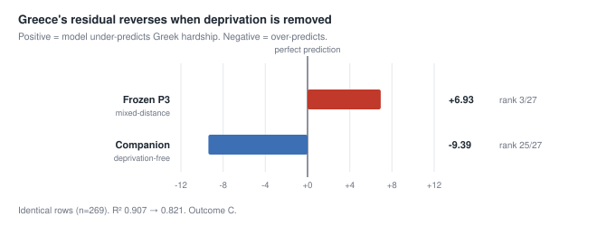

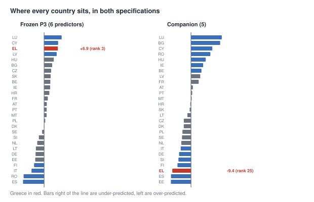

Removing deprivation also destroys the narrowing story. In frozen P3,
accumulation moves Greece +27.05 → +6.93. In the companion the same comparison
is +9.52 → −9.39: not a narrowing, a crossing.

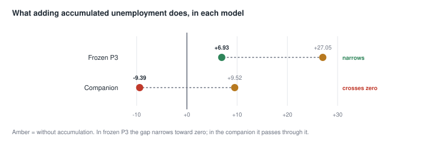

### The decision rule failed, and had to be corrected

**The rule as pre-registered returned Outcome A.** That verdict was wrong, and
the reason matters more than the result.

`decide()` compared *absolute* residuals: |−9.39| − |6.93| = +2.46 points, inside
band A's 3.0-point threshold. And its rank gate was one-tailed — it checked only
whether Greece became *more* under-predicted, so rank 3 → 25 registered as an
improvement.

Both are implementation defects, not disagreements with the pre-registration.
The pre-registered prose for Outcome A reads "companion still materially
narrows Greece's residual." A residual crossing zero does not narrow under any
reading of that sentence. The function diverged from the condition it was
written to implement — the same class of failure as the P3 `branch_rule` default
`else`, which also returned the strongest conclusion on a case its author had
not anticipated.

Two corrections, both regression-tested:

- **Sign reversal is not narrowing.** A residual crossing zero returns C unless
  it lands within 3.0 points of zero, in which case it genuinely did narrow.
- **Extremeness is two-tailed.** Tail position is `min(rank, n − rank + 1)`, so
  rank 3 and rank 25 of 27 both score 3. Greece's tail position is *unchanged*.

`test_ea_rule.py` grew from 37 to 47 tests; the observed case (−9.39 at rank 25)
is now a named regression test.

### Notes from review

Two things about this correction need to be defensible, not just stated.

**Why this is fixing an implementation, not moving a goalpost.** The
pre-registered prose for Outcome A reads *"companion still materially narrows
Greece's residual."* A residual crossing zero does not narrow under any reading
of that sentence. So the function and the frozen prose disagreed, and the prose
is the pre-registration. The prose was not touched.

**What would make this illegitimate.** If the prose had been ambiguous — if it
had said "improves" or "performs comparably" — then choosing an interpretation
after seeing −9.39 would be exactly the post-hoc rule-fitting the whole protocol
exists to prevent. The fix survives only because "narrows" is unambiguous about
direction.

The reversal tolerance (3.0 points) *was* chosen while looking at the result. It
does not change this verdict — any tolerance below 9.39 yields C — but it was
not set blind, and it should be treated as provisional if EA is reused.

Worth noting what the defect was not: not a coding slip. Both defects come from
the same unexamined assumption — that the residual would stay positive and only
shrink. Every test written before the run shared that assumption, which is why
47 tests passed while the rule was wrong.

### Decision

**Outcome C — the frozen P3 result depends materially on an official but
same-instrument deprivation measure.**

Both specifications are reported, per the anti-selection rule.

### Interpretation

`severe_mat_soc_deprivation` was carrying the fit. Without it, R² falls from
0.907 to 0.821, and the remaining predictors — long-term unemployment, income,
wage history, accumulated unemployment — predict Greece should report
*substantially more* hardship than it does.

That is a finding about the evidence layers, not a repair of P3. Greece's
hardship tracks its deprivation closely; conditional on labour-market and income
data alone it is over-predicted. The two layers do not tell the same story, which
is precisely why they may not sit under one "objective" label.

### What this does not establish

That the companion is the better model — it is not, and Outcome C means it does
not take the headline. That deprivation "causes" the fit. And nothing about
`p5f-frozen`, which is unchanged and was re-verified on this run.

The accumulated-unemployment coefficient survives in the companion (+0.2271,
bootstrap p = 0.0285, LOO sign-stable), so the accumulation result is not itself
an artefact of deprivation. What depends on deprivation is Greece's *position*
relative to prediction, not the coefficient.

### What this does not establish

Nothing about `p5f-frozen`, which EA may not alter. And a clean companion result
would not make the model "objective" in the strict sense -- it would make it
free of *same-instrument* predictors, which is a narrower claim.

### Where the detail lives

`scripts/63_ea_preregistration.py`, `scripts/ea_rule.py`,
`scripts/test_ea_rule.py` -
`data/processed/ea_preregistration.json`

---

## E1 — Current-level constructs

### In plain words

The first real test. Each of the six objective constructs was put, one at a
time, against the same baseline — relative income poverty plus year effects —
to ask whether it explains Greek hardship beyond what AROP already accounts
for.

**Three survived everything: material resources, labour-market exclusion, and
wage-adjusted affordability.** Countries with less to spend, more long-term
unemployment, and worse affordability relative to wages report more hardship,
and those results held up under every check we had pre-committed to.

**Six came back inconclusive** — and *inconclusive* is the honest word, not
"nothing there". With this panel we can only reliably detect quite large
effects, so a result that fails is usually a result we could not have found
even if it were real.

**Two of those six are more interesting than a plain null.** Share below peak
and housing-cost overburden looked overwhelmingly significant on the standard
test — and then collapsed under the bootstrap, to p = 0.40 and p = 0.55. That
is not a technicality. With 27 countries and predictors that vary mostly
*between* them rather than within, the standard test is far too confident. The
bootstrap is the honest one, and it is the one we committed to in advance.

Deprivation was tested and then set aside by rule, not by result. It is a
same-instrument measure and can never be a headline explanation — the same
issue EA had already found sitting inside frozen P3.

### Specification

```
primary:    subjective_poverty ~ arop + C(time) + <construct>
secondary:  (subjective_poverty - arop) ~ C(time) + <construct>
```

Family 1 holds **nine** tests: C3 contributes four individual primaries, since
the frozen construct map gives it no composite. P1 is run but excluded from the
family and blocked by the proximity gate.

Decision rule: `scripts/e_rule.py`, 40 tests, written before this ran.

### Results

| Con | Variable | Coef | SE | p raw | p FDR | Boot p | Dir | Effect (SD) | n | Outcome |
|---|---|---:|---:|---:|---:|---:|:--:|---:|---:|---|
| C1 | `aic_pps_pc` | −0.0013 | 0.0003 | 0.0000 | 0.0000 | **0.0055** | ok | 0.59 | 270 | **supported** |
| C2 | `ltu_rate` | +4.3402 | 0.7802 | 0.0000 | 0.0000 | **0.0085** | ok | 0.81 | 270 | **supported** |
| C4 | `wadj_a01` | +0.3110 | 0.0696 | 0.0000 | 0.0000 | **0.0005** | ok | 0.69 | 270 | **supported** |
| C3 | `pct_below_peak` | +1.8675 | 0.4258 | 0.0000 | 0.0000 | 0.4005 | ok | 0.62 | 270 | inconclusive |
| C6 | `housing_cost_overburden` | +1.1385 | 0.4305 | 0.0082 | 0.0147 | 0.5530 | ok | 0.54 | 269 | inconclusive |
| C3 | `real_income_idx` | −0.2168 | 0.2088 | 0.2991 | 0.4131 | — | ok | 0.31 | 268 | inconclusive |
| C5 | `hicp` | −0.9925 | 1.0007 | 0.3213 | 0.4131 | — | **wrong** | 0.27 | 270 | inconclusive |
| C3 | `real_wages_idx` | −0.0924 | 0.1826 | 0.6130 | 0.6531 | — | ok | 0.17 | 270 | inconclusive |
| C3 | `arop_threshold_real` | −0.0556 | 0.1237 | 0.6531 | 0.6531 | — | ok | 0.14 | 260 | inconclusive |
| P1 | `severe_mat_soc_deprivation` | +1.4524 | 0.4952 | 0.0034 | — | — | ok | 0.72 | 270 | **blocked by proximity** |

Every inconclusive result sits below the published MDE: the largest standardized
effect any of their intervals admits is 0.74–0.91 SD, so none can be called
*unsupported with adequate power*.

### What the bootstrap does

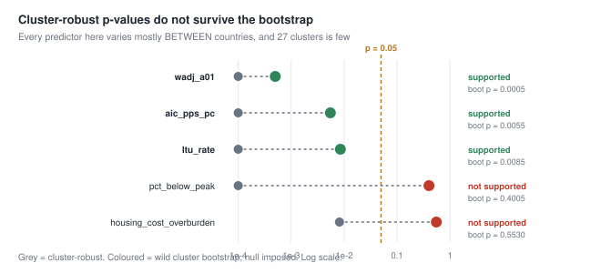

| Variable | Cluster-robust p | Bootstrap p | Verdict |
|---|---:|---:|---|
| `wadj_a01` | 0.0000 | 0.0005 | holds |
| `aic_pps_pc` | 0.0000 | 0.0055 | holds |
| `ltu_rate` | 0.0000 | 0.0085 | holds |
| `pct_below_peak` | 0.0000 | **0.4005** | collapses |
| `housing_cost_overburden` | 0.0082 | **0.5530** | collapses |

The correction is not uniform — it separates. Three survive at 0.0005–0.0085
while two go to 0.40 and 0.55, which is what a small-cluster correction is
supposed to do rather than deflating everything equally.

This is also P5's finding arriving from a third direction. When a predictor's
variation is overwhelmingly between countries, 27 clusters is a small sample no
matter how many country-years sit underneath it.

### Secondary outcome

BH family 3, corrected separately. AROP is not re-added on the right-hand side:
it is already inside the outcome by subtraction.

Two results clear FDR with the correct sign on the secondary outcome while their
primary did not survive: **`pct_below_peak`** and **`housing_cost_overburden`**.

They are recorded and **may not be promoted**. The pre-registration is explicit
that a secondary result may qualify or illustrate a primary finding and may
never create one — and these two are exactly the case that rule was written for,
since both are also the two whose primary collapsed under the bootstrap.

### Interpretation

The three supported constructs are all measures of *current standing*: what a
country has, how excluded its labour market is, and what wages buy. That is a
coherent group, and it is the group with the strongest prior support.

The four C3 measures — loss against one's own past — did **not** clear at
current levels. That is not evidence against C3. It is what the construct map
predicted would happen: C3 is about accumulated loss, and a current-level
snapshot is the wrong test for it. E4 is where C3 gets its real test.

C5 (inflation) came back with the wrong sign and nowhere near significance.

### What this does not establish

- Nothing about accumulated measures. Every result here is a current-level
  snapshot; the accumulated family is E4, a separate BH family.
- No causal claim. These are between-country associations conditional on AROP
  and year, on the same panel P5 showed to be dominated by between-country
  variation.
- The six inconclusive results are **not** evidence of absence. Their intervals
  still admit effects at or above the MDE.
- Deprivation's apparent significance is not a finding. It was blocked by rule
  before its p-value was consulted, and reporting it as a near-miss would defeat
  the purpose of the rule.

### Notes from review

**A bug that would have published four false contradictions.** The first run
reported `ltu_rate`, `pct_below_peak`, `wadj_a01` and `housing_cost_overburden`
as contradicting their pre-registered direction. They do not. The registry
stores `higher_is_worse` / `lower_is_worse` directly, and the script translated
from `"high"` / `"low"` — values that column has never held. Every variable
silently became `lower_is_worse`, so every positive coefficient read as wrong.
The variables that showed "ok" were right only by accident.

It was caught because `ltu_rate` at +4.34 being called a contradiction is
absurd on its face: more long-term unemployment predicting more hardship is the
least surprising result in the study. A subtler variable would have gone
through.

The same bug was in the EDA rank code, where it had already shipped: Greece's
worst-in-Europe real wages were displayed as rank 27/27 under a heading saying
rank 1 is worst. Fixed in both, and the corrected ranks put Greece at **rank 1
on ten of fifteen** variables rather than the mixture shown before.

**The lesson is the same one EA taught.** Both the E rule and the EA rule were
written and tested before any result existed, and both had 40+ passing tests.
Neither test suite touched the *translation layer* feeding the rule. A tested
decision function does not protect against wrong inputs.

### Where the detail lives

`scripts/68_e1_current_constructs.py`, `scripts/e_rule.py`,
`scripts/test_e_rule.py` ·
`data/processed/e1_results.csv`, `e1_secondary.csv`

---

## E2 — Current-level sensitivities

> **Protocol deviation, disclosed.** The within-construct FDR grouping used in
> this stage is **not** pre-registered. `e_preregistration.json` declares three
> BH families — current primaries, accumulated primaries, secondary outcome —
> and no within-construct sensitivity family. See
> [Protocol deviations](#protocol-deviations). E2 sensitivity FDR is a
> post-registration choice and must not be described as pre-registered
> inference.

### In plain words

Each construct was measured one way at E1. E2 asks whether that choice mattered
— swap in the other members of the same construct and see whether the answer
holds.

**Material resources is robust to two of its four alternatives.** Hourly
compensation and real GDP reproduce the result; consumption and GDP PPS point
the same way but do not clear every Greece-specific gate.

**Long-term unemployment is the most robust labour-market indicator**, while
the headline unemployment rate is not. The pattern is *consistent with* duration
mattering. It does not establish that duration rather than exclusion is the
operative distinction — employment rate also confirms C2, and that is evidence
for exclusion more generally.

**Nothing was promoted.** Three sensitivities belong to constructs whose primary
failed and cannot become findings by rule. None performed well either, so the
rule was not tested against temptation this time.

**Two specific inflation effects are ruled out** — annual food and housing
inflation, at the magnitude this design was declared able to detect. That is a
narrow statement, and the section below says exactly what it does not cover.

### The finding that reframes the study

The four proximate hardship items — arrears, inability to meet an unexpected
expense, inability to keep the home warm, severe material and social deprivation
— are the strongest predictors in the entire study. Arrears alone (0.96 SD)
exceeds every objective construct.

They are blocked from any headline explanation, and that remains correct. But
their *evidential* value is not zero, and reading them only as "too close to
use" misses what they establish.

**They are weak as causes and strong as validation.** If Greeks simply described
their circumstances more negatively — culture, mood, generalised distrust — we
would not expect that reporting style to align this tightly with unpaid bills,
absent emergency resources, and homes that are not adequately heated. It does.

> Greece's subjective-poverty result is **subjective in measurement, but not
> merely subjective in substance**. It closely tracks concrete material
> constraints: arrears, lack of emergency resources, and inadequate heating.

The distinction to hold on to:

| | Proximate items (P1) | Distant economic indicators |
|---|---|---|
| **As causal explanation** | limited — closely related symptoms | the appropriate tools |
| **As validation evidence** | strong — the feeling comes with concrete affordability failures | not what they are for |

Which gives the report a two-layer structure:

1. **Is the reported hardship real?** Arrears, emergency-expense capacity,
   heating and deprivation corroborate it strongly.
2. **What economic conditions lie behind it?** Income, wages, long-term
   unemployment, housing pressure, purchasing power and accumulated exposure
   address that separate question.

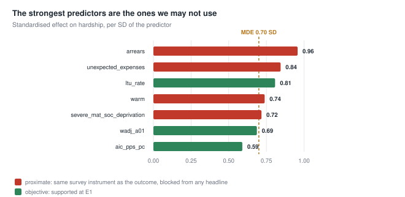

| Variable | Coef | p raw | Effect (SD) |
|---|---:|---:|---:|
| `arrears` | +1.4549 | 0.0000 | **0.96** |
| `unexpected_expenses` | +0.9825 | 0.0000 | **0.84** |
| `warm` | +1.2335 | 0.0008 | **0.74** |
| `severe_mat_soc_deprivation` | +1.4463 | 0.0036 | 0.72 |

The accurate statement about what the proximity rule buys:

> Without it, the model would achieve much stronger prediction partly by using
> closely related self-reported hardship measures, making the apparent
> explanation less independent than its fit suggests.

Not that these variables explain nothing. Severe material and social deprivation
is an official multidimensional EU indicator, not the outcome restated in
different words — it is *conceptually close*, which is a different objection
from *circular*.

### Method

Members of a construct are compared on the **intersection of that construct's
complete cases**, with the primary refit there too, so a difference between two
measures is a difference of measure and not of sample.

FDR is applied within construct — a post-registration choice, disclosed above. A
pooled correction across all ten sensitivities is shown as a post hoc robustness
display below.

The sensitivity rule is enforced by `e_rule.sensitivity_disposition()`, which
has no code path returning a finding from a sensitivity alone.

C4 has no testable sensitivity: `work_effort_squeeze` correlates 0.963 with
`wadj_a01` in all three views and the construct map forbids the pairing. C6's
declared sensitivity is a tenure drill-down, descriptive only.

### C1 — Material resources · primary supported

Common sample 270 rows, 27 countries.

| Role | Variable | Coef | p FDR | Boot p | Outcome | Failed gate | Disposition |
|---|---|---:|---:|---:|---|---|---|
| primary | `aic_pps_pc` | −0.0013 | 0.0000 | **0.0070** | supported | — | — |
| sensitivity | `hourly_comp` | −0.8501 | 0.0006 | **0.0015** | supported | — | **confirms** |
| sensitivity | `real_gdp_pc` | −0.0003 | 0.0024 | **0.0360** | supported | — | **confirms** |
| sensitivity | `consumption_pc` | −0.0009 | 0.0000 | 0.0025 | inconclusive | `greece_residual` | qualifies |
| sensitivity | `gdp_pps_pc` | −0.0004 | 0.0109 | 0.0865 | inconclusive | `bootstrap` | qualifies |

C1 is robust to hourly compensation and real GDP. Consumption and GDP PPS point
in the same direction but do not satisfy every Greece-specific robustness gate —
`consumption_pc` clears FDR *and* the bootstrap and fails only on Greece's
equal-sample residual, which the `failed_gate` column now makes visible.

### C2 — Labour-market exclusion · primary supported

Common sample 270 rows, 27 countries.

| Role | Variable | Coef | p FDR | Boot p | Outcome | Failed gate | Disposition |
|---|---|---:|---:|---:|---|---|---|
| primary | `ltu_rate` | +4.3402 | 0.0000 | **0.0100** | supported | — | — |
| sensitivity | `employment_rate` | −1.5959 | 0.0102 | **0.0200** | supported | — | **confirms** |
| sensitivity | `youth_unemployment` | +0.8751 | 0.0419 | 0.0775 | inconclusive | `bootstrap` | qualifies |
| sensitivity | `unemployment_rate` | +2.1265 | 0.0419 | 0.1865 | inconclusive | `bootstrap` | qualifies |

**Long-term unemployment is the most robust labour-market indicator.** The
pattern is consistent with duration mattering, but does **not** establish that
duration rather than exclusion itself is the operative distinction: this is a
comparison of significance verdicts, not a formal test that the two effects
differ, and `employment_rate` confirming C2 is evidence for exclusion more
generally.

### C3 — Loss against own past · no primary supported

Common sample 258 rows, 26 countries. The composite is a standardised average of
the four primaries, each oriented so higher = worse before averaging.

| Role | Variable | Coef | p FDR | Outcome | Failed gate | Disposition |
|---|---|---:|---:|---|---|---|
| primary | `pct_below_peak` | +1.9044 | 0.0001 | inconclusive (boot 0.4140) | `bootstrap` | — |
| primary | `real_income_idx` | −0.2092 | 0.5480 | inconclusive | `power` | — |
| primary | `real_wages_idx` | −0.1279 | 0.6126 | inconclusive | `power` | — |
| primary | `arop_threshold_real` | −0.0645 | 0.6126 | inconclusive | `power` | — |
| sensitivity | `c3_composite` | +7.2321 | 0.5454 | inconclusive | `power` | **cannot promote** |

### C5 — Inflation exposure · primary failed

| Role | Variable | Coef | p FDR | Outcome | Failed gate | Disposition |
|---|---|---:|---:|---|---|---|
| primary | `hicp` | −0.9925 | 0.4819 | inconclusive | `power` | — |
| sensitivity | `hicp_housing` | −0.2803 | 0.4819 | **unsupported with adequate power** | `fdr` | cannot promote |
| sensitivity | `hicp_food` | −0.2200 | 0.6994 | **unsupported with adequate power** | `fdr` | cannot promote |

**What this rules out, precisely:** effects of *annual food inflation* and
*annual housing and energy inflation*, at or above the pre-declared detectable
magnitude of 0.70 residual SD.

**What it does not rule out:**

- smaller effects, below that magnitude;
- **headline inflation** (`hicp`), which remains inconclusive;
- **compounded inflation since 2008**, which is C5's accumulated representative
  and has not been tested — that is E4;
- **affordability** effects, which are C4's separate question and where
  `wadj_a01` is supported.

These are the only **Family E results so far** whose intervals exclude an
MDE-sized effect. That is not a claim about the whole study: the legacy families
A–D have not been audited against the same MDE criterion, and until they are, no
statement of the form "the only results in the study" is supportable.

### P1 — Proximate hardship · diagnostic only

| Role | Variable | Coef | p raw | Effect (SD) | Outcome |
|---|---|---:|---:|---:|---|
| primary | `severe_mat_soc_deprivation` | +1.4463 | 0.0036 | 0.72 | blocked |
| sensitivity | `arrears` | +1.4549 | 0.0000 | **0.96** | blocked |
| sensitivity | `unexpected_expenses` | +0.9825 | 0.0000 | 0.84 | blocked |
| sensitivity | `warm` | +1.2335 | 0.0008 | 0.74 | blocked |

All four blocked, all four large. See
[the finding that reframes the study](#the-finding-that-reframes-the-study)
above for what they do and do not establish.

### Post hoc: pooled correction

Shown because the within-construct grouping is itself post-registration, so the
reader is entitled to see what the more permissive choice bought. **This display
cannot change any status.**

| Variable | p raw | Within-construct | Pooled | Verdict differs |
|---|---:|---:|---:|---|
| `consumption_pc` | 0.0000 | 0.0000 | 0.0000 | no |
| `hourly_comp` | 0.0003 | 0.0006 | 0.0017 | no |
| `real_gdp_pc` | 0.0019 | 0.0024 | 0.0063 | no |
| `employment_rate` | 0.0051 | 0.0102 | 0.0127 | no |
| `gdp_pps_pc` | 0.0109 | 0.0109 | 0.0218 | no |
| `youth_unemployment` | 0.0407 | 0.0419 | 0.0598 | **yes** |
| `unemployment_rate` | 0.0419 | 0.0419 | 0.0598 | **yes** |
| `hicp_housing` | 0.1764 | 0.4819 | 0.2204 | no |
| `c3_composite` | 0.2182 | 0.5454 | 0.2424 | no |
| `hicp_food` | 0.6994 | 0.6994 | 0.6994 | no |

Two verdicts differ: `unemployment_rate` and `youth_unemployment` would not
clear FDR under pooling. Both already failed the bootstrap, so **no reported
outcome depends on the grouping choice.** That is fortunate rather than
principled, and does not retrospectively make the choice pre-registered.

### Disposition summary

| Disposition | n | Variables |
|---|---:|---|
| confirms primary | 3 | `real_gdp_pc`, `hourly_comp`, `employment_rate` |
| qualifies primary | 4 | `gdp_pps_pc`, `consumption_pc`, `unemployment_rate`, `youth_unemployment` |
| cannot promote | 3 | `c3_composite`, `hicp_food`, `hicp_housing` |
| blocked by proximity | 3 | `arrears`, `unexpected_expenses`, `warm` |

**Sensitivities that would have become findings had the rule allowed it: 0.**

### What this does not establish

- No sensitivity here creates a finding. C1 and C2 are supported because their
  *primaries* were supported at E1.
- That duration rather than exclusion is what C2 measures. That comparison was
  not formally tested.
- That inflation does not matter. Two specific annual rates are excluded at one
  specific magnitude; see C5 above.
- C3's composite failing is not additional evidence against C3 — it is one more
  current-level test of a construct about accumulated loss.
- That proximate items "explain nothing". They predict strongly and offer
  limited conceptual distance, which is a different claim.

### Notes from review

**The FDR family was not pre-registered.** Review caught that the frozen
pre-registration declares three BH families and none of them is a
within-construct sensitivity family. The first write-up of this stage described
the grouping as pre-registered inference. It is not, and it is the more
permissive of the available choices. Recorded as PD-01, with the conservative
pooled alternative displayed above.

The promotion rule limits the damage — no E2 sensitivity could have become a
finding whatever its FDR verdict — but that is a property of a *different*
safeguard, and does not make this choice registered.

**Failure labels were hiding their reasons.** `consumption_pc` was reported as
`inconclusive_under_available_power` despite clearing FDR and the bootstrap and
failing only Greece's residual gate — the same label carried by variables that
were never close. A `failed_gate` field now records which gate actually bound:
`direction`, `power`, `fdr`, `bootstrap`, `loo_stability`, `greece_residual`,
`proximity`. The pre-registered outcome is unchanged; only the visibility is new.

**Three overstatements corrected.** "C1 holds however measured" (two of four
confirm, two qualify). "C2 is duration, not exclusion" (a comparison of
verdicts, not a test of difference). "The only results in the entire study"
(only Family E has been audited against the MDE criterion).

A guard added before this stage ran: `scripts/registry.py` validates every
registry vocabulary at load time, with a test asserting that `"high"` — the
value E1 compared against — now fails the load. That is the narrow fix for
[C-09](#corrections-and-supersessions); the general lesson, that tested rules
were fed by untested translation, stands.

One bug caught on the first run: when *every* member of a construct is
proximity-blocked, as in P1, nothing is eligible for FDR and the adjusted-p
column was never created, crashing the P1 block. Columns are now initialised
before use. It failed loudly, which is the right kind of failure.

### Where the detail lives

`scripts/69_e2_sensitivities.py`, `scripts/e_rule.py`, `scripts/registry.py`,
`scripts/test_registry.py` ·
`data/processed/e2_results.csv`, `e2_pooled_posthoc.csv`

---

## E3 — Diagnostic and contextual checks

> **E3 declares no FDR family, deliberately.** The frozen pre-registration names
> three — current primaries, accumulated primaries, secondary outcome — and none
> covers contextual or legacy variables. Inventing a fourth here would repeat
> [PD-01](#protocol-deviations). So nothing in this stage is FDR-corrected and
> **nothing here can become a finding**. Raw p-values are shown because
> suppressing them would be worse, but they are diagnostic quantities, not tests.

### In plain words

This stage handles everything that is not a candidate explanation: measures too
close to the outcome to explain it, measures whose direction we cannot state in
advance, an old null being re-checked, and two variables that are arithmetic
restatements of something already in the model.

**Two diagnostic readings, pointing in opposite directions.** Neither is
eligible to become a formal finding under this stage's declared design.

Same-instrument hardship indicators **statistically absorb 71% of the baseline
residual** — it falls from 46.9 to 13.7 when all four are added, and R² goes from
0.25 to 0.87. They do not *explain* 71% of the gap. Absorption through a shared
instrument is not shared cause. That is the scale of what the proximity rule
refuses, and any analysis that used them would look dramatically more successful
without being more informative.

And the same items **corroborate** the outcome. Once each country's own average
is removed, reported difficulty co-moves with arrears, emergency-expense
capacity, heating and deprivation at **0.63 to 0.80**.

> The subjective-hardship measure co-moves strongly with reported material
> restrictions. This supports its material grounding, while the shared survey
> instrument prevents treating those indicators as independent explanations of
> hardship.

Both readings are true of the same four variables: **weak as causes, strong as
corroboration** — and corroboration of a specific, limited kind, since the
alignment is between two reports collected by one instrument.

### A1 — How much of the residual same-instrument items absorb

n = 268, 27 countries.

| | Greece residual | R² |
|---|---:|---:|
| Baseline (`arop` + year) | **+46.92** | 0.253 |
| All four P1 items added | **+13.74** | 0.870 |
| **Statistically absorbed by same-instrument items** | **33.18 points — 71%** | |

This is the quantity P1 exists to produce. **Absorbed, not explained.** It
measures how much of the paradox can be made to disappear using measures drawn
from the same survey instrument as the outcome — a statement about shared
measurement, not about shared cause.

For comparison, the whole objective apparatus of P3 — six predictors including
accumulated unemployment — narrowed Greece's residual from 27.05 to 6.93.

### A2 — Corroboration: does reported difficulty co-move with reported restriction?

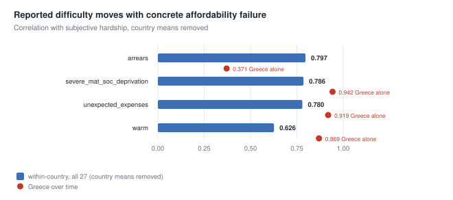

Correlation with subjective hardship after removing each country's own mean, so
this is co-movement *within* countries, not a comparison of national levels.

| Item | Within-country r | Greece over time | Greek mean |
|---|---:|---:|---:|
| `arrears` | **0.797** | 0.371 | 43.5 |
| `severe_mat_soc_deprivation` | **0.786** | 0.942 | 15.6 |
| `unexpected_expenses` | **0.780** | 0.919 | 48.7 |
| `warm` | **0.626** | 0.869 | 21.6 |

If Greeks simply described their circumstances more negatively — culture, mood,
generalised distrust — that reporting style would not need to move with unpaid
bills, absent emergency resources, and homes that cannot be heated. It does,
across all 27 countries and within Greece.

> Greece's subjective-hardship measure is **subjective in measurement, but not
> merely subjective in substance.**

**This is same-instrument corroboration, not independent validation.** All four
items and the outcome come from EU-SILC, asked of the same households in the
same interview. A shared survey method, and a general tendency to report
financial matters consistently, could strengthen these correlations on their
own. Independent validation would require a source outside the instrument —
administrative arrears data, metered energy consumption — which this panel does
not contain.

Two further qualifications. Within Greece specifically, three of the four align
strongly (0.87–0.94) but **arrears does not** (0.371), so the corroboration is
not uniform. And the cross-country within-estimate is what carries this reading,
not the Greek series alone.

### B — Inequality retest

**A retest of the known null at claim 8.1, never a fresh candidate.**

| Variable | Coef | SE | p raw | n |
|---|---:|---:|---:|---:|
| `s80s20` | +6.4679 | 3.8136 | 0.0899 | 270 |

Not significant even uncorrected, and not eligible to become a finding in any
case. The earlier null stands.

### C — Migration context

| Variable | Coef | SE | p raw | n |
|---|---:|---:|---:|---:|
| `net_migration` | +0.6492 | 0.7723 | 0.4006 | 269 |

Causal position is ambiguous by construction: migration is both a response to
labour-market damage and a contributor to it. Nothing here changes that.

### D — Ambiguous-direction context

**No pre-registered direction exists for these**, so no directional claim is
made. High saving may be prudence or demand collapse; long hours may be
opportunity or necessity. `e_rule` raises rather than guessing when asked to
evaluate an `ambiguous` variable.

| Variable | Coef | SE | p raw | n |
|---|---:|---:|---:|---:|
| `working_hours` | +4.5983 | 1.4726 | 0.0018 | 270 |
| `saving_rate` | −1.2891 | 0.5276 | 0.0146 | 268 |
| `debt_to_income` | −0.0727 | 0.0295 | 0.0137 | 268 |

These p-values are **descriptive, unadjusted, and carry no evidentiary
status.** They are printed only because omitting them would be worse.

Each variable's ambiguity is its own, and the record now stores it per variable
rather than as a group note:

| Variable | Why the direction cannot be fixed in advance |
|---|---|
| `saving_rate` | high saving may be prudence or collapsed demand |
| `debt_to_income` | high debt may be burden; low debt may be deleveraging or exclusion from credit |
| `working_hours` | long hours may be strain; short hours may be underemployment |

That is exactly why the ambiguous-direction rule exists: with no direction fixed
in advance, either sign would have been narratable after the fact, and a
two-sided p-value carries no evidential weight when both tails were available
for interpretation.

### E — Work-effort squeeze retest

| Variable | Coef | SE | p raw | n |
|---|---:|---:|---:|---:|
| `work_effort_squeeze` | +0.1705 | 0.0469 | 0.0003 | 270 |

Run alone, because it correlates **0.963 with `wadj_a01`** in all three views and
the construct map forbids the pairing. Its result therefore **cannot be read as
independent of C4** — this is largely the same measurement as the supported C4
primary, arriving by a different route, not corroboration from a second source.

### F — Transfer-policy comparators

| Variable | Coef | SE | p raw | n |
|---|---:|---:|---:|---:|
| `arop_before_transfers` | +0.8800 | 0.9098 | 0.3334 | 270 |
| `transfer_effect` | +0.8800 | 0.9098 | 0.3334 | 270 |

**Blocked by mechanical overlap — not by proximity.** The two are different
disqualifications and the record now keeps them apart:

| Block | Objection | Applies to |
|---|---|---|
| `blocked_by_proximity` | conceptual distance: measures the outcome's subject matter through the outcome's instrument | P1 items |
| `blocked_by_mechanical_overlap` | arithmetic: an algebraic function of a variable already in the baseline | transfer indicators |

The identical numbers demonstrate the second. `transfer_effect` equals
`arop_before_transfers − arop` exactly, to floating-point precision (verified:
max absolute difference 3.6 × 10⁻¹⁵, correlation 1.000000). Since `arop` is
already in the baseline, adding either variable spans the same column space, so
the two regressions are the same regression.

`registry.block_reason()` now returns the two separately, with tests.

### What this does not establish

- Nothing here can become a finding. E3 declares no family and applies no
  correction, by design.
- The 71% is **absorption, not explanation**. It measures overlap between two
  reports from one instrument, which is what same-instrument means.
- The corroboration correlations do not establish that reported hardship is
  *accurate*, nor that it is independently validated. They establish co-movement
  between two reports collected together. An outside source would be needed for
  independent validation, and this panel has none.
- Nothing in E3 is eligible to become a formal finding. Both A1 and A2 are
  diagnostic readings.
- `work_effort_squeeze`'s small p-value adds nothing to C4. It is the same
  measurement.
- The `s80s20` retest does not revive the inequality hypothesis, and was never
  capable of doing so at this stage.

### Notes from review

The FDR question was settled *before* running this stage rather than after,
which is the direct consequence of PD-01. The contextual and legacy variables
fit none of the three declared families, and the available choices were to
invent a fourth or to declare none. Declaring none is the honest option: these
were never candidate explanations, so correcting them as though they were
competing hypotheses would misrepresent what the stage does.

The ambiguous-direction group is the clearest illustration of why
pre-registration matters at all. All three produce p-values below 0.02, and all
three are uninterpretable — for each one, a coherent story exists in both
directions, and choosing after seeing the sign is exactly the practice the
protocol exists to prevent.

### Where the detail lives

`scripts/70_e3_diagnostics.py` ·
`data/processed/e3_results.csv`, `e3_restatement.csv`

---

## E4 — Accumulated exposure

### In plain words

C3 — loss against a country's own past — failed twice at current levels, which
is what the construct map predicted, because it is a construct about
accumulation. E4 gives it, and every other accumulated measure, the test it was
built for.

**Three accumulated measures are supported**, and they are not equally secure:

| | Bootstrap p | Exceedances of 1,999 | |
|---|---:|---:|---|
| accumulated excess unemployment | **0.0025** | 4 | strongest |
| duration of wages below 2008 | 0.0245 | 48 | credible secondary support |
| housing deterioration since 2010 | 0.0460 | 91 | **borderline** |

All three meet the pre-registered rule and are classified `supported` by it.
Housing sits close to the 0.05 threshold and is flagged borderline in the data,
never reclassified — and it was **not** re-run with another seed to obtain a
friendlier number.

**C3 is only partly confirmed.** Accumulation produces conventional
associations for several C3 measures, but **robust support is limited to wage
duration**. The three depth or area measures clear FDR and then fail the
bootstrap — wage shortfall at 0.074, GDP shortfall at 0.315, threshold shortfall
at 0.607. The pre-registration insisted area and duration are separate
quantities that may never be summed, and they behave differently.

**Compounded inflation provides no supporting evidence**, but the design
cannot exclude a relevant effect. This was the one avenue E2's narrow ruling
left open; it is now tested and returns the weakest result in the family, gated
on power. That is inconclusive, not ruled out.

**And the decisive one: no accumulated result may be given dynamic wording.**
The evidence is **predominantly between-country**; neither the within-country
estimates nor first differences provide dynamic support. Countries that absorbed
more damage report more hardship. That is not the same as hardship rising inside
a country as damage accumulated, and this stage finds no supporting evidence for
the second.

Non-significant within estimates do **not** prove there is no within-country
relationship — the intervals are wide, and this design's power is concentrated
between countries.

### Feasibility: 7 of 10, and the three failures matter

The accumulations need source history back to 2008–2010, and the analysis panel
starts in 2015. Which measures are constructible is therefore a **result**, not
a preliminary.

| Construct | Variable | Feasible | Reason |
|---|---|:--:|---|
| C2 | `cum_excess_unemployment` | ✓ | already built and frozen — reused, not reconstructed |
| C3 | `real_wages_idx` | ✓ | 27 countries at 2008; area **and** duration |
| C3 | `pct_below_peak` | ✓ | 27 countries at 2008 |
| C3 | `arop_threshold_real` | ✓ | primary on 26 countries, **uniform 2008**; mixed-baseline version is a sensitivity |
| C4 | `wadj_a01` | ✓ | 27 countries at 2008 |
| C5 | `hicp` | ✓ | 27 countries at 2008 |
| C6 | `housing_cost_overburden` | ✓ | 27 countries at 2010 |
| **C1** | `aic_pps_pc` | ✗ | **source begins 2015; no 2008 baseline exists** |
| C3 | `real_income_idx` | ✗ | 1 country at 2008; never a panel series before 2015 |
| P1 | `severe_mat_soc_deprivation` | ✗ | source begins 2015; diagnostic only regardless |

**C1's failure is the notable one.** Material resources is one of the three
constructs E1 supported, and its accumulated form cannot be tested at all. The
baseline was **not** moved to a later year to make it testable — choosing a
baseline after seeing which choice yields data is the error the protocol exists
to prevent.

**Croatia's baseline, resolved.** The pre-registration fixes baseline 2008.
Croatia has no 2008 threshold observation, and the existing build falls back to
its earliest year (2010), so Croatia would accumulate over two fewer years than
everyone else. A per-country fallback is not authorised, so the mixed-baseline
series **cannot be the primary test**.

| | Countries | Baseline | Role |
|---|---:|---|---|
| `acc_threshold_shortfall` | 26 | **uniform 2008** | **primary**, in BH family 2 |
| `acc_threshold_shortfall_mixed` | 27 | 2008, HR 2010 | sensitivity, **not** FDR-corrected with the family |

The primary is the uniform-baseline test on 26 countries; family FDR is computed
on it. The two agree closely (+0.1477 against +0.1498, both p < 0.0001), and
neither survives the bootstrap, so the correction changes no outcome — but the
primary is now a legitimate uniform-baseline test rather than a mixed one.

Every built series passed a **no-future-information check**: rebuilt on data
truncated at each year, the value at that year is unchanged. `accumulate.py`,
27 tests.

### BH family 2 — accumulated primaries

| Con | Accumulated | Coef | p raw | p FDR | Boot p | Effect | n | Outcome | Gate |
|---|---|---:|---:|---:|---:|---:|---:|---|---|
| C2 | `acc_cum_excess_unemployment` | +0.4145 | 0.0000 | 0.0000 | **0.0025** | 0.78 | 270 | **supported** | — |
| C6 | `acc_housing_excess` | +0.2540 | 0.0000 | 0.0000 | **0.0460** | 0.70 | 269 | **supported** (borderline) | — |
| C3 | `dur_real_wages_below` | +1.7202 | 0.0190 | 0.0253 | **0.0245** | 0.51 | 270 | **supported** | — |
| C4 | `acc_wadj_excess` | +0.0135 | 0.0000 | 0.0000 | 0.0025 | 0.43 | 270 | inconclusive | `greece_residual` |
| C3 | `acc_threshold_shortfall` | +0.1477 | 0.0000 | 0.0000 | 0.6065 | 0.61 | **260** | inconclusive | `bootstrap` |
| C3 | `acc_pct_below_peak` | +0.1745 | 0.0000 | 0.0001 | 0.3145 | 0.62 | 270 | inconclusive | `bootstrap` |
| C3 | `acc_real_wages_shortfall` | +0.0952 | 0.0324 | 0.0370 | 0.0740 | 0.52 | 270 | inconclusive | `bootstrap` |
| C5 | `acc_hicp_compounded` | −0.1793 | 0.3666 | 0.3666 | — | 0.27 | 270 | inconclusive | `power` |

`acc_wadj_excess` clears FDR *and* the bootstrap and still fails, on Greece's
equal-sample residual — visible only because of the `failed_gate` field.

### Current versus accumulated, on identical observations

| Con | Current | Accumulated | Cur coef | Acc coef | Cur p | Acc p | n |
|---|---|---|---:|---:|---:|---:|---:|
| C2 | `ltu_rate` | `acc_cum_excess_unemployment` | +4.3402 | +0.4145 | 0.0000 | 0.0000 | 270 |
| C3 | `real_wages_idx` | `acc_real_wages_shortfall` | −0.0924 | +0.0952 | 0.6130 | **0.0324** | 270 |
| C3 | `pct_below_peak` | `acc_pct_below_peak` | +1.8675 | +0.1745 | 0.0000 | 0.0000 | 270 |
| C3 | `arop_threshold_real` | `acc_threshold_shortfall` | −0.0556 | +0.1477 | 0.6531 | **0.0000** | 260 |
| C4 | `wadj_a01` | `acc_wadj_excess` | +0.3110 | +0.0135 | 0.0000 | 0.0000 | 270 |
| C5 | `hicp` | `acc_hicp_compounded` | −0.9925 | −0.1793 | 0.3213 | 0.3666 | 270 |
| C6 | `housing_cost_overburden` | `acc_housing_excess` | +1.1385 | +0.2540 | 0.0082 | 0.0000 | 269 |

Two C3 measures nowhere near significance at current levels —
`real_wages_idx` (0.6130) and `arop_threshold_real` (0.6531) — reach
conventional significance in accumulated form on the same rows. That is
consistent with the construct map's expectation, on identical samples. It does
**not** make them supported: both fail the bootstrap afterwards, so this is a
conventional association, not robust support.

### Accumulated versus annual inflation

| | Coef | p |
|---|---:|---:|
| annual `hicp` | −0.9925 | 0.3213 |
| compounded `acc_hicp_compounded` | −0.1793 | 0.3666 |

Identical sample, n = 270. E2 could only exclude annual food and housing
inflation at 0.70 SD; compounded inflation since 2008 was untested and is now
tested. It provides **no supporting evidence**, and its failure is `power`-gated
— so the design **cannot exclude** a relevant effect. Not closed, not ruled
out.

Compounded inflation measures cumulative **price growth** — not affordability,
not hardship. Affordability is C4's separate question.

### Between/within and first differences

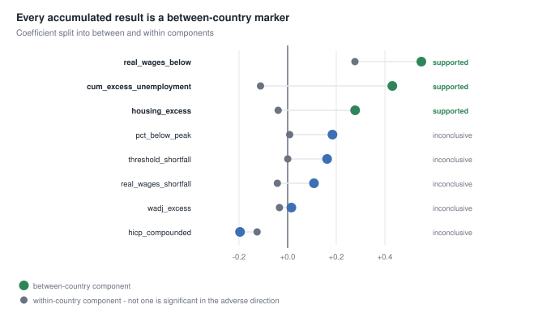

| Accumulated | Between | p | Within | p | FD coef | FD p | Dynamic? |
|---|---:|---:|---:|---:|---:|---:|:--:|
| `acc_cum_excess_unemployment` | +0.4306 | 0.0000 | −0.1115 | 0.5322 | −0.0432 | 0.7484 | **no** |
| `acc_housing_excess` | +0.2777 | 0.0000 | −0.0390 | 0.5751 | −0.0130 | 0.8028 | **no** |
| `dur_real_wages_below` | +2.1563 | 0.0194 | +0.2765 | 0.3251 | +0.1223 | 0.2362 | **no** |
| `acc_pct_below_peak` | +0.1845 | 0.0001 | +0.0084 | 0.6844 | +0.0264 | 0.1876 | **no** |
| `acc_threshold_shortfall` | +0.1641 | 0.0000 | +0.0043 | 0.7404 | +0.0001 | 0.9967 | **no** |
| `acc_real_wages_shortfall` | +0.1085 | 0.0336 | −0.0423 | 0.1661 | −0.0442 | 0.1066 | **no** |
| `acc_wadj_excess` | +0.0154 | 0.0000 | −0.0337 | 0.0000 | −0.0309 | 0.0000 | **no** |
| `acc_hicp_compounded` | −0.1960 | 0.4723 | −0.1255 | 0.1215 | −0.0211 | 0.6628 | **no** |

**Dynamic wording is permitted for none of them.**

Every supported result is carried entirely by the between-country component. Not
one within-country estimate is significant in the adverse direction, and first
differences support nothing. `acc_wadj_excess` is the sharpest case: its within
component *is* highly significant and points the **wrong way** (−0.0337,
p < 0.0001), as do its first differences.

This reproduces P5's finding across a whole family rather than one variable.

### Interpretation

> Countries with greater accumulated unemployment, longer wage under-recovery
> and greater housing deterioration since 2010 report more hardship. These are
> **predominantly between-country historical markers**. E4 finds no supporting
> evidence that hardship changed within countries as these measures accumulated.

That is useful. It is **not** a demonstrated dynamic process.

Ranked by security: accumulated unemployment is the strongest result; wage
duration is credible secondary support; housing is borderline; the depth
measures and compounded inflation remain inconclusive.

Greece sits at or near the worst of Europe on all three supported measures. The
first-difference requirement exists precisely to stop a dynamic sentence being
written on the strength of a strong cross-country coefficient.

### What this does not establish

- No dynamic or within-country claim, for any measure in the family. The
  absence of within-country evidence is **not** evidence of absence: the
  intervals are wide and the design's power is concentrated between countries.
- Nothing about C1's accumulated form, which could not be built.
- The C3 area measures are not refuted — three of four fail on the bootstrap,
  which is a power-limited outcome, not evidence of absence.
- That duration matters *more* than depth. `dur_real_wages_below` survives and
  the area measures do not, but the two were never formally compared.
- That housing is as secure as accumulated unemployment. It passes at p = 0.046
  against p = 0.0025.
- Compounded inflation's null is `power`-gated, so it is inconclusive rather
  than ruled out.

### Notes from review

**Two bugs, both caught before publication, both from construction rather than
from the decision rule.**

`acc_wadj_excess` first came back degenerate — standard deviation exactly 0.00,
p = NaN, and an outcome of `contradicts_direction`. The cause:
`panel_nominal_compensation_wage_level.csv` holds absolute compensation in euros
(~32,000), not the EU27 = 100 index the price ratio needs. `wadj_a01` came out
near 0.3 instead of near 120, so `max(0, x − 100)` was zero for every
country-year. The appendix builder converts to an index in
`wage_level_frame()`; the E4 build did not. Fixed, with an assertion that fails
the build if the series is degenerate again.

`res.var` returned `DataFrame.var` — the variance **method** — not the column,
so a row-selection mask silently became a scalar. This is the same
attribute-shadowing trap this project has already hit with `.between` and
`.pct_change`, now on its third variable. Bracket access throughout.

Neither bug was in the decision rule. Both were in the code preparing its
inputs, which is exactly the pattern C-09 identified at E1 and which
`registry.py` addressed only for one class of input.

**Feasibility was audited before testing**, and the three infeasible
accumulations are reported as a result rather than dropped. Moving C1's baseline
forward to make it testable was available and was not done.

### Where the detail lives

`scripts/71_e4_build_accumulations.py`, `scripts/72_e4_accumulated.py`,
`scripts/accumulate.py`, `scripts/test_accumulate.py` ·
`data/processed/e4_feasibility.csv`, `e4_accumulated_panel.csv`,
`e4_results.csv`, `e4_current_vs_accumulated.csv`

---

## E5 — Accumulation sensitivities

> **Protocol deviation.** FDR is grouped within construct, which the frozen
> pre-registration does not declare. This is [PD-01](#protocol-deviations)
> applying again to the accumulated family, recorded as **PD-02**. The pooled
> alternative is below.

### In plain words

E4 found three supported accumulated measures. E5 asks whether those
conclusions survive being measured a different way — and, crucially, does *not*
go looking for replacements where a primary failed.

**Accumulated unemployment is robust to an alternative construction.** The
result survives replacing headline unemployment exposure with accumulated
long-term-unemployment exposure. That is robustness, **not** independent
confirmation: the two correlate at **r = 0.943**, so this is a closely related
labour-market-history measure rather than a second source of evidence.

**Wage duration's robust support is specific to one construction.** The primary
is the *current* uninterrupted run of years below the fixed 2008 level. Three
alternative constructions all point the **same way** (+1.14, +1.29, +0.82) but
none meets the full support rule.

That is a qualification, not a demonstration of non-generalisation. Two of the
three are explicitly *inconclusive under available power*, and failure to reject
is not evidence that their effects differ from the primary's — no formal
comparison was made.

**Nothing was promoted.** The C3 depth alternatives behave almost exactly like
their primaries and cannot become findings whatever they had shown.

**Housing has no sensitivity, and stays borderline.** The only alternative
available would be a different baseline, and trying baselines until one performs
better is the move this protocol exists to prevent. Its 2010 base is forced by
coverage. Its bootstrap p is 0.0460, and that remains the number describing it.

### Two classes of sensitivity, kept apart

| Class | Meaning | Count |
|---|---|---:|
| **DECLARED** | named in the frozen construct map before any result existed | 1 |
| **ALTERNATIVE** | a different reasonable construction, identified *after* E4 | 5 |

The distinction is not cosmetic. The alternative set was chosen knowing which
primaries had succeeded, so it can qualify a conclusion and cannot support a
discovery. Only C2 has a declared accumulated sensitivity; the construct map
names no others.

### Results

| Primary | E4 outcome | Sensitivity | Class | Coef | Boot p | Disposition |
|---|---|---|---|---:|---:|---|
| `acc_cum_excess_unemployment` | supported | `cum_excess_ltu` | **DECLARED** | +0.5127 | **0.0200** | robust (r = 0.943) |
| `dur_real_wages_below` | supported | `wage_years_below_peak` | ALTERNATIVE | +1.1388 | — | qualifies |
| `dur_real_wages_below` | supported | `wage_longest_streak_2008` | ALTERNATIVE | +1.2934 | — | qualifies |
| `dur_real_wages_below` | supported | `wage_longest_streak_peak` | ALTERNATIVE | +0.8243 | — | qualifies |
| `acc_real_wages_shortfall` | inconclusive | `cum_wage_shortfall_ownpeak` | ALTERNATIVE | +0.0984 | 0.0870 | **cannot promote** |
| `acc_pct_below_peak` | inconclusive | `cum_gdp_shortfall_2008base` | ALTERNATIVE | +0.1721 | 0.3170 | **cannot promote** |
| `acc_housing_excess` | supported (borderline) | — | — | — | — | none available |
| `acc_hicp_compounded` | inconclusive | — | — | — | — | none run |

**Sensitivities that would have been findings had the rule allowed it: 0.**

### C2 — robust to an alternative construction

> The accumulated-unemployment result is robust to replacing headline
> unemployment exposure with accumulated long-term-unemployment exposure.

`cum_excess_ltu` reproduces the result at bootstrap p = 0.0200, and it is the
only sensitivity in this stage declared in advance.

**This is robustness, not independent confirmation.** The two series correlate
at **r = 0.943** on the estimation sample. A measure that close is a variant of
the same labour-market history, so it tests whether the conclusion depends on
one construction — not whether a second, separate line of evidence agrees. E4's
strongest result is not made stronger by it; it is shown not to hinge on the
particular unemployment measure chosen.

### C3 wage duration — robust support is construction-specific

The primary counts the **current** uninterrupted run of years with real wages
below their fixed 2008 level. Three alternatives change one thing each, and all
three point in the same direction:

| Alternative | What differs | Coef | Raw p | Outcome |
|---|---|---:|---:|---|
| `wage_years_below_peak` | own rolling peak rather than fixed 2008 | +1.1388 | 0.0479 | inconclusive under available power |
| `wage_longest_streak_2008` | longest run ever, not the current run | +1.2934 | 0.0848 | inconclusive under available power |
| `wage_longest_streak_peak` | both changes together | +0.8243 | 0.3093 | unsupported with adequate power |

None clears FDR within the construct, so none reaches the bootstrap.

> Robust evidentiary support is specific to the current uninterrupted run below
> the fixed 2008 wage level. Alternative duration constructions point in the
> same direction but do not independently meet the support criteria.

**This is not a finding of non-generalisation.** Two of the three are
inconclusive under available power, and a failure to reject is not evidence that
an alternative's effect differs from the primary's. The third
(`wage_longest_streak_peak`) does clear the power bar and is *unsupported with
adequate power* — but even there, no formal test compared it against the
primary, so it establishes something about that construction, not a difference
between constructions.

### C3 depth and inflation — no promotion possible

`cum_wage_shortfall_ownpeak` (0.0870) and `cum_gdp_shortfall_2008base` (0.3170)
behave almost identically to the primaries they vary. Both are barred from
promotion by rule, and both would have failed anyway.

Compounded inflation was given **no** sensitivity, and the reason is a
stopping rule rather than an inference:

> No accumulated inflation sensitivity was pre-declared. Constructing
> category-specific accumulated measures after the primary result was known
> would reopen exploratory searching.

E2 excluded *annual* food and housing inflation at the detectable magnitude. It
did not exclude every possible accumulated category measure, and citing it as
though it had would overstate what that stage established.

### Housing — no sensitivity, and still borderline

The only alternative construction available is a different baseline. Trying
baselines until one performs better is precisely the move the protocol exists to
prevent, and the 2010 base is already forced by coverage rather than chosen.

Its status is unchanged: **supported under the declared rule, borderline at
bootstrap p = 0.0460 with 91 exceedances of 1,999**. No sensitivity result could
have altered that, because the number describing the primary is the primary's
own.

### What this does not establish

- No sensitivity here creates or rescues a finding, by construction.
- That the wage-duration alternatives are *wrong*. They are different
  quantities that do not carry the result.
- That housing is more secure than E4 reported. It is exactly as secure.
- That inflation is ruled out. It remains inconclusive under available power.

### Post hoc: pooled correction

Within-construct grouping is not pre-registered (PD-02). Under a single pooled
correction across all six sensitivities the picture is unchanged: `cum_excess_ltu`
still clears and the rest still do not, and no disposition depends on the
grouping because every one of them is governed by its primary rather than by
FDR.

### Notes from review

The scope question was settled before running. E4 left three supported measures
and four failures, and the tempting design was to run a wide battery of
alternative constructions across all of them. That would have been a search for
replacements dressed as robustness — with the set chosen after seeing which
primaries failed.

So the sensitivities are split into what the construct map declared in advance
(one) and what was identified afterwards (five), and the second class is
labelled in the data as qualification-only. Two primaries were given no
sensitivity at all, with the reason recorded in the code rather than decided
silently.

### Where the detail lives

`scripts/73_e5_accumulation_sensitivities.py`, `scripts/e_rule.py` ·
`data/processed/e5_results.csv`

---

## E6 — Frozen combined model

> **Nothing is fitted in this stage.** The pre-registration fixes the combined
> model as the frozen P3 specification and does not reopen it. The fifteen
> pairwise family combinations are **not** tested. Frozen P3's values are read
> from `p5f_frozen_result.json`, not recomputed.

### In plain words

E6 does not build a best model. It puts two specifications side by side and
reports that they disagree — because the disagreement is the finding.

**Frozen P3** is the pre-committed historical result. It includes severe
material and social deprivation, an EU-SILC item drawn from the same instrument
as the outcome, so it **cannot be described as purely objective or fully
distant from the outcome**.

**The EA companion** removes exactly that predictor and nothing else. The
residual changes materially. It is a **stricter diagnostic**, not a replacement
chosen because its result is preferable.

Neither specification is independent of EU-SILC. Both retain AROP, which comes
from the same survey. What EA removes is the *additional* P1 hardship predictor
beyond AROP — that is the proximity distinction, and it is narrower than
"same-instrument or not".

Neither is the definitive model. They are not merged, averaged, or ranked by
which residual looks better.

> **Conclusions about how much of Greece's gap is absorbed depend materially on
> whether same-instrument deprivation is admitted.**

### The two specifications

| | Frozen P3 | EA companion |
|---|---:|---:|
| Predictors | 6 | 5 |
| Additional P1 same-instrument predictor beyond AROP | **yes** | no |
| Greece residual | **+6.93** | **−9.39** |
| Greece rank | 3 / 27 | 25 / 27 |
| R² | 0.907 | 0.821 |
| n | 269 | 269 (identical rows) |


Frozen P3 *under*-predicts Greek hardship by 6.93 points; the companion
*over*-predicts it by 9.39. Greece moves from third-most under-predicted to
third-most **over**-predicted — the same distance from the middle, on the
opposite side.

### What E1–E5 say about each frozen-P3 predictor

| Predictor | Con | Kind | E-stage verdict |
|---|---|---|---|
| `ltu_rate` | C2 | current | **supported** (E1) |
| `aic_pps_pc_k` | C1 | current | **supported** (E1, as `aic_pps_pc`) |
| `wage_years_below_2008` | C3 | accumulated duration | **supported** (E4, as `dur_real_wages_below`) |
| `cum_excess_unemployment` | C2 | accumulated | **supported** (E4, as `acc_cum_excess_unemployment`) |
| `housing_cost_overburden` | C6 | current | inconclusive (E1) |
| `severe_mat_soc_deprivation` | P1 | current | **blocked by proximity** (E1) |

Four supported, one inconclusive, one blocked.

Two things this cross-walk must not be read as saying.

**It is not independent corroboration.** Every E test used the same panel, the
same outcome and the same 27 countries. It shows the frozen specification is
*consistent* with the pre-registered framework — not that it was replicated.

**It does not establish four independent contributions.** E1–E4 tested these
variables mostly one at a time against AROP and year effects. Those were not
tests of each coefficient's contribution *inside* the six-variable P3 model.

> The cross-walk records which predictors received support in separate construct
> tests. It does not show that all four contribute independently when entered
> together in P3.

**The housing row is a different variable.** Frozen P3 contains housing at its
**current** level, which E1 found inconclusive. It is the **accumulated**
housing measure that E4 supported, and that measure is not in P3.

One incidental identity worth recording: `wage_years_below_2008` and E4's
`dur_real_wages_below` are the **same series**, identical to floating point. The
C3 duration measure E4 supported was already inside the frozen specification.

### Prohibited reinterpretations

1. Calling frozen P3 **"objective-only"**. It retains a same-instrument EU-SILC
   item.
2. Calling the EA companion a **replacement** or a corrected model. EA returned
   Outcome C: the frozen result *depends* materially on that predictor.
3. **Merging** the two into one preferred estimate, or averaging their residuals.
4. Choosing between them **on residual size**. EA's anti-selection rule forbids
   it, and both are reported under every outcome.
5. Describing accumulated exposure **dynamically**. P5 and E4 both find the
   evidence predominantly between-country with no first-difference support.
6. Treating E1–E5 as **replication** of P3, or as evidence that its predictors
   contribute independently when entered jointly.
7. Reopening the **fifteen pairwise family combinations**.

### What is not reopened

The fifteen pairwise combinations of the six constructs are not tested.
Searching combinations after seeing which constructs succeeded would be exactly
the exploratory screening this design was built to replace.

Nothing in E6 alters `p5f-frozen`.

### What this does not establish

- That either specification is correct. The stage reports a dependency, not a
  preferred estimate.
- That the EA companion is independent of EU-SILC. Both specifications retain
  AROP; EA removes the additional P1 predictor beyond it.
- That P3's supported predictors contribute independently in the joint model.
  They were tested separately, not conditionally on each other.
- That deprivation "should" be excluded. EA's Outcome C says the result depends
  on it, which is a statement about fragility, not about which model is right.
- That the companion's over-prediction is more informative than P3's
  under-prediction. Both are single specifications on one panel.
- Anything about the combinations that were not tested.

### Notes from review

The communication problem in this stage is the P1 tension, and the temptation is
to resolve it — to pick the specification that reads better and relegate the
other to a footnote. Both readings are available: frozen P3 is pre-committed and
therefore privileged, or the companion is proximity-clean and therefore
stricter.

Resolving it either way would discard the actual result. The two specifications
differ by one predictor, run on identical rows, and produce residuals of
opposite sign. That dependency is what E6 has to report, and it is more
informative than either number alone.

### Where the detail lives

`scripts/74_e6_combined.py` ·
`data/processed/e6_results.csv`, `e6_crosswalk.csv` ·
frozen values from `p5f_frozen_result.json`, companion from `ea_results.csv`

---

## E7 — Current versus accumulated comparison

> Design frozen at `fe28fc5`, power published at `2206620`, both before any
> joint model was fitted. Eight pairs × two directions = 16 conditional
> coefficients, corrected together as **BH family 4**.

### In plain words

Every earlier stage tested current and accumulated measures in *separate*
models. Separate models cannot answer whether accumulation adds anything
**beyond** current conditions — for that the two have to compete inside one
model, on the same rows.

**Accumulation adds information in three of eight pairs**: accumulated
unemployment, wage duration, and housing deterioration. Each survives with its
current-level counterpart controlled.

> Historical exposure carries **additional** cross-country information after the
> present-day measure is controlled. The current measure does not independently
> meet the support criteria, but its contribution is **not ruled out** — in all
> three pairs it is *inconclusive*, not unsupported.

**One pair runs the other way.** For wage-adjusted affordability:

> The current measure remains supported after accumulated pressure is
> controlled; the accumulated measure does not meet the support criteria and
> remains **inconclusive** — not unsupported with adequate power.

**Two pairs are unresolved** — GDP shortfall and the poverty threshold. Neither
direction survives, and power is insufficient to say more.

**One is a genuine null.** Annual inflation is unsupported *with adequate power*
against its own conditional threshold.

**One was capped by rule.** The accumulated wage-shortfall coefficient cleared
every gate conditionally, but E4 had not supported it — and E7 is not allowed to
create findings. Reported, not promoted.

**The collinearity gate never triggered.** Focal VIFs run 1.53–7.76, all below
10, and no partial correlation exceeds 0.90.

> No pair triggered the pre-declared collinearity gate, so none was
> automatically classified as uninterpretable. Several conditional effects
> nevertheless remain **imprecisely estimated** — the highest focal VIF, 7.76 on
> `hicp`, sits well inside the gate but is not small.

**And nothing here unlocks dynamic language.** Not one pair passes the
conditional first-difference test.

### The 16 conditional coefficients

| Pair | Direction | Coef | p FDR | Boot p | Focal VIF | MDE | Outcome |
|---|---|---:|---:|---:|---:|---:|---|
| P1_ltu | acc \| cur | +0.2936 | 0.0000 | **0.0025** | 2.18 | 0.60 | **supported** |
| P1_ltu | cur \| acc | +1.9318 | 0.0207 | 0.1075 | 2.82 | 0.60 | inconclusive ⚠ |
| P2_wage_area | acc \| cur | +0.1094 | 0.0202 | 0.0060 | 1.53 | 0.60 | **capped by ceiling** ⚠ |
| P2_wage_area | cur \| acc | +0.0788 | 0.5594 | — | 1.55 | 0.50 | inconclusive |
| P3_wage_duration | acc \| cur | +2.0897 | 0.0051 | **0.0060** | 1.54 | 0.50 | **supported** ⚠ |
| P3_wage_duration | cur \| acc | +0.1055 | 0.3610 | — | 1.67 | 0.50 | inconclusive |
| P4_gdp | acc \| cur | +0.1057 | 0.0064 | 0.1155 | 2.50 | 0.60 | inconclusive |
| P4_gdp | cur \| acc | +0.9889 | 0.0018 | 0.1480 | 2.65 | 0.40 | inconclusive |
| P5_threshold | acc \| cur | +0.1848 | 0.0000 | 0.0755 | 1.55 | 0.50 | inconclusive |
| P5_threshold | cur \| acc | +0.1215 | 0.0260 | 0.0075 | 1.73 | 0.60 | **contradicts direction** |
| P6_wadj | acc \| cur | −0.0124 | 0.3610 | — | 3.81 | 0.80 | inconclusive |
| P6_wadj | cur \| acc | +0.4449 | 0.0189 | **0.0035** | 3.35 | 0.80 | **supported** |
| P7_hicp | acc \| cur | −0.1667 | 0.5178 | — | 3.95 | 0.80 | inconclusive |
| P7_hicp | cur \| acc | −0.1446 | 0.8130 | — | 7.76 | 0.50 | **unsupported with adequate power** |
| P8_housing | acc \| cur | +0.2423 | 0.0000 | **0.0015** | 2.57 | 0.60 | **supported** ⚠ |
| P8_housing | cur \| acc | +0.0881 | 0.8460 | — | 2.52 | 0.60 | inconclusive ⚠ |

⚠ marks a coefficient whose conditional MDE is boundary-fragile. A null near
one of those thresholds must be described cautiously and **cannot** support a
strong exclusion claim.

Note that every `inconclusive` above means exactly that. Only one coefficient in
the table — `hicp` conditional on compounded inflation — is *unsupported with
adequate power*. Nothing else here is ruled out.

### Pair verdicts

| Pair | Verdict |
|---|---|
| P1_ltu | **Accumulation adds** — additional information after the current measure is controlled |
| P3_wage_duration | **Accumulation adds** |
| P8_housing | **Accumulation adds** |
| P6_wadj | **Current supported, accumulated inconclusive** — the accumulated measure is not ruled out |
| P2_wage_area | **Capped** — cleared every gate, but its prior stage did not support it |
| P4_gdp | Unresolved — neither survives, power insufficient |
| P5_threshold | Unresolved — neither survives, power insufficient |
| P7_hicp | Neither survives, adequate power in one direction |

"Both survive" did not occur for any pair, and the collinearity gate never fired.

### The ceiling, enforced in code

The pre-registration says E7 may only **qualify or withdraw** — a conditional
coefficient cannot create support for a construct E1 and E4 did not already
support.

`acc_real_wages_shortfall` cleared FDR (0.0202), the bootstrap (0.0060), LOO
stability and Greece's residual gate. Under the rule as prose it would have been
reported as supported. E4 had recorded it **inconclusive** (bootstrap 0.074), so
the ceiling caps it: the conditional result stays fully visible and may not
become a finding.

This is the second time in the project that a rule stated in prose failed to
bind until it was written into code.

### Conditional dynamic evidence

Mundlak **with the current measure controlled**, and conditional first
differences. E4's separate-model decomposition does not satisfy this
requirement.

| Pair | Acc between | p | Acc within | p | FD acc | p | Dynamic? |
|---|---:|---:|---:|---:|---:|---:|:--:|
| P1_ltu | +0.3214 | 0.0000 | +0.0906 | 0.6867 | +0.0461 | 0.7324 | **no** |
| P2_wage_area | +0.1257 | 0.0130 | −0.0329 | 0.3147 | −0.0596 | 0.0284 | **no** |
| P3_wage_duration | +2.7791 | 0.0025 | +0.4903 | 0.0823 | +0.0721 | 0.4952 | **no** |
| P4_gdp | +0.1144 | 0.0289 | +0.0737 | 0.0600 | +0.0273 | 0.1442 | **no** |
| P5_threshold | +0.2083 | 0.0000 | +0.0101 | 0.5599 | −0.0148 | 0.3917 | **no** |
| P6_wadj | −0.0127 | 0.3639 | −0.0108 | 0.2825 | −0.0298 | 0.0000 | **no** |
| P7_hicp | −0.1810 | 0.4947 | −0.1050 | 0.3738 | −0.0314 | 0.5766 | **no** |
| P8_housing | +0.3514 | 0.0000 | −0.0855 | 0.2343 | −0.0090 | 0.8679 | **no** |

**Dynamic wording is permitted for none of them**, conditionally as well as
marginally. Not one within-country term is significant in the adverse direction,
and the two first-difference coefficients that *are* **nominally significant**
(P2, P6) point the **wrong way**.

"Nominally" because these eight dynamic tests were **not** multiplicity-corrected
— they are a restriction check, not a discovery family. It does not change the
conclusion: no adverse-direction dynamic result appears even before correction.

This is the third **related analytical check** reaching the same conclusion,
after P5 and E4 — not an independent one. All three use the same panel and
related specifications.

### Interpretation

> Accumulated unemployment, wage duration and housing deterioration retain
> cross-country associations after their current counterparts are controlled.
> This establishes **additional historical information** — not causality, not
> superiority over current conditions, and not a within-Greece dynamic process.

For wage-adjusted affordability the pattern reverses: the current measure
survives conditioning and the accumulated one is inconclusive.

On inflation, narrowly: **annual headline inflation is unsupported at the
detectable conditional magnitude; compounded inflation remains inconclusive.**

Current and accumulated remain **different estimands**. A pair where the
accumulated measure survives conditionally does not show that history matters
*more* than standing — only that it is not redundant with it, and the two
coefficients were never formally compared.

### What this does not establish

- No dynamic or within-country claim, for any pair, conditionally or otherwise.
- That any current measure carries no information. Every one that failed is
  *inconclusive*; only `hicp` is unsupported with adequate power.
- That every pair is precisely estimated. None triggered the collinearity gate,
  which is not the same as being well separated.
- That accumulation matters more than current conditions anywhere. The two
  coefficients were never formally compared, and E7 forbids deciding
  superiority by comparing p-values.
- That `acc_real_wages_shortfall` adds information. It was capped by rule and
  is not a finding.
- Strong exclusion for any pair marked ⚠. Their MDE thresholds are
  boundary-fragile.
- Anything about C1, which has no feasible accumulated form.

### Notes from review

The stage was rebuilt three times before it ran, and each round changed what it
could conclude.

The original design ran current and accumulated in separate models, which cannot
answer "adds information beyond". The joint design followed.

The first pre-registration then left four gaps: the pairs were not named — which
would have let the supported wage-duration result be added or dropped after
seeing results — the conditional coefficients were not assigned a multiplicity
family, the published 0.70 SD MDE was assumed to transfer when conditional power
depends on the pair's correlation, and the dynamic tests had no executable
formulas, so E4's separate-model decomposition could have been reused.

The power artifact then needed rebuilding twice: only 8 of 16 MDEs existed, the
cluster-robust SE omitted the finite-sample correction (1.0870 at 27 clusters,
so every threshold was optimistic), seeds came from `hash()` and were not
reproducible across processes, and 400 simulations left several MDEs inside one
Monte Carlo SE of the target.

And the ceiling had to be moved from prose into code, which caught P2.

### Where the detail lives

`scripts/75_e7_preregistration.py`, `scripts/76_e7_conditional_mde.py`,
`scripts/77_e7_conditional.py` ·
`data/processed/e7_preregistration.json`, `e7_conditional_mde.csv`,
`e7_mde_curves.csv`, `e7_results.csv`, `e7_verdicts.csv`, `e7_dynamic.csv`

---

## Final — Claim freeze and publication

> **FROZEN. Model searching is closed.** No new specification, construct,
> sensitivity, combination or subgroup may be tested after this point. Anything
> further is a new pre-registered project, not a continuation of this one.

### In plain words

This stage discovers nothing. It fixes what may be published — the exact wording
of every claim, where each one goes, which caveats travel with it — so the four
documents are written against one source rather than against memory.

**21 claims. 12 headline-eligible.
3 retained as labelled legacy only.**

The story that survived the whole sequence:

> Relative income poverty understates crisis-era deterioration when read alone.
> AROPE narrows the puzzle but does not close it. Concrete hardship corroborates
> the subjective measure. And accumulated unemployment, wage non-recovery and
> housing deterioration provide additional historical information beyond current
> snapshots — **without establishing causality**.

### The analytical sequence

`P0 → P2 → P3 → P5 → P3a → E0 → PRE → EDA → EA → E1 → E2 → E3 → E4 → E5 → E6 → E7 → FINAL`

Sixteen gated stages. Every one pre-registered before running and reviewed
after.

### Mandatory caveats on every historical-exposure result

These four travel with **every** accumulated-exposure claim, in all four
documents, without exception:

1. **cross-country association**
2. **no demonstrated within-Greece dynamic**
3. **no causal claim**
4. **current conditions not ruled out**

A historical-exposure claim appearing anywhere without all four is a defect.

### One finding, three technical levels

Report, paper and narrative carry the **same substantive claims** at different
technical levels. A claim present in one and absent from another is a defect,
not an editorial choice. The appendix carries every number.

The frozen record stores a narrative-level phrasing for each claim so the
plain-language version cannot drift from the technical one.

---

### 1. The puzzle

**V2-1.1** — The outcome is Eurostat's official subjective-hardship indicator, extended backwards before 2010 using a constructed series validated against it on 432 overlapping country-years.
  - *pre-2010 provenance is ours, not Eurostat's*
  - narrative level: "The measure is the official European one, carried further back in time."

**V2-1.2** **[HEADLINE]** — Greek subjective hardship runs 52.6 points above relative income poverty on average, and Greece ranks first of 27 on hardship while ranking seventh on AROP.
  - narrative level: "Greeks report far more difficulty than the official poverty rate suggests."

### 2. AROPE narrows the gap

**V2-2.1** **[HEADLINE]** — Switching to AROPE closes 9.8 of those 52.6 points (19%), leaving 42.8 unexplained, and its contribution shrinks from 11.0 points in 2015 to 7.3 in 2024.
  - narrative level: "The EU's broader measure helps, but closes only about a fifth of the gap."

### 3. The hardship is real

**V2-3.1** **[HEADLINE]** — Reported difficulty co-moves with arrears, inability to meet an unexpected expense, inadequate heating and severe deprivation at within-country correlations of 0.63 to 0.80.
  - *same-instrument corroboration, NOT independent validation*
  - *all items and the outcome come from EU-SILC*
  - *not uniform: arrears within Greece is 0.371*
  - narrative level: "When a country's reported difficulty rises, its unpaid bills and cold homes rise with it."

**V2-3.2** — Those same four items statistically absorb 71% of Greece's baseline residual (+46.92 to +13.74).
  - *ABSORPTION, never explanation*
  - *shared instrument is not shared cause*
  - *diagnostic only; never a headline explanation*
  - narrative level: "Measures this close to the question can make the puzzle vanish without explaining it."

### 4. Current conditions

**V2-4.C1** **[HEADLINE]** — Material resources (aic_pps_pc) predicts hardship beyond AROP and year effects (coef -0.0013, wild-cluster bootstrap p=0.0055).
  - *cross-country association*
  - *no causal claim*
  - narrative level: "Countries differ in what a country has to spend, and that tracks reported hardship."

**V2-4.C2** **[HEADLINE]** — Labour-market exclusion (ltu_rate) predicts hardship beyond AROP and year effects (coef +4.3402, wild-cluster bootstrap p=0.0085).
  - *cross-country association*
  - *no causal claim*
  - narrative level: "Countries differ in how many are locked out of work for years, and that tracks reported hardship."

**V2-4.C4** **[HEADLINE]** — Wage-adjusted affordability (wadj_a01) predicts hardship beyond AROP and year effects (coef +0.3110, wild-cluster bootstrap p=0.0005).
  - *cross-country association*
  - *no causal claim*
  - narrative level: "Countries differ in what a local paycheck buys, and that tracks reported hardship."

**V2-4.X** — Six of nine current-level constructs are inconclusive under available power, not unsupported; two cleared FDR and collapsed under the bootstrap (p=0.40 and 0.55).
  - *inconclusive is not evidence of absence*
  - narrative level: "Most candidates could not be tested sharply enough to say either way."

### 5. Accumulated history

**V2-5.C2** **[HEADLINE]** — Accumulated excess unemployment predicts hardship (bootstrap p=0.0025) and retains a cross-country association after its current-level counterpart is controlled (conditional bootstrap p=0.0025).
  - *cross-country association*
  - *no demonstrated within-Greece dynamic*
  - *no causal claim*
  - *current conditions not ruled out*
  - narrative level: "Countries differ in how much unemployment a country has absorbed since the crisis, and that still tracks hardship once today's conditions are accounted for."

**V2-5.C3** **[HEADLINE]** — Duration of real wages below their 2008 level predicts hardship (bootstrap p=0.0245) and retains a cross-country association after its current-level counterpart is controlled (conditional bootstrap p=0.0060).
  - *cross-country association*
  - *no demonstrated within-Greece dynamic*
  - *no causal claim*
  - *current conditions not ruled out*
  - *supported only as the CURRENT uninterrupted run against a fixed 2008 base; alternative constructions point the same way but do not meet the criteria*
  - narrative level: "Countries differ in how long wages have stayed below where they were, and that still tracks hardship once today's conditions are accounted for."

**V2-5.C6** **[HEADLINE]** — Housing-cost deterioration since 2010 predicts hardship (bootstrap p=0.0460) and retains a cross-country association after its current-level counterpart is controlled (conditional bootstrap p=0.0015).
  - *cross-country association*
  - *no demonstrated within-Greece dynamic*
  - *no causal claim*
  - *current conditions not ruled out*
  - *BORDERLINE: bootstrap p=0.0460, 91 of 1,999 exceedances*
  - narrative level: "Countries differ in how much worse housing costs have got since 2010, and that still tracks hardship once today's conditions are accounted for."

**V2-5.X** — For wage-adjusted affordability the pattern reverses: the current measure survives conditioning (bootstrap p=0.0035) while the accumulated one remains inconclusive.
  - *the accumulated measure is inconclusive, NOT unsupported*
  - narrative level: "For affordability it is today's prices against today's wages that tracks hardship."

**V2-5.Y** **[HEADLINE]** — No accumulated measure permits dynamic wording. Across P5, E4 and E7 no within-country estimate is significant in the adverse direction and no first-difference test supports one.
  - *three RELATED checks on one panel, not independent replications*
  - *the dynamic tests were not multiplicity-corrected*
  - narrative level: "We cannot say hardship rose inside Greece as the damage piled up. Only that countries carrying more damage report more hardship."

**V2-5.Z** — Accumulated material resources (C1) could not be tested at all: the source series begins in 2015 and no 2008 baseline exists. The baseline was not moved to make it testable.
  - *infeasible, not null*
  - narrative level: "One promising measure simply had no history to accumulate."

### 6. Model dependence

**V2-6.1** **[HEADLINE]** — Greece's residual is +6.93 (rank 3/27) in the frozen P3 specification and -9.39 (rank 25/27) when the same-instrument deprivation predictor is removed, on identical rows. Neither specification is definitive.
  - *NEITHER specification is definitive*
  - *the two may not be merged or averaged*
  - *selection between them may not be made on residual size*
  - *conclusions about absorption depend materially on whether same-instrument deprivation is admitted*
  - narrative level: "How big the unexplained gap looks depends on whether you allow one measure that is very close to the question itself."

### 7. What this is not

**V2-7.1** **[HEADLINE]** — Greece ranks first of 27 on subjective hardship and on financial expectations while ranking second to sixth on life satisfaction, so generic pessimism is insufficient as an explanation. A financial-domain-specific reporting difference cannot be excluded.
  - *generic pessimism is INSUFFICIENT, not disproved*
  - *a financial-domain-specific reporting difference CANNOT be excluded*
  - narrative level: "Greeks are not simply gloomier about everything. But we cannot rule out that they answer money questions differently."

### Legacy

**L-1** — The synthetic-control comparative design failed four of six pre-registered gates and is not a usable comparison. Its divergence figure is machine-blocked from every output document.
  - *donor weights collapse to Hungary 0.55 and Bulgaria 0.45*
  - *the divergence figure is NON-REPORTABLE*
  - narrative level: "One method we tried did not work, and we say so."

**L-2** — Multi-domain breadth failed the incremental criterion: adding it to the frozen model worsened Greece's residual from 6.93 to 10.39 and reversed its sign conditionally. The reversal is left uninterpreted.
  - *a result about the specification, not about power*
  - *the sign reversal is deliberately left uninterpreted*
  - narrative level: "Counting how many kinds of hardship a country has did not help."

**L-3** — The accumulated wage-shortfall coefficient cleared every conditional gate but its prior stage did not support it, so the pre-registered ceiling caps it. It is reported and is not a finding.
  - *capped by the E7 ceiling: E7 may only qualify or withdraw*
  - narrative level: "One result looked good but arrived by a route we had closed in advance."

**L-4** — Annual food and housing inflation are unsupported with adequate power at 0.70 SD; annual headline inflation is unsupported at its detectable conditional magnitude; compounded inflation since 2008 remains inconclusive.
  - *the exclusions are narrow and magnitude-specific*
  - *compounded inflation is INCONCLUSIVE, not ruled out*
  - narrative level: "Inflation did not explain the gap, though we cannot rule out small effects."


### The model-dependence result

| | Frozen P3 | EA companion |
|---|---:|---:|
| Greece residual | **+6.93** | **−9.39** |
| Rank | 3 / 27 | 25 / 27 |

**Neither specification is definitive.** They may not be merged or averaged, and
selection between them may not be made on residual size. How much of Greece's
gap appears absorbed depends materially on whether same-instrument deprivation
is admitted — and that dependence is itself the result.

### The reporting-culture conclusion, stated narrowly

**Established:** generic pessimism is *insufficient* as an explanation. Greece
ranks first of 27 on subjective hardship and on financial expectations while
ranking second to sixth on life satisfaction.

**Not established:** a financial-domain-specific reporting difference **cannot
be excluded**.

### Final verification

`make verify` green across every gate: 8 test suites, output-schema validation
over all reported quantities, and claim/document parity. The record's generated
blocks refresh on every run, so the stage index, artifact index and claim counts
cannot drift from the repository.

### What happens next

Prose only. The technical report, academic paper and narrative companion are
rebuilt against `e_final_claims.csv`, and the appendix against every artifact in
`data/processed`. No analysis accompanies that work.

### Stage 7 — the context register

> The statistical analysis identifies where Greece's hardship aligns with material conditions and accumulated history. It does not identify which institutions or policies produced that history. Crisis policy, taxation, trust and migration therefore belong in the interpretation as plausible context, not as estimated explanations.

Trust, crisis policy, migration and taxation are **necessary for the story and
must not become an informal second model**. They live in a register that is
structurally separate from the claim freeze:

- a **different status vocabulary**, disjoint from the claim register's, so the
  two can never be read as one list;
- **no entry is headline-eligible**, and no entry may be cited as support for an
  analytical claim;
- every entry carries an explicit **Forbidden** line, not just a permitted one.

The analytical freeze is untouched: no claim added, removed or reworded.

**CTX-1 — Financial expectations and life satisfaction**  ·  *descriptive corroboration* · points at **V2-7.1**

- **Permitted:** Generic pessimism is insufficient; financially specific reporting differences remain possible.
- **Forbidden:** Concluding that reporting style plays no part, or that a financial-domain difference has been ruled out.

**CTX-2 — Institutional trust**  ·  *contextual evidence*

- **Permitted:** May affect how households interpret insecurity; available evidence does not identify an independent effect.
- **Forbidden:** Presenting trust as an explanation of the residual, or implying it was tested and found to matter.

**CTX-3 — Crisis and adjustment policies**  ·  *literature-grounded context*

- **Permitted:** Help explain the historical setting; this project does not estimate their causal contribution.
- **Forbidden:** Attributing any share of the accumulated exposure to a specific programme or measure.

**CTX-4 — Migration**  ·  *contextual consequence*

- **Permitted:** Consistent with prolonged scarring; not supported as an independent explanation of the gap.
- **Forbidden:** Reading it as a driver. E3 tested it and found nothing (p=0.4006), and its causal position is ambiguous by construction.

**CTX-5 — Tax burden and unequal treatment**  ·  *future hypothesis*

- **Permitted:** A plausible distributional channel requiring dedicated tax-incidence data; not tested here.
- **Forbidden:** Any quantitative statement. This project holds no tax-incidence data and none may be added post-freeze.

**CTX-6 — Policy implications**  ·  *author interpretation*

- **Permitted:** Poverty dashboards should combine AROP, its real threshold, anchored poverty, AROPE/deprivation and accumulated labour and housing indicators.
- **Forbidden:** Presenting this as a finding. It follows from what the analysis showed AROP alone misses; it is not itself a result.

CTX-1 is the only topic that is also a tested claim. It **points at** V2-7.1
rather than restating it, so there is a single source and the two cannot drift.

CTX-4 is worth reading carefully: migration was *tested* at E3 and returned
nothing (p = 0.4006), and its causal position is ambiguous by construction —
both a response to labour-market damage and a contributor to it. It appears here
as consequence, never as driver.

**Placement**

| Document | Treatment |
|---|---|
| Technical report | full contextual discussion with evidence-status labels |
| Academic paper | concise competing-explanations and policy-implications section |
| Narrative | one readable chapter connecting the findings to lived institutional context |
| Appendix | sources, exact indicators, coverage limitations and null tests |

### Anchored, not keyword-policed

Each context discussion sits in its own `data-context-id="CTX-x"` container,
mirroring the `data-claim-id` system, and the container must carry **together**:

| Part | What it is |
|---|---|
| `status` | the evidence-status label |
| `permitted` | the permitted interpretation |
| `limitation` | the limitation or forbidden interpretation |
| `citation` | the supporting source, where one applies |

Keyword detection could be satisfied by four unrelated sentences in four places,
and could miss a paraphrase entirely. Container auditing fixes both: matching is
by **distinctive-word overlap**, so the prose may paraphrase freely but cannot
drift into an unrelated sentence. `audit_parity.py` distinguishes *unanchored*
(topic discussed, no container) from *incomplete* (container present, parts
missing), and blocks the release build on either.

`scripts/test_context_anchors.py`, 14 tests, including one proving a paraphrase
passes while unrelated prose in the same container fails.

> Building this surfaced a pre-existing bug in the shared extractor: it cut at
> the *end* of the matching close tag, leaving a `</p` fragment in the extracted
> text that the tag-stripping regex could not remove. Fixed for claims and
> context alike; both suites pass.

### Sources, verified and locked

Every entry records a source, URL or DOI, source status, how it was verified,
and a review date. **All five citable entries are verified against their primary
releases** — none rests on a secondary summary.

| Entry | Source | Verified how |
|---|---|---|
| CTX-1 | This project's `reporting_style_cross_indicator.csv` | own artifact |
| CTX-2 | OECD (2024), *Survey on Drivers of Trust in Public Institutions — 2024 Results*, Country Notes: Greece | **primary PDF read directly** |
| CTX-3 | Andriopoulou, Kanavitsa & Tsakloglou (2020), *Decomposing Poverty in Hard Times: Greece 2007–2016*, LSE GreeSE 149 | read in full |
| CTX-4 | Lazaretou (2016), *The Greek brain drain*, Bank of Greece Economic Bulletin 43, 31–53 | RePEc record `bog:econbl:y:2016:i:43:p:31` |
| CTX-5 | Kaplanoglou (2015), *Who Pays Indirect Taxes in Greece?*, Public Finance Review 43(4), 529–556, DOI `10.1177/1091142113517925` | **DOI resolved to publisher record** |
| CTX-6 | not applicable — authors' interpretation | — |

Substantive detail is stored with each: Greek trust in central government at
**32%** against an OECD average of **39%** (fieldwork October–November 2023);
**427,000** residents aged 15–64 leaving permanently 2008–2013; the **2011**
indirect tax system the most regressive of the 1988–2011 period.

**CTX-5 was kept, not dropped.** The instruction was to drop it if adequate tax
evidence were unavailable — a published microsimulation incidence study exists,
so the entry stands on real evidence. Its status remains *future hypothesis*
because what the literature establishes (the incidence became more regressive)
is **not** what the entry would claim (that this contributes to the hardship
gap). The permitted line now separates the two explicitly, and the forbidden
line bars any quantitative statement linking tax burden to this outcome.

**CTX-6 is labelled in the register itself**, not only in prose: its permitted
text begins *"POLICY RECOMMENDATION, NOT AN EMPIRICAL CONCLUSION"*, so the label
travels wherever the entry is quoted.

### The rewrite rule for the 11 unanchored passages

The unanchored discussions must be **resolved by rewriting**, not by wrapping
existing text in a container. A container around old prose would satisfy the
extractor and defeat the register: the completeness check tests for the status,
permitted and limitation content, and old prose written before the register
existed does not contain them.

Claim and context containers are added **during composition**, not retrofitted.

### Where the detail lives

`scripts/78_final_claim_freeze.py`, `scripts/79_context_register.py` ·
`data/processed/e_final_claims.csv`, `final_freeze.json`,
`context_register.csv`, `context_anchor.json`

---

# Registers

## Decision Register

| ID | Date | Stage | Decision | Evidence and reason | Alternatives rejected | Status | Supersedes | Commit |
|---|---|---|---|---|---|---|---|---|
| D-01 | 2026-08-21 | P0 | Outcome renamed *backward-extended official subjective-hardship indicator* | 432 overlapping country-years, median abs diff 0.0 pp, none >0.1 pp | Treating the series as our own construction | `frozen` | — | — |
| D-02 | 2026-08-21 | P2 | Synthetic-control design rejected as infeasible; divergence figure non-reportable | Failed 4 of 6 pre-registered gates; donors collapse to HU 0.55 + BG 0.45 | Reporting the +27 pp divergence with caveats | `infeasible` | — | — |
| D-03 | 2026-08-21 | P3 | Branch 2 — material history explains a meaningful share, not all | Residual 27.05 → 6.93, but rank stays 3 of 27 | Branch 1 (strong objective support) | `frozen` | — | — |
| D-04 | 2026-08-21 | P5 | Mundlak outcome B — between-country scarring marker | Between +0.332 (p<0.0001), within −0.076 (p=0.692) | Any dynamic within-country wording | `frozen` | D-03 wording | `p5f-frozen` |
| D-05 | 2026-08-21 | P3a | Family D rejected as incremental predictor | Residual worsens 6.93 → 10.39, rank 3 → 1 on the same 269 rows | Interpreting the −2.17 sign reversal | `frozen` | — | — |
| D-06 | 2026-08-22 | E0 | Construct map frozen: six objective constructs plus one diagnostic | Correlation, redundancy and non-independence evidence across three views | Empirically-fitted family groupings | `frozen` | — | `2103b3d` |
| D-07 | 2026-08-22 | PRE | Family E pre-registration frozen | Committed with zero results present | Testing the 15 pairwise family combinations | `frozen` | — | `a747e7a` |
| D-08 | 2026-08-22 | PRE | MDE published at 0.70 SD = 9.29 points before any E result | Simulation on the actual cluster structure | Publishing E results without a power floor | `frozen` | — | `476e177` |
| D-09 | 2026-08-22 | EA | P3 relabelled *frozen P3 mixed-distance model*; numbers unchanged | `severe_mat_soc_deprivation` is `proximate_same_instrument`, construct P1 | Keeping the "objective-only" label; re-estimating frozen P3 | `frozen` | D-03 label only | — |
| D-10 | 2026-08-22 | EA | One deprivation-free companion pre-registered; no substitutions, no further searching | Documented classification inconsistency, not a result | Searching for a better companion; leaving it to wording | `pre-registered` | — | — |
| D-11 | 2026-08-22 | EA | Selection between the two specifications may never be made on residual size | A smaller residual from dropping a predictor is not attributable improvement | Choosing whichever model looks better | `frozen` | — | — |
| D-12 | 2026-08-22 | EA | E1 and E4 use the neutral baseline `AROP + year effects`, not P3 | P3 carries a P1 predictor and must not seed the construct tests | Using P3 as the E-stage baseline | `frozen` | — | — |
| D-13 | 2026-08-22 | EA | Outcome C: frozen P3 depends materially on a same-instrument deprivation measure | Greece's residual reverses, +6.93 → −9.39; R² 0.907 → 0.821 | Outcome A, which the defective rule returned | `frozen` | — | — |
| D-14 | 2026-08-22 | EA | `ea_rule` corrected: sign reversal is not narrowing; extremeness is two-tailed | Function diverged from the pre-registered prose it implements | Publishing Outcome A; changing the pre-registered prose instead | `frozen` | — | — |
| D-15 | 2026-08-23 | E1 | Three constructs supported: C1 material resources, C2 labour-market exclusion, C4 wage-adjusted affordability | All six pre-registered conditions hold; bootstrap p 0.0005–0.0085 | Reporting the cluster-robust p-values at face value | `frozen` | — | — |
| D-16 | 2026-08-23 | E1 | `pct_below_peak` and `housing_cost_overburden` recorded inconclusive despite clearing FDR | Bootstrap p 0.40 and 0.55; the pre-registration requires bootstrap support | Reporting them as supported on FDR alone | `frozen` | — | — |
| D-17 | 2026-08-23 | E1 | Two secondary-outcome results that clear FDR may not be promoted | Their primary did not survive; pre-registration forbids promotion | Promoting them as findings | `frozen` | — | — |
| D-18 | 2026-08-23 | E1 | C3's current-level nulls are not evidence against C3 | C3 is about accumulated loss; a current snapshot is the wrong test | Recording C3 as refuted at E1 | `frozen` | — | — |
| D-19 | 2026-08-23 | E2 | C1 robust to `hourly_comp` and `real_gdp_pc`; `consumption_pc` and `gdp_pps_pc` agree in direction but miss a gate | 2 of 4 reproduce under the bootstrap; none contradict | Claiming C1 holds however measured | `frozen` | — | — |
| D-20 | 2026-08-23 | E2 | `ltu_rate` is the most robust labour-market indicator; duration-vs-exclusion left open | Comparison of significance verdicts, not a test that the effects differ; `employment_rate` also confirms | Claiming C2 is duration rather than exclusion | `frozen` | — | — |
| D-21 | 2026-08-23 | E2 | Annual food and housing inflation unsupported with adequate power, at 0.70 SD | Their intervals exclude MDE-sized effects | Extending this to headline, compounded or affordability effects; claiming a study-wide first | `frozen` | — | — |
| D-22 | 2026-08-23 | E2 | P1 items reported as VALIDATION evidence, headline-ineligible as explanation | Strong alignment with arrears, emergency expense and heating is hard to produce by reporting style alone | Reading them only as circular; or as causal explanations | `frozen` | — | — |
| D-23 | 2026-08-23 | E2 | Registry vocabularies validated at load time | E1's direction bug came from an untested translation layer, not the rule | Fixing only the one call site | `frozen` | C-09 | — |
| D-24 | 2026-08-23 | E3 | E3 declares NO FDR family and applies no correction | Contextual/legacy variables fit none of the three declared families; these were never candidate explanations | Inventing a fourth family, repeating PD-01 | `frozen` | — | — |
| D-25 | 2026-08-23 | E3 | P1 absorption (71%) reported as a restatement measure AND as validation evidence | Both are true of the same four variables; they are weak as causes, strong as validation | Reporting only the circularity, or promoting them to explanation | `frozen` | D-22 | — |
| D-26 | 2026-08-23 | E3 | Ambiguous-direction variables reported with no directional claim despite p < 0.02 | Both signs were narratable in advance; a two-sided p carries no weight when either tail was interpretable | Reading the observed signs as findings | `frozen` | — | — |
| D-27 | 2026-08-23 | E3 | `work_effort_squeeze` cannot corroborate C4 | r = 0.963 in all three views; it is the same measurement by another route | Citing it as independent support for C4 | `frozen` | — | — |
| D-28 | 2026-08-23 | E3 | The 71% is ABSORPTION, never explanation | Overlap between two reports from one instrument is shared measurement, not shared cause | Writing "explains 71% of the gap" | `frozen` | D-25 | — |
| D-29 | 2026-08-23 | E3 | A2 is same-instrument corroboration, not independent validation | All four items and the outcome come from EU-SILC, same households, same interview | Calling it validation; treating the items as independent evidence | `frozen` | D-25 | — |
| D-30 | 2026-08-23 | E3 | Mechanical overlap separated from proximity as a distinct block | The transfer indicators' objection is algebraic, not conceptual distance | Filing both under `blocked_by_proximity` | `frozen` | — | — |
| D-31 | 2026-08-23 | E4 | Three accumulated measures supported: C2 exposure, C6 housing deterioration, C3 wage duration | All six conditions hold; bootstrap 0.0025–0.0460 | Reporting the FDR-clearing set at face value | `frozen` | — | — |
| D-32 | 2026-08-23 | E4 | NO dynamic wording for any accumulated result | Not one within component is significant in the adverse direction; first differences support nothing | Describing hardship as rising within Greece as exposure accumulated | `frozen` | D-04 | — |
| D-33 | 2026-08-23 | E4 | C1's accumulated form recorded INFEASIBLE; baseline not moved | Source begins 2015; choosing a baseline after seeing which yields data is the error the protocol prevents | Rebasing C1 to 2015 to make it testable | `frozen` | — | — |
| D-34 | 2026-08-23 | E4 | C3 area and duration reported separately, never summed or ranked | Duration survives, area does not; the two were not formally compared | Concluding duration matters more than depth | `frozen` | — | — |
| D-35 | 2026-08-23 | E4 | `arop_threshold_real` PRIMARY is the uniform 2008 baseline on 26 countries; mixed-baseline version is a sensitivity outside the family | The pre-registration fixes 2008 and does not authorise a per-country fallback | Running the mixed-baseline series as the primary | `frozen` | — | — |
| D-36 | 2026-08-23 | E4 | `acc_housing_excess` flagged BORDERLINE, classified `supported` by the rule | p=0.0460, 91 of 1,999 exceedances, against 0.0025 for C2 | Reclassifying it; re-running with another seed for a friendlier p | `frozen` | — | — |
| D-37 | 2026-08-23 | E4 | Robust C3 support limited to wage DURATION | The three depth measures clear FDR then fail the bootstrap at 0.074, 0.315, 0.607 | Reporting C3 as confirmed by accumulation | `frozen` | D-34 | — |
| D-38 | 2026-08-23 | E5 | C2 recorded as ROBUST to an alternative construction, not independently confirmed | `cum_excess_ltu` correlates r = 0.943 with the primary; a variant of the same history, not a second source | Saying the result 'gets stronger' or is confirmed | `frozen` | — | — |
| D-39 | 2026-08-23 | E5 | Robust support for wage duration is specific to the current run against a fixed 2008 base | Three alternatives point the same way but do not meet the support criteria; two are inconclusive under available power | Claiming the finding does not generalise — failure to reject is not evidence of difference | `frozen` | D-37 | — |
| D-40 | 2026-08-23 | E5 | No sensitivity run for housing or compounded inflation | Housing's only alternative is a rebasing exercise; NO accumulated inflation sensitivity was pre-declared, and building category measures post-result would reopen searching | Running baselines until one performs better; citing E2 as though it had excluded accumulated category measures | `frozen` | — | — |
| D-41 | 2026-08-23 | E5 | Sensitivities split into DECLARED (1) and post-hoc ALTERNATIVE (5) | The alternative set was chosen knowing which primaries failed; it can qualify, never discover | Presenting all six as equivalent robustness evidence | `frozen` | — | — |
| D-42 | 2026-08-23 | E6 | Frozen P3 and the EA companion reported side by side; neither named definitive | They differ by one predictor on identical rows and produce residuals of OPPOSITE SIGN | Merging them, averaging residuals, or ranking by residual size | `frozen` | D-09 | — |
| D-43 | 2026-08-23 | E6 | The dependency on same-instrument deprivation is itself the reported result | Resolving the tension either way would discard the finding | Picking the better-reading specification and footnoting the other | `frozen` | D-13 | — |
| D-44 | 2026-08-23 | E6 | The E1–E5 cross-walk is consistency, not replication, and not evidence of independent joint contribution | Same panel/outcome/countries; and the E tests were separate, not conditional on each other inside P3 | Citing E-stage support as independent corroboration, or as showing four independent contributions | `frozen` | — | — |
| D-45 | 2026-08-23 | E6 | The fifteen pairwise family combinations remain closed | Searching combinations after seeing which constructs succeeded is the exploratory screening this design replaced | Testing them now that construct verdicts are known | `frozen` | D-07 | — |
| D-46 | 2026-08-23 | E7 | Accumulation carries ADDITIONAL information after the current measure is controlled, for C2, C3 duration and C6 | All three survive conditioning, bootstrap 0.0015–0.0060; their current counterparts are inconclusive, NOT ruled out | Concluding accumulation matters MORE, or that current measures carry nothing | `frozen` | — | — |
| D-47 | 2026-08-23 | E7 | C4 reverses: the current measure survives conditioning, the accumulated one is INCONCLUSIVE | `wadj_a01` bootstrap 0.0035; `acc_wadj_excess` p_FDR 0.3610, not unsupported with adequate power | Calling it "current only", or treating accumulation as generally superior | `frozen` | — | — |
| D-48 | 2026-08-23 | E7 | `acc_real_wages_shortfall` CAPPED: cleared every gate but E4 did not support it | The pre-registered ceiling — E7 may only qualify or withdraw | Reporting it as supported | `frozen` | — | — |
| D-49 | 2026-08-23 | E7 | No dynamic wording, conditionally either | No within term significant in the adverse direction; the two significant FD terms point the wrong way | Any sentence describing hardship rising within a country as exposure accumulated | `frozen` | D-32 | — |
| D-50 | 2026-08-23 | E7 | Nulls at boundary-fragile MDEs may not support strong exclusion claims | Five of sixteen conditional MDEs sit within 2 MC SEs of the target | Reporting those nulls as adequate-power exclusions | `frozen` | — | — |
| D-51 | 2026-08-23 | FINAL | Claim set frozen: 22 claims, 11 headline-eligible, 4 legacy-only | Canonical wording, placement and caveats fixed before any prose is written | Writing the documents against memory | `frozen` | — | — |
| D-52 | 2026-08-23 | FINAL | Four caveats mandatory on EVERY historical-exposure claim in all four documents | Cross-country association; no within-Greece dynamic; no causal claim; current conditions not ruled out | Attaching them selectively, or only in the technical report | `frozen` | D-49 | — |
| D-53 | 2026-08-23 | FINAL | Report, paper and narrative carry the same claims at different technical levels | A claim in one and absent from another is a defect, not editorial choice | Letting the narrative simplify a claim out of existence | `frozen` | — | — |
| D-54 | 2026-08-23 | FINAL | MODEL SEARCHING CLOSED | Anything further is a new pre-registered project | Any post-freeze specification, construct, sensitivity, combination or subgroup | `frozen` | — | — |
| D-55 | 2026-08-23 | FINAL | Stage 7 becomes a discussion grounded in literature, in a SEPARATE context register | Trust, policy, migration and taxation are needed for the story and must not become an informal second model | Adding them freely during prose writing; listing them beside the frozen claims | `frozen` | — | — |
| D-56 | 2026-08-23 | FINAL | Context statuses are disjoint from claim statuses, and no context entry may support a claim | Two vocabularies that overlap would be read as one list of findings | A shared status vocabulary | `frozen` | — | — |
| D-57 | 2026-08-23 | FINAL | Context discussions anchored in `data-context-id` containers, mirroring `data-claim-id` | Keyword detection can be satisfied by four unrelated sentences in four places, and can miss a paraphrase | Policing the discussion by keyword | `frozen` | — | — |
| D-58 | 2026-08-23 | FINAL | Every context entry records a source, source status and review date | Four of six have no verified citation, including the two most exposed: trust and taxation | Writing the entries up before their citations exist | `frozen` | — | — |
| D-59 | 2026-08-23 | FINAL | A `REQUIRED-PENDING` entry may not be written up at all | Naming what a source must be is honest; supplying an invented reference is not | Citing a plausible-looking reference to unblock the prose | `frozen` | — | — |
| D-60 | 2026-08-23 | FINAL | CTX-5 KEPT with a verified source; status stays *future hypothesis* | Kaplanoglou (2015) establishes the incidence became more regressive; it does NOT establish a contribution to the hardship gap | Dropping it, or upgrading it to literature-grounded context on the strength of the citation | `frozen` | — | — |
| D-61 | 2026-08-23 | FINAL | Unanchored passages resolved by REWRITING, never by wrapping old prose | A container around old text satisfies the extractor and defeats the register | Retrofitting containers onto the existing documents | `frozen` | D-57 | — |
| D-62 | 2026-08-23 | FINAL | V2-7.1 REWORDED after the freeze | Greece is second-worst on life satisfaction, not middling; the original wording was arithmetically true and substantively misleading | Leaving a frozen claim that four review rounds had passed over | `frozen` | 8.6 | — |
| D-63 | 2026-08-23 | FINAL | The life-satisfaction series cannot support a pre-crisis comparison | Eurostat's wellbeing module begins in 2013, at the crisis trough; there is no baseline in this project | Reading the 2013 start as a pre-crisis level | `frozen` | — | — |
| D-64 | 2026-08-23 | FINAL | The ESS pre-crisis extension is OPTIONAL, is coded but NOT built, and is stamped `[SKIPPED: authenticated source unavailable]` | ESS microdata sits behind a free registration this project has no account for. It does not block publication: V2-7.1 was narrowed on Eurostat evidence alone. Greek rounds are 1 (2002/03) and 2 (2004/05) pre-crisis, 4 (2008/09) crisis onset, 5 (2010/11) early crisis, then 10 (2020-22) and 11 (2023/24); the unobserved decade runs AFTER 2010/11, covering the depth of the adjustment and the recovery. `scripts/87_ess_pre_crisis.py` writes a SKIPPED status marker so an empty run can never read as a successful one | Letting the clean exit pass for a completed extension; reporting any ESS number; splicing ESS onto the Eurostat series if it is later obtained; reopening the model analysis or softening the report's conclusion when it arrives | `frozen` | — | — |
| D-65 | 2026-08-23 | FINAL | The technical report is assembled by `scripts/88_assemble_report.py` into `output/v2_report.html`, and figures are lifted VERBATIM from the batch pages rather than rebuilt | Each batch page already passed the figure checks, so reusing the built HTML carries every checksum, fallback table, badge and caveat across unchanged; rebuilding would create a second rendering path that could silently diverge from the verified one | Editing figure HTML during assembly; adding a figure that no batch page produced | `frozen` | — | — |
| D-66 | 2026-08-23 | FINAL | Assembly fails closed on three conditions: any built figure not placed, any context entry not placed, and any claim marked `body` for the report that is absent | The first draft of the claim check tested the placement column for boolean values and matched nothing, so it passed vacuously while reporting `claims 0`; the check now raises if the required set is empty | Allowing a coverage check that can pass without asserting anything | `frozen` | — | — |
| D-67 | 2026-08-23 | FINAL | `audit_parity.py` now audits `output/v2_report.html` as the report; `output/report.html` is the superseded v3 build, retained only because the batch pages borrow its stylesheet | The report was rebuilt around the eight-stage story and the frozen claim set, so auditing the old build measures a document that is no longer the report | Deleting report.html while the batch scripts still read it; retiring the legacy 53-claim matrix before the paper and narrative are rewritten against the frozen set | `frozen` | — | — |
| D-68 | 2026-08-23 | FINAL | The ESS extension is BUILT from aggregate distributions obtained through the ESS portal's public Analysis tab, not from microdata, and is registered as CTX-7 rather than as a claim | Respondent files stay login-gated; the portal publishes weighted response distributions by country, and country means were reconstructed as the score-weighted sum of displayed percentages. The portal rounds those percentages, so the means are approximate, carry no standard errors and support no interval | Attaching any confidence interval, standard error or significance test to these means; splicing ESS to EU-SILC; treating the decade after 2010/11 as observed | `frozen` | — | — |
| D-69 | 2026-08-23 | FINAL | Only the BALANCED 12-country comparison may be used across rounds; the all-country ranks are recorded but never compared between rounds | The full ESS country set varies from 22 to 30 countries across the six Greek rounds, so an all-country rank moves when the country set moves and a change in it is partly composition | Reading Greece's all-country rank trajectory (4, 9, 8, 4, 4, 5) as movement in Greek satisfaction | `frozen` | — | — |
| D-70 | 2026-08-23 | FINAL | V2-7.1 is NOT reworded again; ESS corroborates its existing caveat descriptively | The claim was already narrowed to state that a broader negative reporting tendency is not ruled out. ESS shows a Greek deficit that pre-dates the crisis, which supports that caveat rather than changing the claim, and ESS is context, not a tested result | Promoting CTX-7 into claim support; letting a descriptive extension reopen the analytical freeze | `frozen` | — | — |
| D-71 | 2026-08-23 | The report presents OUTCOMES of failed and constrained analyses in prose, and stops printing the project's governance apparatus | Readers need to know that the synthetic control failed, that breadth reversed its sign, that one measure was capped by a prior-stage rule and one was untestable. They do not need claim identifiers, tier labels, register inventories or a corrections diary to follow the argument | Removing any failed-analysis OUTCOME, or removing the `data-claim-id` and `data-context-id` anchors, which the release gate and parity audit both key on and which remain in the markup | `frozen` | — | — |
| D-72 | 2026-08-23 | The report carries NO build stamp, and internal names reach the reader through a presentation layer that never edits the claim set | A generated document that is then committed cannot name the commit containing itself: the stamp is written before that commit exists, so it is always the previous hash plus 'uncommitted changes'. Provenance lives in the research record, which is not subject to that circularity. Separately, `reader_text()` in `88_assemble_report.py` strips redundant `(code)` glosses and maps internal specification labels to the words the report uses, at RENDER time only | Editing `e_final_claims.csv` to achieve reader-facing wording; applying the presentation layer to CAVEATS, which are checked verbatim by release condition 4 and must never be softened, even cosmetically | `frozen` | — | — |
| D-73 | 2026-08-23 | The paper and narrative are REBUILT from the frozen claim set by `90_build_paper.py` and `91_build_narrative.py`; the earlier drafts are superseded | Both predated the E-stage sequence and carried no anchors. The paper concluded that Greece's residual was 'ultimately explained by accumulated, rather than current-year, labour-market exposure', which the final evidence contradicts, and its literature review asserted the same 'under full nested validation'. The narrative's chapters carried a proof table from a model that no longer exists | Citing `academic_paper_draft.html` or `narrative_companion.html` as current; letting either superseded conclusion re-enter | `frozen` | — | — |
| D-74 | 2026-08-23 | The legacy 53-claim matrix in `docs/claim_matrix.csv` is RETIRED as the parity basis; `audit_parity.py` now audits `e_final_claims.csv` across all three documents | The matrix audited a specification none of the three documents targets, and reported every one of them as missing claims that had been deliberately superseded. Parity now uses the same container matching the release gate applies, so one specification governs every document: 63 of 63 pairs | Reinstating the matrix as a gate; matching on an anchor alone, since a hollow container must fail | `frozen` | — | — |
| D-75 | 2026-08-23 | The report opens with a one-page findings summary, and states each limitation once rather than in every stage that touches it | The stages are the right depth but the report had no findings-first entry point, so a reader had to walk all eight before the argument resolved. The summary states findings in plain prose and carries NO claim containers, because a claim may appear only once in a document | Compressing the stages themselves; anchoring claims in the summary, which would place them twice | `frozen` | — | — |
| D-76 | 2026-08-23 | The statistical appendix is a strict SUPERSET of the report: every report figure appears there with an identical payload, lifted from the same built pages rather than rebuilt | The appendix held 65 tables and no figures at all while report caveats sent readers there for detail that did not exist. Identity is enforced by hashing payloads, so a reader checking a number finds the same object rather than a similar one | Rebuilding an appendix figure independently of the report's; letting a report figure exist that the appendix lacks | `frozen` | — | — |
| D-77 | 2026-08-23 | Paper and narrative figure selections are chosen by PURPOSE and frozen in code | Several figure ids changed meaning during the figure work, so reuse by id was unsafe: an id that once pointed at a rank trajectory now points at a distribution strip. The paper carries seven (paradox, threshold, breadth, current conditions, historical exposure, between/within, model dependence); the companion five (paradox, threshold, breadth, historical scars, the reporting-style comparison) | Changing either list without changing the frozen constant, which fails the build | `frozen` | — | — |
| D-78 | 2026-08-23 | The appendix detail figures are built in-process by the appendix builder, not written to an intermediate page | They were rendered to `output/_appendix_figures.html` purely so the appendix builder could read them back. That file was a second appendix document on disk, looking like an output while being a build artifact, and the superset rule exists precisely to keep one | Reintroducing an intermediate figure page; the detail module exposes `cards()` and writes nothing | `frozen` | — | — |

Allowed statuses: `proposed`, `pre-registered`, `frozen`, `superseded`,
`withdrawn`, `infeasible`.

## Results Register

| ID | Stage | Outcome | Construct or predictor | Estimand | Sample | Estimate | Raw p | FDR p | Wild-bootstrap | LOO | MDE assessment | Interpretation | Status | Output |
|---|---|---|---|---|---|---:|---:|---:|---|---|---|---|---|---|
| R-01 | P3 | hardship level | objective conditions, no accumulation | cross-country residual | n=269 | +27.05 (rank 1/27) | — | — | — | — | — | Greece is the largest outlier in Europe | `supported` | `p3_objective_only.csv` |
| R-02 | P3 | hardship level | `cum_excess_unemployment` | cross-country residual | n=269 | +6.93 (rank 3/27) | — | — | p=0.0005 primary | max 12.7% | above MDE | accumulated history narrows most of the gap | `supported` | `p3_objective_only.csv` |
| R-03 | P5 | hardship level | `cum_excess_unemployment` | between-country | n=269 | +0.3323 | <0.0001 | — | worst p=0.0070 | Greece −0.8% | above MDE | between-country scarring marker | `supported` | `p5_audit.csv` |
| R-04 | P5 | hardship level | `cum_excess_unemployment` | within-country | n=269 | −0.0755 | 0.692 | — | — | — | below MDE | no dynamic evidence | `inconclusive_under_available_power` | `p5_audit.csv` |
| R-05 | P3a | hardship level | accumulated breadth (Family D) | cross-country residual | n=269 | residual 10.39 (rank 1/27); coefficient −2.17 | — | — | — | — | no MDE computed for this family | failed the incremental criterion and reversed sign conditionally; reversal left uninterpreted | `failed_incremental_criterion` | `p3a_results.csv` |
| R-06 | EA | hardship level | companion, `severe_mat_soc_deprivation` removed | cross-country residual | n=269, identical rows | residual −9.39 (rank 25/27); R² 0.821 | — | — | p=0.0285 for `cum_excess_unemployment` | sign-stable, +0.1655 to +0.2490 | no new MDE; comparison on identical observations | residual reverses sign; frozen P3 depends materially on a same-instrument measure | `outcome_C` | `ea_results.csv` |
| R-07 | E1 | hardship level | `aic_pps_pc` (C1) | between-country, cond. on AROP + year | n=270 | −0.0013 (se 0.0003) | 0.0000 | 0.0000 | p=0.0055 | sign-stable | 0.59 SD, above MDE | material resources predict hardship beyond AROP | `supported` | `e1_results.csv` |
| R-08 | E1 | hardship level | `ltu_rate` (C2) | between-country, cond. on AROP + year | n=270 | +4.3402 (se 0.7802) | 0.0000 | 0.0000 | p=0.0085 | sign-stable | 0.81 SD, above MDE | labour-market exclusion predicts hardship beyond AROP | `supported` | `e1_results.csv` |
| R-09 | E1 | hardship level | `wadj_a01` (C4) | between-country, cond. on AROP + year | n=270 | +0.3110 (se 0.0696) | 0.0000 | 0.0000 | p=0.0005 | sign-stable | 0.69 SD, at MDE | wage-adjusted affordability predicts hardship beyond AROP | `supported` | `e1_results.csv` |
| R-10 | E1 | hardship level | `pct_below_peak` (C3) | between-country, cond. on AROP + year | n=270 | +1.8675 (se 0.4258) | 0.0000 | 0.0000 | **p=0.4005** | sign-stable | 0.62 SD | clears FDR, collapses under the bootstrap | `inconclusive_under_available_power` | `e1_results.csv` |
| R-11 | E1 | hardship level | `housing_cost_overburden` (C6) | between-country, cond. on AROP + year | n=269 | +1.1385 (se 0.4305) | 0.0082 | 0.0147 | **p=0.5530** | not sign-stable | 0.54 SD | clears FDR, collapses under the bootstrap | `inconclusive_under_available_power` | `e1_results.csv` |
| R-12 | E1 | hardship level | `real_wages_idx`, `real_income_idx`, `arop_threshold_real` (C3) | between-country, cond. on AROP + year | n=260–270 | −0.09, −0.22, −0.06 | 0.30–0.65 | 0.41–0.65 | — | — | intervals admit 0.74–0.91 SD | current levels are the wrong test for accumulated loss; E4 is the real test | `inconclusive_under_available_power` | `e1_results.csv` |
| R-13 | E1 | hardship level | `hicp` (C5) | between-country, cond. on AROP + year | n=270 | −0.9925 (se 1.0007) | 0.3213 | 0.4131 | — | — | interval admits 0.82 SD | wrong sign and far from significance | `inconclusive_under_available_power` | `e1_results.csv` |
| R-14 | E1 | hardship level | `severe_mat_soc_deprivation` (P1) | — | n=270 | +1.4524 (se 0.4952) | 0.0034 | excluded from family | — | — | — | diagnostic only; blocked before its p-value was consulted | `blocked_by_proximity` | `e1_results.csv` |
| R-15 | E2 | hardship level | C1 sensitivities (4) | within-construct, common sample | n=270 | −0.0003 to −0.85 | — | 0.0006–0.0109 | 0.0015–0.0865 | — | 2 confirm, 2 qualify | measurement choice does not drive C1 | `confirms_primary` ×2 | `e2_results.csv` |
| R-16 | E2 | hardship level | C2 sensitivities (3) | within-construct, common sample | n=270 | +0.88 to −1.60 | — | 0.0102–0.0419 | 0.0200–0.1865 | — | only `employment_rate` confirms | `ltu_rate` is the most robust labour indicator; duration-vs-exclusion not formally tested | `confirms_primary` ×1 | `e2_results.csv` |
| R-17 | E2 | hardship level | `c3_composite` | within-construct, common sample | n=258 | +7.2321 | 0.2182 | 0.5454 | — | — | below MDE | composite fails on its own terms; promotion barred regardless | `cannot_promote` | `e2_results.csv` |
| R-18 | E2 | hardship level | `hicp_food`, `hicp_housing` | within-construct, common sample | n=270 | −0.2200, −0.2803 | 0.70, 0.18 | 0.6994, 0.4819 | — | — | intervals exclude a 0.70 SD effect | annual food and housing inflation excluded at the declared magnitude only; not headline, compounded or affordability effects | `unsupported_with_adequate_power` | `e2_results.csv` |
| R-19 | E2 | hardship level | P1 items (4) | diagnostic only | n=268 | +0.98 to +1.45 | 0.0000–0.0036 | excluded | — | — | 0.72–0.96 SD, all above MDE | headline-ineligible as explanation; strong as VALIDATION that reported strain tracks concrete affordability failure | `blocked_by_proximity` | `e2_results.csv` |
| R-20 | E3 | hardship level | P1 items, all four together | Greece residual absorption | n=268 | residual 46.92 → 13.74; R² 0.253 → 0.870 | — | none applied | — | — | — | same-instrument items statistically ABSORB 71% of the baseline residual; absorption is not explanation | `descriptive_only` | `e3_restatement.csv` |
| R-21 | E3 | hardship level | P1 items | within-country correlation, country means removed | n=268 | r = 0.626–0.797 | — | none applied | — | — | — | SAME-INSTRUMENT corroboration of material grounding; not independent validation, not explanation | `descriptive_only` | `e3_results.csv` |
| R-22 | E3 | hardship level | `s80s20` | diagnostic, cond. on AROP + year | n=270 | +6.4679 (se 3.8136) | 0.0899 | none applied | — | — | — | retest of the known null at claim 8.1; null stands | `descriptive_only` | `e3_results.csv` |
| R-23 | E3 | hardship level | `saving_rate`, `debt_to_income`, `working_hours` | diagnostic, cond. on AROP + year | n=268–270 | −1.29, −0.07, +4.60 | 0.0018–0.0146, unadjusted | none applied | — | — | — | no pre-registered direction; per-variable ambiguity recorded; NO evidentiary status | `descriptive_only` | `e3_results.csv` |
| R-24 | E3 | hardship level | `work_effort_squeeze` | diagnostic, cond. on AROP + year | n=270 | +0.1705 (se 0.0469) | 0.0003 | none applied | — | — | — | r=0.963 with `wadj_a01`; the same measurement, not corroboration | `descriptive_only` | `e3_results.csv` |
| R-25 | E3 | hardship level | `arop_before_transfers`, `transfer_effect` | diagnostic, cond. on AROP + year | n=270 | +0.8800 both, identical | 0.3334 | none applied | — | — | — | `transfer_effect ≡ arop_before_transfers − arop` exactly; same regression twice | `blocked_by_mechanical_overlap` | `e3_results.csv` |
| R-26 | E4 | hardship level | `acc_cum_excess_unemployment` (C2) | between-country, cond. on AROP + year | n=270 | +0.4145 | 0.0000 | 0.0000 | **0.0025** | sign-stable | 0.78 SD | accumulated exposure is a between-country scarring marker | `supported` | `e4_results.csv` |
| R-27 | E4 | hardship level | `acc_housing_excess` (C6) | between-country, cond. on AROP + year | n=269 | +0.2540 | 0.0000 | 0.0000 | 0.0460 (91/1999 exceedances) | sign-stable | 0.70 SD | housing deterioration SINCE 2010; **borderline**, not as secure as C2 | `supported` | `e4_results.csv` |
| R-28 | E4 | hardship level | `dur_real_wages_below` (C3) | between-country, cond. on AROP + year | n=270 | +1.7202 | 0.0190 | 0.0253 | **0.0245** | sign-stable | 0.51 SD | DURATION below the 2008 wage level; a consecutive run, not a total | `supported` | `e4_results.csv` |
| R-29 | E4 | hardship level | `acc_wadj_excess` (C4) | between-country, cond. on AROP + year | n=270 | +0.0135 | 0.0000 | 0.0000 | 0.0025 | — | fails Greece's equal-sample residual | clears FDR and bootstrap; within component significant in the WRONG direction | `inconclusive_under_available_power` | `e4_results.csv` |
| R-30 | E4 | hardship level | C3 area/depth measures (3) | between-country, cond. on AROP + year | n=260–270 | +0.095 to +0.175 | 0.0000–0.0324 | 0.0000–0.0370 | 0.074, 0.315, 0.607 | — | power-limited | conventional associations only; robust support in C3 is limited to wage duration | `inconclusive_under_available_power` | `e4_results.csv` |
| R-31 | E4 | hardship level | `acc_hicp_compounded` (C5) | between-country, cond. on AROP + year | n=270 | −0.1793 | 0.3666 | 0.3666 | — | — | below MDE | no supporting evidence; the design CANNOT EXCLUDE a relevant effect | `inconclusive_under_available_power` | `e4_results.csv` |
| R-32 | E4 | hardship level | all accumulated measures | within-country + first differences | n=260–270 | none significant in the adverse direction | — | — | — | — | wide intervals; power concentrated between countries | evidence is PREDOMINANTLY between-country; no dynamic support, but absence is not proof of absence | `inconclusive_under_available_power` | `e4_results.csv` |
| R-33 | E4 | — | `aic_pps_pc` (C1), `real_income_idx` (C3), `severe_mat_soc_deprivation` (P1) | — | — | not constructible | — | — | — | — | — | no pre-2015 source history; baselines NOT moved to make them testable | `infeasible` | `e4_feasibility.csv` |
| R-34 | E5 | hardship level | `cum_excess_ltu` (C2, DECLARED) | within-construct, common sample | n=270 | +0.5127 | — | cleared | 0.0200 | — | r = 0.943 with the primary | ROBUST to an alternative construction; NOT independent confirmation | `confirms_primary` | `e5_results.csv` |
| R-35 | E5 | hardship level | 3 wage-duration alternatives (C3, post-hoc) | within-construct, common sample | n=270 | +1.14 (p=0.048), +1.29 (p=0.085), +0.82 (p=0.309) | as shown | none cleared FDR | — | — | 2 inconclusive, 1 unsupported with adequate power | all point the same way; robust support is specific to the current run against a fixed 2008 base. NOT a finding of non-generalisation | `qualifies_primary` | `e5_results.csv` |
| R-36 | E5 | hardship level | 2 C3 depth alternatives (post-hoc) | within-construct, common sample | n=270 | +0.098, +0.172 | — | — | 0.0870, 0.3170 | — | — | behave like their primaries; barred from promotion regardless | `cannot_promote` | `e5_results.csv` |
| R-37 | E5 | — | `acc_housing_excess`, `acc_hicp_compounded` | — | — | no sensitivity run | — | — | — | — | — | housing: only alternative is a rebasing exercise; inflation: none pre-declared, and building category measures post-result would reopen searching | `descriptive_only` | `e5_results.csv` |
| R-38 | E6 | hardship level | frozen P3 vs EA companion | Greece residual, identical rows | n=269 | +6.93 (rank 3/27) vs −9.39 (rank 25/27); R² 0.907 vs 0.821 | — | — | — | — | — | **the disagreement IS the result**: absorption depends materially on whether same-instrument deprivation is admitted. Neither is definitive; not merged | `descriptive_only` | `e6_results.csv` |
| R-39 | E6 | — | 6 frozen-P3 predictors vs E1–E5 verdicts | cross-walk | — | 4 supported, 1 inconclusive, 1 blocked | — | — | — | — | — | consistency with the framework, NOT replication (same data) and NOT evidence of independent joint contribution (tested separately) | `descriptive_only` | `e6_crosswalk.csv` |
| R-40 | E7 | hardship level | `acc_cum_excess_unemployment` \| `ltu_rate` | conditional, joint model | n=270 | +0.2936 | 0.0000 | 0.0000 | **0.0025** | sign-stable | MDE 0.60 | accumulation ADDS beyond current LTU | `supported` | `e7_results.csv` |
| R-41 | E7 | hardship level | `dur_real_wages_below` \| `real_wages_idx` | conditional, joint model | n=270 | +2.0897 | 0.0051 | 0.0051 | **0.0060** | sign-stable | MDE 0.50, **fragile** | accumulation ADDS beyond current wages | `supported` | `e7_results.csv` |
| R-42 | E7 | hardship level | `acc_housing_excess` \| `housing_cost_overburden` | conditional, joint model | n=269 | +0.2423 | 0.0000 | 0.0000 | **0.0015** | sign-stable | MDE 0.60, **fragile** | accumulation ADDS beyond current overburden | `supported` | `e7_results.csv` |
| R-43 | E7 | hardship level | `wadj_a01` \| `acc_wadj_excess` | conditional, joint model | n=270 | +0.4449 | 0.0189 | 0.0189 | **0.0035** | sign-stable | MDE 0.80 | CURRENT ONLY: present conditions carry it once history is controlled | `supported` | `e7_results.csv` |
| R-44 | E7 | hardship level | `acc_real_wages_shortfall` \| `real_wages_idx` | conditional, joint model | n=270 | +0.1094 | 0.0202 | 0.0202 | 0.0060 | sign-stable | MDE 0.60, **fragile** | cleared every gate; E4 did not support it, so the CEILING caps it. Not a finding | `capped_by_ceiling` | `e7_results.csv` |
| R-45 | E7 | hardship level | `arop_threshold_real` \| `acc_threshold_shortfall` | conditional, joint model | n=260 | +0.1215 | 0.0260 | 0.0260 | 0.0075 | — | — | clears FDR with the sign OPPOSITE to pre-registration | `contradicts_direction` | `e7_results.csv` |
| R-46 | E7 | hardship level | `hicp` \| `acc_hicp_compounded` | conditional, joint model | n=270 | −0.1446 | 0.8130 | 0.8130 | — | — | interval excludes its 0.50 SD conditional MDE | genuine null against its own threshold | `unsupported_with_adequate_power` | `e7_results.csv` |
| R-47 | E7 | hardship level | P4_gdp and P5_threshold, both directions | conditional, joint model | n=260–270 | — | — | — | 0.076–0.148 | — | below pair-specific MDEs | UNRESOLVED: neither survives, power insufficient | `inconclusive_under_available_power` | `e7_verdicts.csv` |
| R-48 | E7 | hardship level | all 8 pairs | conditional Mundlak + conditional first differences | n=260–270 | no within term significant in the adverse direction; the 2 NOMINALLY significant FD terms point the WRONG way (8 tests, not multiplicity-corrected) | — | not corrected | — | — | — | **NO dynamic wording permitted, conditionally either**. Third RELATED check after P5 and E4, not independent — same panel | `inconclusive_under_available_power` | `e7_dynamic.csv` |
| R-49 | E7 | — | collinearity gate | focal VIF and partial correlation | 8 pairs | VIF 1.53–7.76, all \|r\| < 0.90 | — | — | — | — | — | gate never triggered, so nothing was auto-classified uninterpretable; several effects remain IMPRECISELY estimated | `descriptive_only` | `e7_results.csv` |

Allowed statuses: `supported`, `unsupported_with_adequate_power`,
`inconclusive_under_available_power`, `failed_incremental_criterion`,
`descriptive_only`, `infeasible`, `superseded`.

`outcome_C` is EA's pre-registered verdict label, not a generic status.
`blocked_by_proximity` means a construct was disqualified by rule before its
result was consulted — it is not a null and must never be reported as one.
`blocked_by_mechanical_overlap` is the *separate* disqualification for a
predictor that is an algebraic function of something already in the baseline;
its objection is arithmetic, not conceptual distance.

`unsupported_with_adequate_power` requires a published MDE showing the test
could have detected an effect of the relevant size. Without one, use
`inconclusive_under_available_power`. `failed_incremental_criterion` is for a
predictor that measurably *worsened* the specification it was added to — a
result about the model, not about statistical power.

## Claim Register

Claims are **not** duplicated here. The single source of truth is
`docs/claim_matrix.csv` — 53 claims with `introduced_in`, `v2_disposition`,
`superseded_by`, `decision_reason` and `replacement_claim_id`, enforced against
the published documents by `scripts/audit_parity.py` on every build.

<!-- AUTO:BEGIN claim-summary -->
Current state of `docs/claim_matrix.csv`: **53 claims**.

| V2 disposition | Claims |
|---|---:|
| retained | 44 |
| superseded | 4 |
| reworded | 3 |
| descriptive_only | 1 |
| future_research | 1 |
<!-- AUTO:END claim-summary -->

## Figure provenance notes

Detail that belongs in the record rather than on the face of a figure.

**F17, institutional trust.** The figure plots two numbers only: Greece at 32%
against an OECD average of 39% for trust in central government, both read
directly from the primary OECD country-note PDF (fieldwork October–November
2023, 30 countries). A per-institution breakdown circulates in secondary
summaries — police 51%, courts 47%, parliament 32%, civil service 31%, news
media 22%, political parties 17% — and **none of it was verified against the
source**, so none of it is plotted or stored. Obtaining the underlying OECD
country table would allow the full distribution with Greece placed in it;
until then the figure stays at two points.

Older Greek trust figures exist from other surveys, but they use different
sources, definitions and schedules. Joining them into one line would manufacture
a series that does not exist, which is why the figure is a snapshot rather than
a trend.

**F16, migration.** The EU comparison uses the **cumulative** 2008–2024 net
outflow, not the latest year. Ranking on 2024 alone placed Greece near the
bottom because 2024 was a year of net return — which repeats the reversal the
timeline already shows and hides the historical cost the figure exists to
convey. Cumulatively Greece has lost 290,281 people net, 2.69% of average
population, the fifth highest of the 25 countries with sufficient coverage.

## Open transition state

The rewrite is in progress and the repository is deliberately in a mixed state.
Recorded here so a red number is not mistaken for a regression.

| Item | State |
|---|---|
| Technical report | **rebuilt** against the 21 frozen claims and 6 context entries, 8 stages, 13/13 acceptance conditions |
| Academic paper | not yet rewritten — still V1-era prose |
| Narrative companion | not yet rewritten |
| Statistical appendix | not yet rebuilt |
| Claim/document parity | **126 of 158** pairs, down from 158 |
| Context parity | report clean; **8 unanchored** in paper and narrative |

**Why parity fell.** Two claim systems exist during the transition:
`docs/claim_matrix.csv` holds the 53 V1-era claims that still govern the paper
and narrative, and `data/processed/e_final_claims.csv` holds the 21 frozen V2
claims the report is now written against. The report no longer contains the old
claims, so 32 pairs read as missing.

This resolves when the paper and narrative are rewritten against the frozen set
and the old matrix is retired to legacy. **Release is blocked until then** —
`audit_parity.py --release` fails on both counts.

**What the report rewrite cost.** The previous report's interactive charts are
gone. Its script was a charting library bound to five DOM ids that the
eight-stage structure does not have; carrying it would have dereferenced null on
load and silently aborted, which is a regression this project shipped once
before. Figures now come from `65_record_figures.py`, generated from the frozen
artifacts, so they cannot drift from the numbers they illustrate — at the cost
of hover interactivity, which the statistical appendix retains.

## Protocol deviations

Choices made after a pre-registration was frozen, where the frozen document did
not settle the question. Distinct from a **correction**, which fixes something
that was wrong, and from a **decision**, which records a choice the protocol
authorised.

A deviation is not automatically illegitimate — a pre-registration cannot
anticipate every analytical choice. What is illegitimate is *presenting one as
pre-registered*, which is why they are listed separately and linked from the
stage that made them.

| ID | Date | Stage | Deviation | Why the pre-registration did not settle it | Direction of the choice | Mitigation | Status |
|---|---|---|---|---|---|---|---|
| PD-02 | 2026-08-23 | E5 | FDR grouped **within construct** for accumulated sensitivities | Same gap as PD-01: the frozen pre-registration declares three BH families and no within-construct sensitivity family | **More permissive** than pooling | Pooled alternative reported; no disposition depends on the grouping, since every sensitivity is governed by its primary rather than by FDR | disclosed |
| PD-01 | 2026-08-23 | E2 | FDR applied **within construct** for sensitivity variants | `e_preregistration.json` declares three BH families — current primaries, accumulated primaries, secondary outcome — and no within-construct sensitivity family | **More permissive** than a pooled correction | Pooled correction reported as a post hoc display; only `unemployment_rate` and `youth_unemployment` differ, and both had already failed the bootstrap, so no reported outcome depends on it. The promotion rule independently barred every E2 sensitivity from becoming a finding | disclosed |

Deviations must be disclosed in the stage that made them, not only here.

## Corrections and Supersessions

| ID | Date | Original statement or decision | Problem | Correction | Affected artifacts | Commit |
|---|---|---|---|---|---|---|
| C-01 | 2026-08-21 | Synthetic control showed a near-exact pre-crisis fit | The fit was on a degenerate two-point window; the honest 2003–2008 window gives RMSE 25.3 | Design recorded as failed; figure made non-reportable | report, narrative, paper, `project_description_v3.md` | — |
| C-02 | 2026-08-21 | `p=0.037` attributed to synthetic-control placebo inference | It comes from the TWFE country-placebo test | Attribution corrected in all four documents | report, narrative, paper, v3 | — |
| C-03 | 2026-08-21 | P3 reported "strong objective support" (Branch 1) | Hand-written if/else defaulted to the strongest branch; Greece was at rank 3 | Extracted to `branch_rule.py` with 17 tests | `53_p3_objective_only.py` | — |
| C-04 | 2026-08-21 | Wild bootstrap returned p=0.82 against t=9.69 | Unrestricted residuals used instead of null-imposed | Refit under the null and resample those residuals | `54_p5_inference_audit.py` | — |
| C-05 | 2026-08-22 | `real_wages_idx`, `real_income_idx`, `arop_threshold_real`, `pct_below_peak` marked accumulation-ineligible | The project had already built successful accumulations from all four, one an FDR survivor | Binary field replaced by a six-way construction taxonomy | `e0_variable_registry.csv` | `e791e01` |
| C-06 | 2026-08-22 | E0 correlation views omitted `subjective_poverty` and AROPE entirely | Made the intended exploration impossible | Five comparator columns added to all three views | `e0_corr_*.csv` | `e791e01` |
| C-07 | 2026-08-22 | MDE simulation reported power 1.00 at 0.66 points and 0.00 at 6.64 | Within-country residual permutation correlated noise with the regressor; detection ignored coefficient sign | Variance-component noise; sign-aware detection | `61_e_mde.py` | `476e177` |
| C-08 | 2026-08-22 | EA rule returned Outcome A on the live run | Compared absolute residuals across a sign flip (+2.46, inside band A) and gated rank one-tailed, so rank 3 → 25 read as improvement | Sign reversal returns C unless within 3.0 points of zero; tail position `min(rank, n−rank+1)`; 10 new regression tests | `ea_rule.py`, `test_ea_rule.py` | — |
| C-09 | 2026-08-23 | E1 reported four constructs as contradicting their pre-registered direction | Script translated adverse direction from `"high"`/`"low"`, values the registry never holds, so every variable became `lower_is_worse` and every positive coefficient read as wrong | Pass the registry's own vocabulary through; raise on anything unrecognised | `68_e1_current_constructs.py` | — |
| C-10 | 2026-08-23 | EDA ranks displayed Greece's worst-in-Europe real wages as rank 27/27 under a heading saying rank 1 is worst | Same direction bug, already shipped one stage earlier | Rank ascending for `lower_is_worse`; assert the column's values | `67_eda_descriptives.py` | — |
| C-11 | 2026-08-23 | E2 write-up described within-construct sensitivity FDR as pre-registered | The frozen pre-registration declares no such family | Recorded as protocol deviation PD-01; pooled alternative shown post hoc | `v2_research_record.md` | — |
| C-12 | 2026-08-23 | Failure labels collapsed unlike reasons: `consumption_pc` read the same as a variable that was never close | The pre-registered outcome deliberately merges gates | Added a machine-readable `failed_gate` field; outcome unchanged | `e_rule.py`, `e1_results.csv`, `e2_results.csv` | — |
| C-13 | 2026-08-23 | Three E2 overstatements: "C1 holds however measured", "C2 is duration not exclusion", "only results in the entire study" | Claims outran what the tests establish | Narrowed each to what was actually shown | `v2_research_record.md` | — |
| C-14 | 2026-08-23 | `e3_results.csv` stamped the saving-rate ambiguity note on `debt_to_income` and `working_hours` | Group-level note written once per CHECKS block, applied to every row in it | Per-variable `ambiguity` column; each states its own two directions | `70_e3_diagnostics.py`, `e3_results.csv` | — |
| C-15 | 2026-08-23 | Transfer indicators classified `blocked_by_proximity` | Their objection is algebraic equivalence once AROP is controlled, not conceptual distance | Split into `blocked_by_mechanical_overlap`; `registry.block_reason()` with tests | `registry.py`, `e3_results.csv` | — |
| C-16 | 2026-08-23 | E3 described the 71% as a "finding" and A2 as "validation" | Nothing in E3 is eligible to become a finding, and A2 is same-instrument corroboration | Reworded to diagnostic readings, absorption, and corroboration throughout | `v2_research_record.md` | — |
| C-17 | 2026-08-23 | `acc_wadj_excess` built degenerate: sd 0.00, p NaN, reported as `contradicts_direction` | Wage-level source holds absolute euros (~32,000), not the EU27=100 index the price ratio needs; `wadj_a01` came out ~0.3 so excess over 100 was always zero | Index to EU27=100 as `wage_level_frame()` does; assertion added that fails the build on a degenerate series | `71_e4_build_accumulations.py` | — |
| C-18 | 2026-08-23 | `res.var` returned `DataFrame.var`, the variance method, not the column | Attribute shadowing — the third occurrence in this project after `.between` and `.pct_change` | Bracket access throughout | `72_e4_accumulated.py` | — |
| C-19 | 2026-08-23 | E4 promised a Croatia-dropped threshold sensitivity and did not run it; the mixed-baseline series was the primary | The pre-registration fixes baseline 2008 and does not authorise a per-country fallback | Primary rebuilt on 26 countries with a uniform 2008 baseline; mixed version reported as a sensitivity outside BH family 2 | `71_e4_build_accumulations.py`, `72_e4_accumulated.py` | — |
| C-20 | 2026-08-23 | E4 said every accumulated result is "entirely between-country" and that C3's prediction was "confirmed" | Non-significant within estimates with wide intervals do not prove zero; robust C3 support is limited to wage duration | Softened to "predominantly between-country, no dynamic support"; C3 narrowed to duration only | `v2_research_record.md` | — |
| C-21 | 2026-08-23 | E4 said compounded inflation "closes" the avenue E2 left open | Its failure is power-gated, so the design cannot exclude a relevant effect | Reworded to "no supporting evidence; cannot exclude" | `v2_research_record.md` | — |
| C-22 | 2026-08-23 | E5 described C2's sensitivity as confirmation and said the result "gets stronger" | `cum_excess_ltu` correlates r = 0.943 with the primary — a variant of the same measure, not independent evidence | Reworded to robustness to an alternative construction | `v2_research_record.md` | — |
| C-23 | 2026-08-23 | E5 said wage duration "does not generalise" | Three non-significant alternatives all point the same way; two are inconclusive under available power, and failure to reject is not evidence of difference | Reworded: robust support is construction-specific; no claim about generalisation | `v2_research_record.md` | — |
| C-24 | 2026-08-23 | E5 justified skipping inflation sensitivities by citing E2's exclusion | E2 excluded ANNUAL food and housing inflation at one magnitude, not every accumulated category measure | Replaced with the correct stopping rule: none pre-declared, and post-result construction would reopen searching | `v2_research_record.md` | — |
| C-25 | 2026-08-23 | E6 table said the EA companion has no same-instrument predictor | Both specifications retain AROP, itself an EU-SILC measure; EA removes the ADDITIONAL P1 predictor beyond it | Row relabelled "Additional P1 same-instrument predictor beyond AROP" | `v2_research_record.md` | — |
| C-26 | 2026-08-23 | E6 cross-walk implied four independent P3 contributions | E1–E4 tested those variables separately against AROP and year effects, not conditionally inside the six-variable model | Caveat added; prohibited-reinterpretation 6 extended | `v2_research_record.md` | — |
| C-27 | 2026-08-23 | E7's ceiling was stated in prose and did not bind: `acc_real_wages_shortfall` was reported supported although E4 had it inconclusive | A rule in a JSON field is not enforcement | Ceiling moved into code; `reportable_outcome` and `ceiling_applied` columns added | `77_e7_conditional.py` | — |
| C-28 | 2026-08-23 | E7 said accumulation carries information "the present-day measure does not", and called P6 "current only" | Every failed current counterpart is inconclusive, not unsupported with adequate power | Reworded to "additional information after the current measure is controlled"; contributions explicitly not ruled out | `v2_research_record.md` | — |
| C-29 | 2026-08-23 | E7 said the data "can separate current from accumulated in every pair" | VIFs below the gate mean nothing was auto-classified uninterpretable, not that estimation is precise | Reworded; the 7.76 VIF on `hicp` noted as inside the gate but not small | `v2_research_record.md` | — |
| C-30 | 2026-08-23 | E7 called itself a "third independent route" after P5 and E4, and its FD results "significant" | All three use the same panel and related specifications; the eight dynamic tests were not multiplicity-corrected | "Third related analytical check"; FD results called nominally significant | `v2_research_record.md` | — |
| C-31 | 2026-08-23 | The shared anchor extractor cut at the END of the matching close tag | Left a `</p` fragment in the extracted text that the tag-stripping regex cannot remove, having no `>` | Cut at the close tag's start; affects claims and context alike | `claim_anchors.py` | — |
| C-32 | 2026-08-23 | V2-7.1 said Greece ranks "second to sixth" on life satisfaction, reading as middling | Greece is second-WORST in the EU by 2024 (6.7, behind only Bulgaria at 6.2), and the trend runs 4th lowest to 3rd to 2nd. The claim rested on Greece being ordinary on general wellbeing while extreme on financial measures; it is near the bottom on all three | Claim narrowed to the strict ordering; a broader negative reporting tendency is explicitly NOT ruled out. CTX-1 and F15 follow | `78_final_claim_freeze.py`, `79_context_register.py`, `86_stages_7_8.py` | — |
| C-33 | 2026-08-23 | The worsening life-satisfaction rank was read as falling Greek satisfaction | Greek life satisfaction ROSE over the observed period, 6.2 to 6.9. Only the rank worsened, because other countries improved faster — the same relative-versus-absolute trap as F7's convergence caveat | Both facts now stated together wherever the rank appears | `v2_research_record.md`, F15 | — |
| C-34 | 2026-08-23 | The visual manifest's OWNER map was rotated by one against the figure order: the reporting-style panel was credited to CTX-4 (migration), migration to CTX-2 (trust) and trust to CTX-1 (reporting style) | Positions assign figure ids, so three figures carried the wrong context owner in the manifest | Corrected to F15=CTX-1, F16=CTX-4, F17=CTX-2 |
| C-35 | 2026-08-23 | CTX-7's detect pattern matched the bare phrase 'pre-crisis baseline', which the narrative uses about the social safety net | A broad pattern flagged an unrelated sentence as unanchored ESS discussion | Narrowed to ESS-specific terms |
| C-36 | 2026-08-23 | The report described `ilc_mdes09` as the official post-2010 indicator; it is the reverse | Post-2010 uses official `ilc_sbjp01` directly, and `ilc_mdes09` supplies the validated pre-2010 extension, per `scripts/outcome.py` | Provenance rewritten, with the 318-exact/114-rounding overlap detail and the two things the validation does NOT establish |
| C-37 | 2026-08-23 | The anchored-poverty methods panel claimed 'the same anchor is used for every country' | `anchored_poverty.csv` is Greece-only and has no geo column, so no cross-country comparison exists | Replaced with an explicit statement that the series supports no cross-country claim whatever |
| C-38 | 2026-08-23 | The report claimed the claim set was frozen before the final analysis and unchanged since | FINAL followed E7, and V2-7.1 was narrowed after review | Restated as frozen before publication composition, naming the one subsequent narrowing |
| C-39 | 2026-08-23 | Stage 3 presented same-interview EU-SILC items as things that 'are not opinions' and as settling the question | All four items are self-reported in the same interview as the outcome | Rewritten to say the stage narrows the question rather than closing it |
| C-40 | 2026-08-23 | The context section said nothing in it was tested | Migration was tested diagnostically, and the cross-domain and ESS analyses are descriptive work done here | Boundary restated as: none of it may support a headline claim |
| C-41 | 2026-08-23 | The summary table filed same-instrument correlations under Supported and flattened the dynamic result to 'not supported' | Their frozen status is descriptive corroboration, and the dynamic result is no supporting evidence with the within effect inconclusive | Both rows restated; a third verdict tone added |
| C-42 | 2026-08-23 | F12 and F13 placed coefficients in different units on one axis | percentage-point-years, years, index points and percentages are not comparable by bar length | F12 standardised; F13 standardised with each component scaled by its OWN spread, since between and within SDs differ by factors of 0.8 to 5.7 (`89_between_within_scales.py`) |
| C-43 | 2026-08-23 | F5's shift-share view encoded exact decomposition terms as lo/est/hi | The bars read as confidence intervals for quantities that carry no uncertainty, and the composition term was not drawn at all | Recast as paired bars; alt text corrected from three components to two |
| C-44 | 2026-08-23 | F18 drew a continuous line across the unobserved decade and printed its caveat twice | Connecting 2010/11 to 2020-22 invents an unobserved trajectory | Null slot inserted at 2016 so the renderer breaks the line; manifest caveat shortened to remove the duplication |
| C-45 | 2026-08-23 | The release gate validated `output/report.html`, the superseded v3 build | The shipping report had no acceptance gate at all | Gate repointed at `v2_report.html`; its stage selector, script rule and CSS-variable rule updated for an interactive eight-stage document |
| C-46 | 2026-08-23 | Seven missing bootstrap results printed as `p < 0.0001` in the report's summary tables | `_p()` converted NaN with `float()` without a finiteness check, and every comparison against NaN is False, so `v >= 0.0001` sent missing values down the `<0.0001` branch. Five rows in T1 and two in T2 were affected; the worst was a construct blocked by proximity that was never tested at all | NaN and infinity now return an em dash, verified by an edge-case test over NaN, None, inf, 0.0 and non-numeric input |
| C-47 | 2026-08-23 | The summary tables T1 and T2 had no verification of any kind | They are built in the report rather than lifted from a checked figure, so the figure harness never saw them and a formatter bug passed every existing check | Release condition 14 compares every rendered cell against `e1_results.csv` and `e7_results.csv` and rejects raw NaN or inf in any cell; negative-tested by reintroducing the bug, which it catches and localises per cell |
| C-48 | 2026-08-23 | Four sentences overstated or misdescribed the design: 'tests eight candidate explanations', 'Greece is unremarkable', 'three things account for part of it', 'most untested constructs' | Eight is the number of stages not of tests; rank 7 of 27 is elevated not unremarkable; 'account for' implies a decomposition never performed; the constructs were tested but not supported | All four rewritten, and release condition 15 guards the exact phrases against regression |
| C-49 | 2026-08-23 | The context-register introduction still said nothing in it was tested | Migration was tested diagnostically, and the cross-domain and ESS comparisons are descriptive analyses carried out here | Boundary restated as: none of it may establish a headline analytical claim |
| C-50 | 2026-08-23 | Four T1 rows printed the identical label 'Loss against own past' | Construct C3 covers four distinct measures, so the table read as duplicated and hid which measure each verdict belonged to | Colliding labels now carry the measure name beneath them |
| C-51 | 2026-08-23 | Row labels overflowed their charts, the worst by 134px, cut mid-word | Every renderer sized its label gutter from a fixed constant or a per-character estimate. The estimate (5.9px/char) was calibrated on short country names and underestimated the real bold label font (~7.6px/char); no automated check can see clipping, only rendering can | `labelGutter()` measures the widest label with `getComputedTextLength()` at bold weight, and `fitLabel()` truncates with an ellipsis plus a `<title>` tooltip when the width cap binds. Applied to coefficient, dumbbell, ladder, panel end-labels and the heatmap column |
| C-52 | 2026-08-23 | The measured gutter could silently regress below the fixed value it replaced | `getComputedTextLength()` returns 0 when a chart mounts without layout - inside a closed `details`, an inactive view tab, or a collapsed pane - which would hand back the minimum gutter, narrower than the old constant | Both helpers fall back to a 7.6px/char estimate when measurement returns zero, so the unmeasurable case is never worse than before |
| C-53 | 2026-08-23 | F12's row labels read `focal | counterpart`, up to 48 characters | No gutter sizing can fit that; all sixteen labels were clipped | Label shortened to the focal measure, with the counterpart kept in the tooltip and spelled out in the fallback table |
| C-54 | 2026-08-23 | F18's x-axis labelled the synthetic 2016 slot, implying a missing 2016 observation rather than no ESS round across 2011-2021 | The null slot exists only to hold the gap open and break the line | Opt-in `hiddenTicks` option on the panel renderer, applied to F18 alone; the position keeps its true horizontal distance and only the label is suppressed |
| C-55 | 2026-08-23 | Labels were truncated at desktop width even where they fitted: 50 at 824px, including 'Netherlands' | Charts are built into a DETACHED svg and inserted at the end, so `getComputedTextLength()` returned 0 for every node during drawing and `fitLabel` always used its fallback estimate, which is calibrated on bold text and overestimates regular labels | A shared `measurer()` bound to the LIVE host serves both helpers, so measurement never runs against the detached tree. Desktop truncation fell from 50 to 1, with clipping still zero at both 824px and the 320px floor |
| C-56b | 2026-08-23 | Chart colours failed contrast in BOTH themes | The label colour was a single warm grey shared by light and dark, failing at 3.50:1 on light; the negative-correlation colour reached 2.96:1 on dark, below even the 3:1 graphics threshold; and near-zero heatmap cells rendered at 0.12 opacity, effectively invisible | Chart-local tokens defined per theme: labels dark grey on light and light grey on dark, neutral marks medium grey with a contrasting outline, sign colours kept teal/magenta but re-tuned. Greece blue and the EU orange are unchanged. Worst case now 6.32:1, from 2.96:1 |
| C-56 | 2026-08-23 | The presentation layer was first applied to claim caveats as well as claim wordings | Release condition 4 checks mandatory caveats verbatim and failed, correctly: rewording 'NON-REPORTABLE' inside a caveat is the quiet softening that check exists to catch | Presentation layer restricted to canonical wording; caveats render verbatim |
| C-57 | 2026-08-23 | Every builder scraped its base stylesheet from the superseded `report.html`, which carried an older copy of the chart tokens | The stale definitions were overridden at render time but remained in every published file, so the CSS did not say what it did | `ce.base_style()` strips chart-token declarations from the borrowed stylesheet, leaving exactly one definition per theme in `chart_engine.py` |
| C-58 | 2026-08-23 | The first version of the contrast check could not fail | It read only the LAST definition of each token, so a wrong value in the `@media` block passed while the `[data-theme]` block held a good one -- proven by a negative test that wrongly passed | Rewritten to check every theme block separately; the same negative test now fails and names the offending value. A second defect surfaced while fixing it: the new code shadowed `blocks`, the figure list in the same scope, breaking every check after it |
| C-59 | 2026-08-23 | Every chart redraw appended another legend, and the stale one was left as a row of bare text | `mount()` removed old `<svg>` elements before redrawing but not the legend div. Because a legend's own swatches ARE `<svg>`, the cleanup stripped the stale legend's swatches and left its labels behind, so a figure could show its series named three times | Cleanup now removes the previous drawing's direct `<svg>` AND `.legend` children |
| C-60 | 2026-08-23 | The legend repeated series already named at the end of their own lines | Naming a series twice makes the reader look away from the data to learn something written beside it | The legend now carries ONLY series the chart did not label directly; where every series is end-labelled there is no legend |
| C-61 | 2026-08-23 | Tones `warn` and `ok` were never defined as CSS variables | `var(--warn)` with no fallback makes an SVG fill default to BLACK, so marks and labels on three figures were not low-contrast but literally black. The earlier contrast pass checked a hardcoded list of tokens and never asked which tones figures actually use | Every payload tone now maps to a defined per-theme chart token; the check reads tones from the payloads, resolves them through the engine's alias map, and fails on any that is used but undefined |
| C-62 | 2026-08-23 | Two labels built their fill from the raw tone inside a style string, bypassing the alias map | These were the two visible failures: 'unsupported' in the conditional figure and 'sign reverses' in the correlation comparison | Both routed through `toneVar()`; a check now fails any direct `var(--${tone})` |
| C-63 | 2026-08-23 | Removing one figure silently re-pointed every id after it | The manifest DERIVED ids from position, so the companion's pre-crisis chapter rendered a shift-share decomposition instead of the ESS comparison, and every check passed because every id still resolved to something. The declared ids had drifted unnoticed for the same reason: a duplicate F5, a missing F9, a jump from F8 to F10 | Ids are declared on each entry and are authoritative; a check fails on duplicates or on any divergence between declared and published ids |
| C-64 | 2026-08-23 | The reporting-style figure used rank trajectories | A rank hides how large the differences are, needs its axis inverted to stay readable, moves when OTHER countries move, and put two of the three series permanently on top of each other at rank 1 | Replaced with distribution strips: all 27 member states as dots on each indicator's own scale, Greece marked and valued. New `strip` chart type |
| C-65 | 2026-08-23 | The affordability figure asked the reader to compare four tabs from memory | The comparison between items IS the finding, and switching tabs makes it an act of recall | Replaced with small multiples, four panels side by side, each carrying its own within-country correlation. New `multiples` chart type |
| C-66 | 2026-08-23 | The checksum routine unescaped table CELLS but not HEADERS | Any column name containing an apostrophe or ampersand hashed differently from the builder's own. Latent since the check was written; it fired the first time a header contained one, 'Greece's position' | Headers unescaped identically to cells; the checksum still catches a tampered value |
| C-67 | 2026-08-23 | Three figures shipped stating the same caveat twice | The caveat is assembled from the manifest text plus whatever the builder adds, and builders restated what the manifest already carried | Manifest caveats shortened; a check now compares the two halves for a repeated opening and fails on it |
| C-68 | 2026-08-23 | The threshold figure and the AROPE breakdown plotted the SAME chart | A view added to the threshold figure reproduced the AROPE breakdown's income-poverty view exactly: same series, same 26 context countries, same values. Every check passed because each was individually well formed | The duplicate view removed from the threshold figure, where income poverty is not the subject; a check now fails when any two views plot identical data |
| C-69 | 2026-08-23 | The legend named some series and the chart named others | Listing only the series the chart could not label directly produced a legend naming two lines out of six, which reads as an omission rather than a key | All or nothing: if any named series lacks an end label the legend carries them all, and if every one is labelled there is no legend |
| C-70 | 2026-08-23 | Every European line in the age and sex views drew in the reserved EU colour | That said only 'these are Europe' and left the reader to work out which Greek line each belonged to | Colour now encodes the group and dash encodes the country, so each Greek band is paired with its own European counterpart |
| C-71 | 2026-08-23 | The affordability evidence was a 1,078-point scatter | The message is simple -- reported hardship moves with concrete affordability difficulty, in Europe and in Greece, except for falling behind on bills -- and a dense diagnostic plot was the wrong instrument for it | Replaced with a four-row comparison: the European within-country figure against the Greece-only figure, two dots per row. A second, expandable figure shows each country's own correlation, so a reader can see the pattern is not driven by a few states |
| C-72 | 2026-08-23 | The paired-comparison legend named a colour nothing was drawn in | The 'between' dot took each row's tone, so it drew grey on most rows and orange on one, never the blue the legend showed; the two ends were distinguished only by SIZE | Ends given fixed, per-figure colours; row status stays on the connecting line and the right-hand label |
| C-73 | 2026-08-23 | The midpoint gridline coincided with the zero line | `(lo+hi)/2` lands on zero whenever the data is roughly symmetric, drawing a second vertical line a pixel away | Skipped when it would coincide |
| C-74 | 2026-08-23 | Two attempts at the affordability evidence showed STATISTICS about a relationship rather than the relationship | A scatter of 1,078 points was unreadable; a dumbbell comparing a pooled European correlation with a Greece-only one asked the reader to hold two different estimands in mind and drew a line between them implying a change | Replaced with the quantities moving: four panels of Greek hardship against each item as deviations from their own averages, plus a binned view of the European relationship. Line panels added to the multiples type |
| C-75 | 2026-08-23 | The country-correlation strip repeated the previous figure in another statistical layer | Correlations from ten annual observations are unstable, and the view showed neither hardship nor affordability changing | Replaced with the next substantive result: the residual falling from +46.92 to +13.74 with 71% absorbed |
| C-76 | 2026-08-23 | The absorption figure put percentage points of hardship and percent of variation on one axis | The two rows moved in opposite directions in different units, reading as one quantity improving while another worsened -- the defect corrected in the conditional figures | Model fit moved to the tooltip and the table; the axis carries one unit |
| C-77 | 2026-08-23 | The duplicate-caveat check skipped short sentences | 'Absorption is not explanation.' repeated verbatim and passed, because the check ignored sentences under 45 characters | Threshold lowered and short sentences compared whole |
| C-78 | 2026-08-23 | Two caveats claimed the statistical appendix contains raw scatter observations and the full 31-variable matrix | The appendix contains 65 TABLES and no figures at all, and no such matrix. These were assertions about another document's contents made without opening it | Both claims removed; the numbers behind each figure are in its own fallback table, which is true |
| C-79 | 2026-08-23 | Small-multiple panels each chose their own scale | Similar-looking slopes were not comparable across panels and a small change could occupy as much height as a large one; the panels also carried almost no numerical axis | One scale across all panels, labelled ticks and a zero line; the European view standardised so one step means the same thing in every panel |
| C-80 | 2026-08-23 | The absorption figure was a one-row dumbbell implying a before-and-after process | What changed is the SPECIFICATION, not time, and the figure asked the reader to translate residuals mentally | Rebuilt as three values on one axis: the baseline prediction at 25.1%, the prediction after four related items at 58.2%, and the 72.0% Greek households actually report. The claim that the residual 'stops being statistically distinguishable' is removed from the figure, since no interval is drawn |
| C-81 | 2026-08-23 | The prediction figure said 'Absorption is not explanation' twice, and the duplicate check did not catch it | The check compared fixed-length prefixes, so a short sentence repeated as the OPENING of a longer one read as two different sentences | Duplicate removed; the check now flags any sentence that another sentence begins with, negative-tested |
| C-82 | 2026-08-23 | The prediction figure's rows read as a sequence in time | 'After adding four related survey items' describes a specification change as though something happened; and the unaccounted-for distance had to be worked out by subtracting two numbers | Both rows renamed as predictions, and each distance to the observed value is drawn and labelled, so 46.92 falling to 13.74 is visible rather than inferred |

## Artifact Index

<!-- AUTO:BEGIN artifact-index -->
| Stage | Artifact | Purpose | Status |
|---|---|---|---|
| P0 | `p0_outcome_reconciliation.csv` | Official vs constructed series, country-year | present |
| P0 | `p0_verdict.csv` | The four pre-declared tolerance checks | present |
| P2 | `p2_donor_weights.csv` | Donor weights showing the two-country collapse | present |
| P2 | `p2_placebo_distribution.csv` | Placebo inference distribution | present |
| P2 | `p2_specifications.csv` | Synthetic-control fit across three pre-periods | present |
| P3 | `p3_objective_only.csv` | Objective-only model, residuals by specification | present |
| P3 | `p3_residuals.csv` | Per-country residuals and ranks | present |
| P5 | `p5_audit.csv` | Mundlak within/between decomposition | present |
| P5 | `p5_bootstrap.csv` | Wild cluster bootstrap across weights and seeds | present |
| P5 | `p5_influence.csv` | Leave-one-country-out stability | present |
| P5 | `p5f_frozen_result.json` | FROZEN P3/P5/P3a values and eight wording rules | present |
| P3a | `p3a_frozen_universe.json` | Family D universe, frozen before testing | present |
| P3a | `p3a_individual_indicators.csv` | Per-indicator breadth components | present |
| P3a | `p3a_results.csv` | Incremental test of accumulated breadth | present |
| E0 | `construct_map_frozen.json` | FROZEN six constructs plus one diagnostic | present |
| E0 | `e0_corr_between.csv` | Between-country correlations | present |
| E0 | `e0_corr_pooled.csv` | Pooled correlations incl. five outcome comparators | present |
| E0 | `e0_corr_within.csv` | Within-country correlations | present |
| E0 | `e0_coverage.csv` | Reporter counts by variable and year | present |
| E0 | `e0_extended_panel.csv` | 27 countries x 2015-2024 candidate panel | present |
| E0 | `e0_lineage.csv` | How each derived variable was constructed | present |
| E0 | `e0_nonindependence_flags.csv` | 35 flags across four overlap types | present |
| E0 | `e0_provenance.json` | Source series and vintage | present |
| E0 | `e0_redundancy.csv` | Primary-vs-sensitivity redundancy, all three views | present |
| E0 | `e0_variable_registry.csv` | 31 variables: units, roles, construction, proximity | present |
| PRE | `e_mde.csv` | Power curve; MDE 0.70 SD = 9.29 points at 80% | present |
| PRE | `e_preregistration.json` | FROZEN outcomes, transformations, decision rule | present |
| EDA | `e_descriptive_ranks.csv` | Greece's rank per variable per year | present |
| EDA | `e_descriptive_recovery.csv` | Gap movement 2015-2024, trend classified | present |
| EDA | `e_descriptives.csv` | Greece hardship vs AROP vs AROPE by year | present |
| EA | `ea_companion_residuals.csv` | Companion residual ladder, 27 countries | present |
| EA | `ea_preregistration.json` | FROZEN deprivation-free companion spec and decision rule | present |
| EA | `ea_results.csv` | Outcome C: residual reverses +6.93 -> -9.39 | present |
| E1 | `e1_results.csv` | Nine current primaries: 3 supported, 6 inconclusive | present |
| E1 | `e1_secondary.csv` | Secondary outcome, BH family 3, promotion blocked | present |
| E2 | `e2_pooled_posthoc.csv` | Post hoc pooled FDR, disclosed under PD-01 | present |
| E2 | `e2_results.csv` | Within-construct sensitivities and dispositions | present |
| E3 | `e3_restatement.csv` | P1 absorbs 71% of Greece's baseline residual | present |
| E3 | `e3_results.csv` | Contextual and legacy checks; no family, no FDR | present |
| E4 | `e4_accumulated_panel.csv` | Panel with the built accumulations merged | present |
| E4 | `e4_current_vs_accumulated.csv` | Head-to-head on identical observations | present |
| E4 | `e4_feasibility.csv` | 7 of 10 accumulations constructible; C1 is not | present |
| E4 | `e4_results.csv` | BH family 2; 3 supported, all between-country | present |
| E4 | `e4_threshold_sensitivity.csv` | Mixed-baseline threshold, outside BH family 2 | present |
| E5 | `e5_results.csv` | Accumulation sensitivities; 1 declared, 5 post-hoc | present |
| E6 | `e6_crosswalk.csv` | Each P3 predictor against its E-stage verdict | present |
| E6 | `e6_results.csv` | Frozen P3 and the EA companion, side by side | present |
| E7 | `e7_conditional_mde.csv` | Pair-specific conditional MDEs, published pre-fit | present |
| E7 | `e7_dynamic.csv` | Conditional Mundlak and first differences | present |
| E7 | `e7_mde_curves.csv` | Power curves, conditional and marginal designs | present |
| E7 | `e7_preregistration.json` | FROZEN 8 pairs, BH family 4, conditional formulas | present |
| E7 | `e7_results.csv` | 16 conditional coefficients, BH family 4 | present |
| E7 | `e7_verdicts.csv` | Per-pair verdict across the six possible outcomes | present |
| FINAL | `context_anchor.json` | The context anchor, statuses and placement | present |
| FINAL | `context_register.csv` | Stage 7 context: 8 entries, none headline-eligible | present |
| FINAL | `e_final_claims.csv` | The frozen claim set with placement and caveats | present |
| FINAL | `final_freeze.json` | The eight locked items; model searching closed | present |
| FINAL | `report_visual_manifest.csv` | 15 figures specified before any was built | present |
| ? | `e7_between_within_scales.csv` | **undocumented — add to ARTIFACT_PURPOSE** | present |
| ? | `e_f15_domains.csv` | **undocumented — add to ARTIFACT_PURPOSE** | present |
| ? | `e_f20_absorption.csv` | **undocumented — add to ARTIFACT_PURPOSE** | present |
<!-- AUTO:END artifact-index -->
